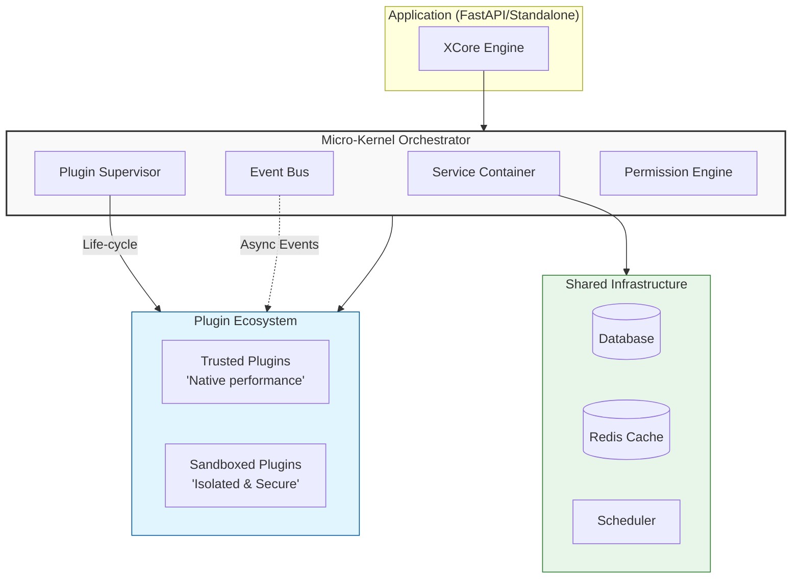

# ⚡ XCore Framework

[](https://github.com/traoreera/xcore)
[](LICENSE)
[](https://www.python.org/downloads/)
[](https://fastapi.tiangolo.com/)
[](https://pydantic-docs.helpmanual.io/)

**XCore** is a high-performance, **plugin-first** orchestration framework for Python. It transforms the way you build scalable applications by providing a **micro-kernel architecture** that natively supports dynamic loading, secure sandboxing, and seamless service injection.

> "The Laravel / NestJS / Spring Boot of Python plugin architectures."

---

## 💎 Why XCore?

In a world of rigid monoliths and overly complex microservices, XCore offers a third way: the **Modular Monolith**.

- 🧩 **True Modularity**: Build everything as a plugin. Load, unload, and hot-reload features without downtime.
- 🛡️ **Hardened Security**: Run untrusted plugins in a multi-layered sandbox (OS-level isolation + AST scanning + Filesystem guards).
- 🚀 **Integrated Ecosystem**: Batteries-included with SQL/NoSQL support, Redis caching, Task Scheduling, and a centralized Event Bus.
- 🔌 **Framework Agnostic Core**: While it integrates deeply with **FastAPI**, the core kernel can power any Python application.
- 📦 **Dependency Injection**: A sophisticated service container that manages life-cycles and provides typed dependencies to your plugins.

---

## 🏗️ Architecture Overview

XCore follows a "minimal core" philosophy. The kernel handles orchestration, while functionality lives in plugins.



---

## 🚀 Quick Start (2 Minutes)

### 1. Installation

```bash
# Recommended: using Poetry
poetry add xcore-framework

# Or using pip
pip install xcore-framework
```

### 2. The Entry Point

Integrate XCore with FastAPI in seconds:

```python
from fastapi import FastAPI
from xcore import Xcore
from contextlib import asynccontextmanager

core = Xcore(config_path="xcore.yaml")

@asynccontextmanager
async def lifespan(app: FastAPI):
    await core.boot(app) # 🚀 Ignition!
    yield
    await core.shutdown()

app = FastAPI(lifespan=lifespan)
```

---

## 🔌 Create Your First Plugin

A plugin is just a folder with a `plugin.yaml` manifest and your code.

### `plugins/hello_world/src/main.py`
```python
from xcore.sdk import TrustedBase, action, ok

class Plugin(TrustedBase):
    @action("greet")
    async def greet(self, payload: dict):
        name = payload.get("name", "XCore")
        return ok(message=f"Hello, {name}!")
```

### `plugin.yaml`
```yaml
name: hello_world
version: "1.0.0"
execution_mode: trusted
entry_point: src/main.py
```

### Call it anywhere!
```python
result = await core.plugins.call("hello_world", "greet", {"name": "Developer"})
# Returns: {"status": "ok", "message": "Hello, Developer!"}
```

---

## 📊 Framework Comparison

| Feature | FastAPI / Django | Microservices | **XCore** |
| :--- | :--- | :--- | :--- |
| **Modularity** | Weak (Modules) | Strong (Network) | **Native (Plugins)** |
| **Isolation** | None | Process/Network | **Sandbox / IPC** |
| **Deployment** | Simple | Complex | **Simple (Single Bin)** |
| **Communication** | Direct Calls | HTTP/gRPC | **Event Bus / IPC** |
| **Hot Reload** | Restart Dev | Rolling Update | **Hot-swap Plugin** |

---

## 🛠️ CLI Power Tools

Manage your entire ecosystem from the terminal.

| Command | Action |
| :--- | :--- |
| `xcore plugin list` | See all loaded and available plugins |
| `xcore plugin reload <name>` | Update plugin code without restarting the server |
| `xcore plugin sign <path>` | Generate HMAC signatures for trusted plugins |
| `xcore health` | Deep health-check of all services (DB, Cache, Scheduler) |
| `xcore marketplace list` | Browse and install plugins from remote registries |

---

## 🗺️ Roadmap

- [x] **v2.0**: Core refactoring, Micro-kernel architecture.
- [x] **Sandbox v2**: Enhanced AST scanning & OS-level resource limits.
- [ ] **Marketplace**: Centralized plugin registry.
- [ ] **Dashboard**: Web UI for monitoring and managing plugins.
- [ ] **Multi-language**: Support for plugins written in Rust/Go via WASM.

---

## 🤝 Contributing

We love contributions! Whether it's a bug report, a new feature, or documentation improvements.

1. Fork the repo.
2. Create your feature branch (`git checkout -b feature/amazing-feature`).
3. Commit your changes (`git commit -m 'Add amazing feature'`).
4. Push to the branch (`git push origin feature/amazing-feature`).
5. Open a Pull Request.

---

## 📄 License

XCore is open-source software licensed under the [MIT License](LICENSE).

<p align="center">
  Built with ❤️ by the <b>XCore Team</b>
</p>
