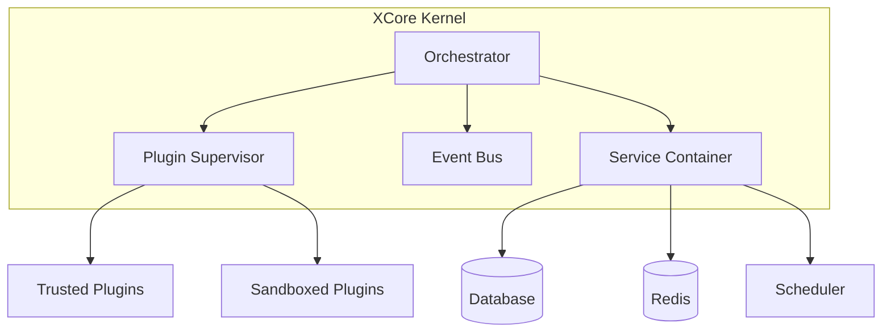

# ⚡ XCore Framework

[](https://github.com/traoreera/xcore)
[](LICENSE)
[](https://www.python.org/downloads/)
[](https://fastapi.tiangolo.com/)

**XCore** is a high-performance, plugin-first orchestration framework built on top of **FastAPI**. It is designed to load, isolate, and manage modular extensions (plugins) in a secure, sandboxed environment.

---

## ✨ Key Features

- 🧩 **Dynamic Plugin System**: Hot-reload, load, and unload plugins at runtime without restarting the server.
- 🛡️ **Sandboxing & Security**:# 🧱 1. ARCHITECTURE

## Isolation & découplage

* [x] API séparée du scheduler
* [x] Plugin runner dans process isolé
* [x] Communication IPC stricte (pas import direct du core)
* [x] Resource limits OS (CPU / RAM / file descriptors)
* [x] Timeout kernel-level
* [x] Event loop jamais bloquée par plugin

## Stateless

* [ ] API stateless
* [ ] Sessions externalisées (Redis)
* [ ] Configuration externalisée (env / secret manager)

---

# 🔐 2. SÉCURITÉ

## Auth

* [ ] JWT rotation automatique
* [ ] Refresh token sécurisé
* [ ] Expiration courte access token
* [ ] Revocation list

## Autorisation

* [ ] RBAC complet
* [ ] Scope par tenant
* [ ] Permission par ressource
* [ ] Policies versionnées

## API Hardening

* [ ] Rate limit global
* [ ] Rate limit par tenant
* [ ] Protection brute force
* [ ] Validation stricte Pydantic (aucun Any sauvage)
* [ ] CORS verrouillé

## Plugin Security

* [ ] Signature obligatoire plugin
* [ ] Validation metadata stricte
* [ ] Scan dépendances auto (CI)
* [ ] Blocage accès FS non autorisé
* [ ] Blocage accès réseau non autorisé

---

# 🧠 3. MULTI-TENANT

* [ ] Isolation DB (row-level ou DB dédiée)
* [ ] Namespace cache par tenant
* [ ] Rate limit par tenant
* [ ] Logs séparés par tenant
* [ ] No data leakage possible cross-tenant

---

# 📊 4. OBSERVABILITÉ

## Logging

* [ ] Structured logging JSON
* [ ] Correlation ID par requête
* [ ] Logs centralisés

## Metrics

* [ ] Prometheus intégré
* [ ] Métriques par plugin
* [ ] Métriques par tenant

## Tracing

* [ ] OpenTelemetry activé
* [ ] Trace distribué inter-service

## Alerting

* [ ] Alert CPU / RAM
* [ ] Alert crash plugin
* [ ] Alert latence élevée

---

# 🚀 5. RÉSILIENCE

* [ ] Retry policy
* [ ] Circuit breaker
* [ ] Dead letter queue
* [ ] Idempotency system
* [ ] Graceful shutdown
* [ ] Healthcheck complet (liveness + readiness)

---

# ⚙️ 6. PERFORMANCE & STABILITÉ

## Tests

* [ ] Tests unitaires >80%
* [ ] Tests d’intégration
* [ ] Tests de charge (k6/locust)
* [ ] Test endurance 48–72h
* [ ] Chaos testing

## DB

* [ ] Pooling correct
* [ ] Indexation vérifiée
* [ ] Slow query monitoring

---

# ☁️ 7. INFRASTRUCTURE

* [ ] Docker multi-stage propre
* [ ] Image minimale
* [ ] Kubernetes ready
* [ ] Autoscaling horizontal
* [ ] Rolling update sans downtime
* [ ] Backup automatique
* [ ] Restore testé

---

# 📜 8. AUDIT & COMPLIANCE

* [ ] Audit log immuable
* [ ] Trace action admin
* [ ] Historique permissions
* [ ] Documentation sécurité écrite
* [ ] Plan incident response
* [ ] Disaster recovery documenté

---

# 🔥 9. VALIDATION FINALE

Tu peux dire “enterprise critique” si :

* [ ] Plugin ne peut pas faire tomber le core
* [ ] Aucun tenant ne peut impacter un autre
* [ ] Crash plugin ≠ crash système
* [ ] 99.9% uptime mesurée
* [ ] Reprise après crash testée

---

# 🎯 Score rapide

Si aujourd’hui tu es honnête :

* < 40% → prototype avancé
* 40–70% → SaaS early stage
* 70–90% → production sérieuse
* 90%+ → critique enterprise
 Isolated execution using sub-processes with strict resource limits (CPU, Memory, Timeouts) and AST validation.
- 🔌 **Native Service Integration**: Built-in support for SQL (PostgreSQL, MySQL, SQLite), NoSQL (Redis), and Task Scheduling (APScheduler).
- 🛰️ **Event-Driven Architecture**: Powerful Event Bus and Hook system for seamless inter-plugin communication.
- 🔐 **Signature Verification**: Ensure plugin integrity with HMAC-SHA256 signature validation.
- 🛠️ **Developer Friendly**: Built-in CLI, automated documentation generator (`docgen`), and structured logging.

---

## 🏗️ Architecture Overview

XCore follows a "minimal core" philosophy where most features are provided via plugins or shared services.



---

## 🚀 Getting Started

### Prerequisites

- **Python 3.11+**
- **Poetry** (Package Manager)

### Installation

1. **Clone the repository**:
   ```bash
   git clone https://github.com/traoreera/xcore
   cd xcore
   ```

2. **Install dependencies**:
   ```bash
   poetry install
   ```

3. **Run the development server**:
   ```bash
   make run-dev
   ```

---

## 💻 Usage

### 1. Integration with FastAPI

```python
from fastapi import FastAPI
from xcore import Xcore
from contextlib import asynccontextmanager

xcore = Xcore(config_path="xcore.yaml")

@asynccontextmanager
async def lifespan(app: FastAPI):
    await xcore.boot(app)
    yield
    await xcore.shutdown()

app = FastAPI(lifespan=lifespan)
```

### 2. Standalone Usage

```python
from xcore import Xcore

async def main():
    app = Xcore()
    await app.boot()
    
    # Call a plugin action
    result = await app.plugins.call("users_plugin", "get_user", {"id": 1})
    print(result)
    
    await app.shutdown()
```

---

## 🔌 Plugin Development

Plugins reside in the `plugins/` directory. A standard plugin structure looks like this:

```text
plugins/my_plugin/
├── plugin.yaml      # Manifest (metadata & entry point)
├── plugin.sig       # Security signature (for trusted plugins)
└── src/
    └── main.py      # Core logic
```

### Example `plugin.yaml`
```yaml
name: "my_plugin"
version: "1.0.0"
entry_point: "src.main:MyPlugin"
trusted: true  # Set to false for sandboxed execution
dependencies: ["other_plugin"]
```

---

## 🛠️ CLI Reference

XCore comes with a powerful CLI for management and security.

| Command | Description |
| :--- | :--- |
| `xcore plugin list` | List all loaded plugins |
| `xcore plugin load <name>` | Load a specific plugin |
| `xcore plugin reload <name>` | Hot-reload a plugin |
| `xcore plugin sign <path>` | Generate a security signature for a plugin |
| `xcore plugin validate <path>`| Validate plugin manifest and structure |
| `xcore services status` | Check the health of DB, Cache, and Scheduler |
| `xcore health` | Perform a global system health check |

---

## 📜 Makefile Commands

| Command | Description |
| :--- | :--- |
| `make init` | Initialize project (install + run) |
| `make test` | Run the test suite |
| `make lint-fix` | Auto-format code (Black, Isort) |
| `make docker-dev` | Spin up development environment with Docker |
| `make logs-live` | View real-time structured logs |

---

## 📄 License

This project is licensed under the **MIT License**. See the [LICENSE](LICENSE) file for details.

---

<p align="center">
  Built with ❤️ by <b>Eliezer Traore</b>
</p>
