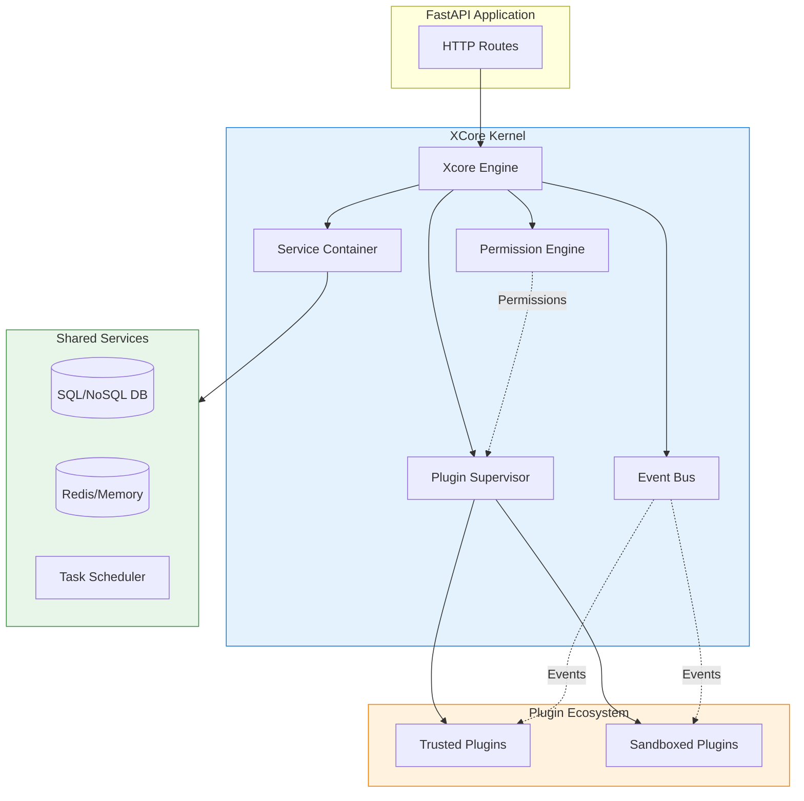

# ⚡ XCore Framework

[](https://github.com/traoreera/xcore)
[](LICENSE)
[](https://www.python.org/downloads/)
[](https://fastapi.tiangolo.com/)

**XCore** is a production-grade, plugin-first Python framework built on top of **FastAPI**. It is designed to build modular, extensible, and secure applications by encapsulating features into isolated plugins.

---

## 🌟 Key Features

- 🚀 **High Performance**: Built on FastAPI and asyncio for maximum throughput.
- 🛡️ **Security by Design**: Multi-layer sandbox, AST validation, and granular permission engine.
- 🧩 **Plugin-First Architecture**: Everything is a plugin. Load, unload, and hot-reload without downtime.
- 🗄️ **Integrated Services**: Built-in support for SQL/NoSQL databases, Redis caching, and task scheduling.
- ⚡ **Events & Hooks**: Loosely coupled communication via an asynchronous event bus.
- ⚖️ **Guaranteed Isolation**: Choose between Trusted (main process) and Sandboxed (isolated OS process) plugins.

---

## 🏗️ Architecture at a Glance

XCore implements a **Modular Monolith** architecture, offering the best of both worlds: the development speed of a monolith and the isolation of microservices.



---

## 🚀 Quick Start

### 1. Installation

```bash
# Using pip (from source)
pip install git+https://github.com/traoreera/xcore.git

# Using Poetry (recommended)
poetry add git+https://github.com/traoreera/xcore.git
```

### 2. Basic Integration

```python
from contextlib import asynccontextmanager
from fastapi import FastAPI
from xcore import Xcore

core = Xcore(config_path="xcore.yaml")

@asynccontextmanager
async def lifespan(app: FastAPI):
    # 🚀 Boot the kernel
    await core.boot(app)
    yield
    # 🛑 Cleanup
    await core.shutdown()

app = FastAPI(title="My XCore App", lifespan=lifespan)
```

### 3. Create Your First Plugin

Create a directory `plugins/hello/` with two files:

**`plugin.yaml`**:
```yaml
name: hello
version: "1.0.0"
execution_mode: trusted
entry_point: src/main.py
```

**`src/main.py`**:
```python
from xcore.sdk import TrustedBase, AutoDispatchMixin, action, ok

class Plugin(AutoDispatchMixin, TrustedBase):
    @action("greet")
    async def greet(self, payload: dict):
        name = payload.get("name", "World")
        return ok(message=f"Hello, {name}!")
```

### 4. Test it!

```bash
PYTHONPATH=. python3 -m xcore.cli.main plugin call hello greet '{"name": "Developer"}'
# Output: {"status": "ok", "message": "Hello, Developer!"}
```

---

## 📚 Documentation

Visit our [Full Documentation](https://xcore.readthedocs.io) for:

- [🚀 Installation Guide](docs/getting-started/installation.md)
- [⚡ Quick Start Guide](docs/getting-started/quickstart.md)
- [🧩 Plugin Development](docs/guides/creating-plugins.md)
- [🏗️ Architecture Deep Dive](docs/architecture/overview.md)
- [🛡️ Security & Sandboxing](docs/guides/security.md)

---

## 🛠️ CLI Reference

| Command | Description |
| :--- | :--- |
| `xcore plugin list` | List all loaded plugins |
| `xcore plugin load <name>` | Load a specific plugin |
| `xcore plugin reload <name>` | Hot-reload a plugin |
| `xcore plugin sign <path>` | Generate a security signature |
| `xcore plugin validate <path>`| Validate plugin manifest |

---

## 📄 License

This project is licensed under the **MIT License**. See the [LICENSE](LICENSE) file for details.

---

<p align="center">
  Built with ❤️ by the <b>XCore Team</b>
</p>
