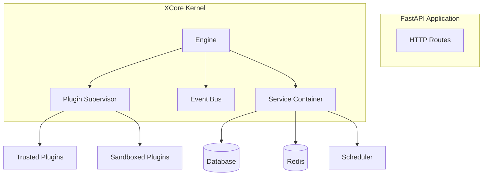

# ⚡ XCore Framework

[](https://github.com/traoreera/xcore)
[](LICENSE)
[](https://www.python.org/downloads/)
[](https://fastapi.tiangolo.com/)

**XCore** is a high-performance, plugin-first orchestration framework built on top of **FastAPI**. It is designed to load, isolate, and manage modular extensions (plugins) in a secure, sandboxed environment.

> **Build robust, scalable, and secure applications using the Modular Monolith pattern.**

---

## ✨ Key Features

*   🧩 **Plugin-First Architecture**: Everything is a module. Load, unload, and hot-reload features without downtime.
*   🛡️ **Multi-Layer Sandbox**: Securely execute third-party code using AST scanning, OS process isolation, and resource limits.
*   🚀 **Performance-Oriented**: Built with `asyncio` and optimized middleware pipelines (< 6µs overhead).
*   🔧 **Shared Services**: Out-of-the-box support for SQL/NoSQL Databases, Redis Caching, and Task Scheduling.
*   📡 **Async Messaging**: Decoupled communication via a high-performance Event Bus and Hook system.
*   🔐 **PBAC Security**: Granular, policy-based access control for every inter-plugin call and service access.

---

## 🏗️ Architecture Overview

XCore bridges the gap between rigid monoliths and complex microservices by providing a **Modular Monolith** kernel.



---

## 🚀 Quick Start

### 1. Installation

```bash
pip install xcore-framework
# Or using poetry
poetry add xcore-framework
```

### 2. Initialize the Kernel

```python
from fastapi import FastAPI
from xcore import Xcore
from contextlib import asynccontextmanager

xcore = Xcore(config_path="xcore.yaml")

@asynccontextmanager
async def lifespan(app: FastAPI):
    await xcore.boot(app)
    yield
    await xcore.shutdown()

app = FastAPI(lifespan=lifespan)
```

### 3. Create a Plugin

**`plugins/hello/plugin.yaml`**:
```yaml
name: hello
version: "1.0.0"
execution_mode: trusted
entry_point: src/main.py
```

**`plugins/hello/src/main.py`**:
```python
from xcore.sdk import TrustedBase, AutoDispatchMixin, action, ok

class Plugin(AutoDispatchMixin, TrustedBase):
    @action("greet")
    async def greet(self, payload: dict):
        name = payload.get("name", "World")
        return ok(message=f"Hello, {name}!")
```

### 4. Call it via CLI

```bash
xcore plugin call hello greet '{"name": "Developer"}'
# Output: {"status": "ok", "message": "Hello, Developer!"}
```

---

## 🛠️ CLI at a Glance

| Command | Description |
| :--- | :--- |
| `xcore plugin list` | List all installed and active plugins |
| `xcore plugin reload <name>` | Hot-reload a plugin without restarting the app |
| `xcore plugin sign <path>` | Generate a cryptographic signature for a plugin |
| `xcore plugin validate <path>`| Perform an AST scan and manifest validation |
| `xcore services status` | Check the health of DB, Cache, and Scheduler |

---

## 📚 Documentation

Visit our [Full Documentation](https://xcore.readthedocs.io) for:
- [Installation Guide](docs/getting-started/installation.md)
- [Security Deep Dive](docs/guides/security.md)
- [Plugin Development Guide](docs/guides/creating-plugins.md)
- [Architecture & Decisions](docs/architecture/overview.md)
- [SDK Reference](docs/reference/sdk.md)

---

## 📄 License

This project is licensed under the **MIT License**. See the [LICENSE](LICENSE) file for details.

---

<p align="center">
  Built with ❤️ by the <b>XCore Team</b>
</p>
