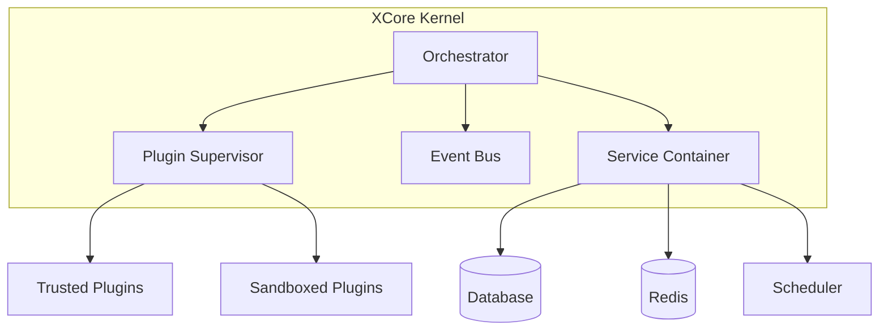

# ⚡ XCore Framework

<p align="center">
  
</p>

<p align="center">
  <b>High-performance, plugin-first orchestration framework built on FastAPI.</b>
</p>

<p align="center">
  <a href="https://github.com/traoreera/xcore/actions/workflows/ci.yml">
    
  </a>
  <a href="https://codecov.io/gh/traoreera/xcore" > 
    
   </a>
  <a href="https://github.com/traoreera/xcore/releases">
    
  </a>
  <a href="LICENSE">
    
  </a>
  <a href="https://www.python.org/downloads/">
    
  </a>
  <a href="https://fastapi.tiangolo.com/">
    
  </a>
</p>

---

**XCore** is designed to load, isolate, and manage modular extensions (plugins) in a secure, sandboxed environment. It provides a robust foundation for building scalable applications where features can be dynamically added, removed, or updated without affecting the core system.

## ✨ Key Features

- 🔌 **Plugin-First Architecture**: Everything is a plugin. Keep your core lean and your features modular.
- 🛡️ **Advanced Sandboxing**: AST-based scanning and resource restriction to run untrusted code safely.
- 🚀 **Built on FastAPI**: Leverage the speed and ecosystem of one of the fastest Python frameworks.
- 📦 **Service Container**: Seamless management of Databases (SQLAlchemy), Cache (Redis), and Schedulers.
- 🛠️ **Dev-Friendly CLI**: Hot-reload plugins, sign manifests, and verify system health with one command.
- 📊 **Production Ready**: Structured logging, integrated metrics, and comprehensive test coverage.

---

## 📺 Demo

Integrating XCore into your FastAPI application is straightforward:

```python
from fastapi import FastAPI
from xcore import Xcore
from contextlib import asynccontextmanager

# 1. Initialize the Kernel
xcore = Xcore(config_path="xcore.yaml")

@asynccontextmanager
async def lifespan(app: FastAPI):
    # 2. Boot XCore (loads plugins and services)
    await xcore.boot(app)
    yield
    # 3. Graceful shutdown
    await xcore.shutdown()

app = FastAPI(lifespan=lifespan)

@app.get("/compute")
async def compute(value: int):
    # 4. Call a plugin method dynamically
    result = await xcore.plugins.call("math_plugin", "calculate", {"x": value})
    return {"result": result}
```

---

## 🚀 Getting Started

### Installation

```bash
# Clone the repository
git clone https://github.com/traoreera/xcore.git
cd xcore

# Install using Poetry
make install
```

### Quick Run

Start the development server with auto-reload enabled:

```bash
make dev
```

---

## 🏗️ Architecture

XCore follows a "minimal core" philosophy. Most business logic resides in plugins, which are managed by the **Plugin Supervisor**.



---

## 🛠️ CLI Reference

The `xcore` CLI is your control center for managing the framework.

| Command | Description |
| :--- | :--- |
| `xcore plugin list` | List all loaded plugins |
| `xcore plugin reload <name>` | Hot-reload a plugin without restarting the server |
| `xcore plugin info <name>` | Inspect plugin manifest and permissions |
| `xcore plugin sign <path>` | Generate a security signature for a plugin |
| `xcore services status` | Check the health of DB, Cache, and Scheduler |
| `xcore health` | Perform a global system health check |
| `xcore worker start` | Start the background task worker |

---

## 🧪 Development & Quality

We maintain high standards for code quality and security:

```bash
make test              # Run the full test suite
make lint-fix          # Auto-format and fix linting issues
make security-check    # Run Bandit security audit
make benchmark         # Run performance benchmarks
```

---

## 📄 License

This project is licensed under the **MIT License**. See the [LICENSE](LICENSE) file for details.

---

<p align="center">
  Built with ❤️ by the <b>XCore Team</b>
</p>
