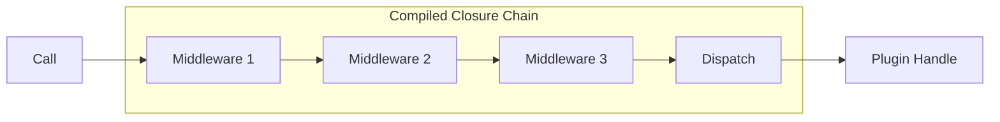

# Middleware Internals

Xcore features a high-performance middleware system designed to apply cross-cutting concerns (security, logging, metrics) to every plugin call with minimal overhead.

---

### Key Concepts

#### Middleware Registry
The `MiddlewareRegistry` is a central store for middleware factories. Instead of instantiating middlewares directly, the supervisor uses these factories to build a pipeline based on the names provided in the configuration.

#### Pipeline Compilation
To avoid iterating over a list of middlewares for every single call, Xcore **compiles** the pipeline at boot time. This process creates a chain of nested closures, resulting in an $O(1)$ execution path that is significantly faster than a loop-based approach.



---

### Practical Guide

#### 1. Developing a Custom Middleware
Implement the `Middleware` abstract base class. Always remember to `await next_call`.

```python linenums="1" title="myapp/middlewares/logging.py"
from xcore.kernel.runtime.middlewares import Middleware

class LoggingMiddleware(Middleware):
    def __init__(self, logger_name="xcore.audit"):
        import logging
        self.logger = logging.getLogger(logger_name)

    async def __call__(self, plugin_name, action, payload, next_call, handler, **kwargs):
        self.logger.info(f"START: {plugin_name}.{action}")
        try:
            # Pass execution to the next middleware or the final dispatch
            result = await next_call(plugin_name, action, payload, handler, **kwargs)
            self.logger.info(f"END: {plugin_name}.{action} -> {result.get('status')}")
            return result
        except Exception as e:
            self.logger.error(f"FAIL: {plugin_name}.{action} -> {e}")
            raise
```

#### 2. Declaring Middlewares in `xcore.yaml`
You can add your custom middlewares to the global pipeline via the `middleware` block.

```yaml linenums="1" title="xcore.yaml"
middleware:
  - name: "audit_log"           # (1)!
    module: "myapp.middlewares.logging:LoggingMiddleware" # (2)!
    config:                     # (3)!
      - name: "logger_name"
        value: "my_app_audit"
```

1.  **Name**: Unique identifier for the middleware.
2.  **Module Path**: Format `package.module:ClassName`.
3.  **Config**: List of parameters passed to the constructor.

---

### Default Middleware Order

When Xcore boots, it initializes the default pipeline in the following order:

1.  **IPC Auth**: Verification of the caller's identity.
2.  **Tracing**: OpenTelemetry span initialization.
3.  **Rate Limit**: Quota enforcement.
4.  **Permissions**: ACL verification.
5.  **Retry**: Automated retries for sandboxed failures.
6.  **Custom Middlewares**: Appended in the order they appear in `xcore.yaml`.

---

### API Reference

#### `MiddlewareRegistry`
| Method | Description |
|--------|-------------|
| `register(name, factory)` | Adds a new middleware factory to the registry. |
| `create_pipeline(names, ...)`| Builds and compiles a `MiddlewarePipeline`. |

#### `Middleware` (`__call__` signature)
| Parameter | Type | Description |
|-----------|------|-------------|
| `plugin_name`| `str` | Target plugin. |
| `action` | `str` | Action name. |
| `payload` | `dict` | Input data. |
| `next_call` | `Callable`| The next closure in the compiled chain. |
| `handler` | `Handler` | Handler for the target plugin. |

---

### Common Errors & Pitfalls

!!! danger "Breaking the Chain"
    If you forget to `await next_call(...)`, the execution stops and the plugin is never reached. Xcore does not automatically warn you about this, as it might be intentional (e.g., in a security middleware).

!!! warning "Instantiation Errors"
    If the constructor of your middleware fails (e.g., missing parameter in `xcore.yaml`), the pipeline creation will fail, and Xcore will boot without that middleware (logging an error).

!!! failure "Performance Bottlenecks"
    Middlewares are "hot paths." Avoid any heavy I/O or CPU-bound tasks. Use the `XWorker` service if you need to perform heavy processing as part of a middleware flow.

---

### Best Practices

!!! success "Stateless Middlewares"
    Keep your middlewares as stateless as possible. If you need to track state across multiple calls, use the `CacheService` or the `ServiceContainer`.

!!! tip "Use `kwargs` for context"
    Use the `**kwargs` dictionary to pass metadata down the chain (e.g., passing a validated user object from an Auth middleware to a Permission middleware).
