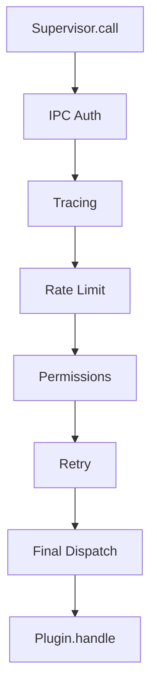

# Middleware Pipeline

Xcore uses a **compiled middleware pipeline** to process every call to a plugin. This pipeline ensures that security, observability, and reliability features are applied consistently and efficiently across the entire ecosystem.

---

### Key Concepts

#### The Execution Flow
When `xcore.plugins.call()` is invoked, the request travels through a series of nested middlewares before finally reaching the plugin's `handle()` method.



#### Compiled for Performance
To minimize overhead during high-frequency calls, Xcore **compiles** the pipeline at boot time into a single chain of nested closures. This avoids the overhead of iterating over lists or repeatedly resolving function names during the request flow.

---

### Standard Middlewares

The following middlewares are active by default in the specified order:

#### 1. IPC Auth (`IPCAuthMiddleware`)
Ensures that the caller is authorized to invoke the target plugin.
- **Fail-closed**: If `tenancy.enforce_ipc` is `true`, calls from unauthorized plugins or untrusted sources are blocked.
- **Service Bypass**: Direct calls from the framework kernel (`xcore`) are always permitted.

#### 2. Tracing (`TracingMiddleware`)
Automatically starts an OpenTelemetry span for the call.
- Captures `plugin_name`, `action`, and `caller`.
- Records errors and execution duration as span attributes.

#### 3. Rate Limit (`RateLimitMiddleware`)
Enforces the quotas defined in the plugin's `plugin.yaml`.
- Uses a sliding window algorithm.
- Blocks calls once the `calls` per `period_seconds` threshold is exceeded.

#### 4. Permissions (`PermissionMiddleware`)
Evaluates the `resource` and `action` against the plugin's `PolicySet`.
- Replaces the generic `execute` action with a specific resource string if provided.
- Raises `PermissionDenied` on failure.

#### 5. Retry (`RetryMiddleware`)
Automatically retries failed calls to **Sandboxed** plugins if the worker process crashes or the IPC channel times out.
- Configurable via the `retry:` block in `plugin.yaml`.

---

### Practical Guide

#### Customizing the Pipeline
You can register custom middlewares to add behavior like logging, transformation, or custom authentication.

```python linenums="1"
from xcore.kernel.runtime.middlewares import Middleware

class AuditMiddleware(Middleware):
    async def __call__(self, plugin_name, action, payload, next_call, handler, **kwargs):
        print(f"Audit: {plugin_name} called {action}")
        # Call the next middleware in the chain
        return await next_call(plugin_name, action, payload, handler, **kwargs)

# Register dynamically after boot
xcore.plugins.register_middleware(AuditMiddleware())
```

---

### API Reference

#### `Middleware` (Abstract Base Class)
| Parameter | Type | Description |
|-----------|------|-------------|
| `plugin_name`| `str` | Name of the target plugin. |
| `action` | `str` | Action string being invoked. |
| `payload` | `dict` | Input data for the call. |
| `next_call` | `Callable`| The next step in the pipeline (must be awaited). |
| `handler` | `Handler` | The supervisor handler for the target plugin. |
| `**kwargs` | `dict` | Contextual data: `caller`, `tenant_id`, `resource`. |

---

### YAML Configuration

The pipeline behavior is influenced by both the global `xcore.yaml` and individual `plugin.yaml` files.

```yaml title="plugin.yaml"
resources:
  rate_limit:
    calls: 100
    period_seconds: 60

retry:
  max_attempts: 3
  backoff_seconds: 0.5
```

---

### Common Errors & Pitfalls

!!! danger "Forgetting to await next_call"
    If your middleware doesn't `await next_call(...)`, the pipeline stops immediately and the plugin is never executed.

!!! warning "Middleware Order"
    The order of registration matters. `IPCAuth` must always run first to protect the rest of the pipeline from unauthorized calls.

!!! failure "Blocking the Event Loop"
    Middlewares run in the main thread. Any synchronous, CPU-intensive logic inside a middleware will slow down every plugin call in the system.

---

### Best Practices

!!! success "Keep Middlewares Lean"
    Middlewares are executed on every single plugin call. Avoid complex logic or database queries inside them; use caching or local state instead.

!!! tip "Use kwargs for Context"
    If you need to pass data between middlewares, inject it into `kwargs`. The final `_dispatch` method and the plugin `handle` method can access these values.
