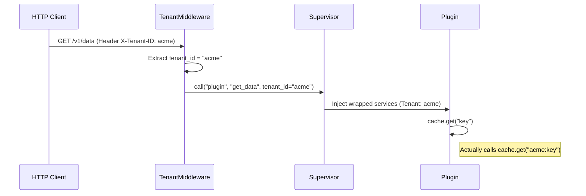

# Multi-Tenancy

Xcore is built from the ground up to support multi-tenant applications. It provides transparent isolation for databases, caches, and scheduled jobs, allowing you to build SaaS platforms where each customer's data is strictly separated.

---

### Prerequisites

- [x] [Service Container](./services.md) overview understood
- [x] [PostgreSQL](./database.md) (required for schema-based isolation)

---

### Key Concepts

#### Transparent Isolation
The core philosophy of Xcore multi-tenancy is **transparency**. A plugin developer writes code as if there were only one tenant. Xcore automatically handles the isolation layer at the service level based on the `tenant_id` of the current request.

#### The extraction flow
For every HTTP request, Xcore extracts the `tenant_id` before it reaches your plugin.



---

### Practical Guide

#### 1. Enabling Multi-Tenancy
Enable and configure the extraction strategy in your `xcore.yaml`.

```yaml linenums="1" title="xcore.yaml"
tenancy:
  enabled: true
  header: "X-Tenant-ID"    # (1)!
  subdomain: true          # (2)!
  default_tenant: "public" # (3)!

  isolate_db: true         # (4)!
  isolate_cache: true      # (5)!
  isolate_scheduler: false
```

1.  Extract tenant from `X-Tenant-ID` HTTP header.
2.  Extract from subdomain: `acme.myapp.com` → `acme`.
3.  Fallback if no tenant is found.
4.  Enable PostgreSQL `search_path` isolation.
5.  Enable automatic key prefixing for Redis/Memory cache.

#### 2. Writing Tenant-Aware Logic
In your plugin, you don't need to do anything special. The `db` and `cache` services are already wrapped for the current tenant.

```python linenums="1"
class Plugin(TrustedBase):
    async def handle(self, action, payload):
        # 1. Access the tenant ID directly
        current_tenant = self.ctx.tenant_id

        # 2. Database call (PostgreSQL search_path is set automatically)
        async with self.db.session() as session:
            await session.execute("INSERT INTO orders ...")

        # 3. Cache call (Key is automatically prefixed with tenant_id)
        await self.cache.set("last_order", 123)
```

---

### Isolation Strategies

#### Database (PostgreSQL Schema)
When `isolate_db` is `true`, Xcore executes `SET search_path TO <tenant_id>, public` at the start of every database session.
- You must ensure that a schema named `<tenant_id>` exists in your database.
- Tables in the `public` schema act as shared data across all tenants.

#### Cache (Key Prefixing)
When `isolate_cache` is `true`, the `CacheService` wraps the backend and prefixes all keys:
- `cache.get("settings")` → `acme:settings`
- `cache.keys("*")` → Returns only keys starting with `acme:`, with the prefix removed.

#### Scheduler (Job ID Prefixing)
If `isolate_scheduler` is `true`, job IDs are prefixed with the tenant ID. This allows multiple tenants to schedule jobs with the same logical ID (e.g., `daily_report`) without collision.

---

### API Reference

#### `TenantMiddleware`
| Option | Default | Description |
|--------|---------|-------------|
| `header` | `"X-Tenant-ID"` | HTTP header name to look for the tenant ID. |
| `subdomain` | `false` | If `true`, extracts the first part of the host as the tenant ID. |
| `default_tenant`| `"default"` | The ID used if no other extraction strategy succeeds. |

---

### Common Errors & Pitfalls

!!! danger "PostgreSQL Schema Missing"
    If `isolate_db` is enabled but the schema for a tenant does not exist, PostgreSQL will not raise an error immediately, but your queries will fail if they try to access tables that only exist in the tenant schema.
    **Fix**: Automate schema creation when a new tenant is provisioned.

!!! warning "Non-PostgreSQL Databases"
    `SET search_path` is a PostgreSQL-specific feature. If you use MySQL or SQLite, `isolate_db` will have no effect.
    **Fix**: You must manually prefix your table names or use separate database connections for each tenant.

!!! failure "Shared Cache Corruption"
    If you disable `isolate_cache` but use the same Redis instance for all tenants, one tenant can overwrite or read another tenant's data.
    **Fix**: Always keep `isolate_cache: true` in production.

---

### Best Practices

!!! success "Use Default Tenant for Public Data"
    Use the `default_tenant` (e.g., `public`) for data that should be shared across all customers, such as global configurations or read-only catalogs.

!!! tip "Provisioning Flow"
    Create a "Tenant Manager" plugin that handles the lifecycle of a tenant: creating the PostgreSQL schema, running migrations, and initializing default cache settings.
