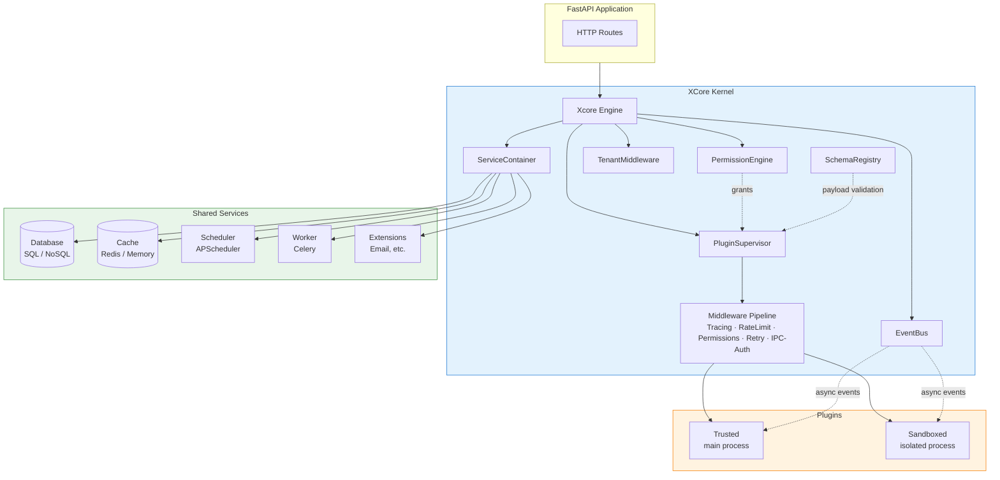
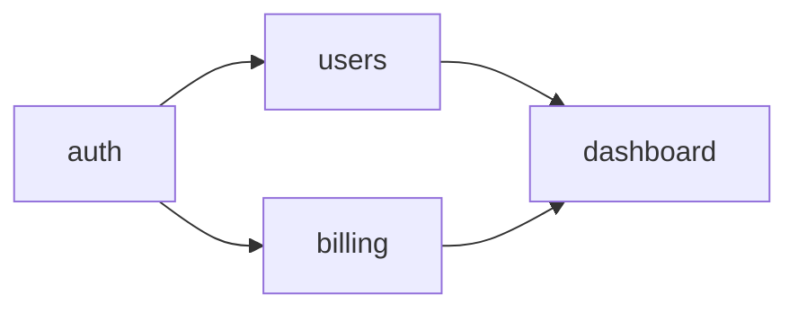
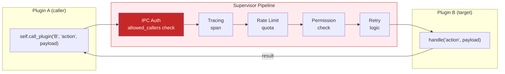
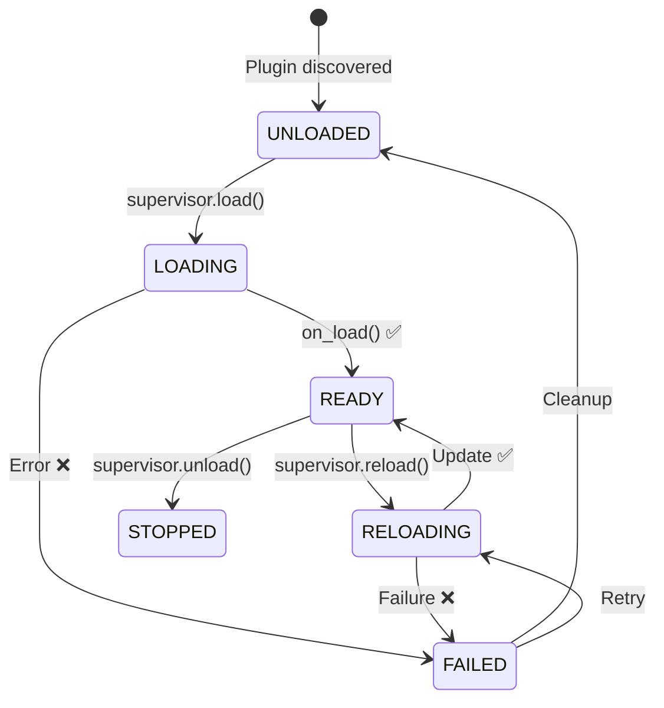

# Architecture Overview

XCore follows the **Modular Monolith** pattern: all plugins run inside a single orchestrated process, isolated via logical boundaries (permissions, context injection) and, for sandboxed plugins, physical OS-level process isolation.

---

## High-Level Diagram



---

## Layers

### 1. Xcore Engine (`xcore/__init__.py`)

The single entry point. `Xcore` owns the boot sequence and wires all subsystems together:

```
boot():
  1. validate secret keys (production guard)
  2. configure observability
  3. init ServiceContainer (DB → Cache → Scheduler → Worker → Extensions)
  4. build PluginRegistry (discovery + versioning)
  5. build KernelContext
  6. boot PluginSupervisor (loads all plugins)
  7. mount plugin HTTP routers on FastAPI
```

`setup(app)` is separate from `boot()` — it registers ASGI middlewares and must be called before uvicorn starts (before the lifespan begins).

---

### 2. Kernel (`xcore/kernel/`)

#### Runtime (`kernel/runtime/`)

| Module | Role |
|:-------|:-----|
| `loader.py` | Discovers plugin directories; parses `plugin.yaml`; resolves dependency DAG |
| `supervisor.py` | Owns all plugin handlers; routes `call(plugin, action, payload)` through the middleware pipeline |
| `lifecycle.py` | `LifecycleManager` sequences `on_init → on_load → on_start → on_stop → on_unload` |
| `state_machine.py` | Enforces valid state transitions: `UNLOADED → LOADING → READY → RELOADING → STOPPED` |
| `activator.py` | Instantiates the plugin class and injects `KernelContext` |
| `dependency.py` | Topological sort of the plugin dependency graph |
| `kernel_handler.py` | Adapter between PluginSupervisor and each plugin's `handle()` |

#### Middleware pipeline (`kernel/runtime/middlewares/`)

Every inter-plugin call (`supervisor.call(...)`) passes through this stack:

```
IPC Auth → Tracing → Rate Limit → Permissions → Retry → plugin.handle()
```

The same stack exists for sandboxed plugins (`kernel/sandbox/middlewares/`) running in a separate process.

#### Sandbox (`kernel/sandbox/`)

| Module | Role |
|:-------|:-----|
| `isolation.py` | AST scan — blocks forbidden imports at load time |
| `limits.py` | Enforces CPU, memory, and disk caps |
| `process_manager.py` | Manages the OS subprocess for sandboxed plugins |
| `worker.py` | Sandboxed plugin runner (executed in the child process) |
| `ipc.py` | IPC channel between main process and sandbox |

#### Events (`kernel/events/`)

- `EventBus` — async pub/sub; plugins subscribe with `self.ctx.events.subscribe("event.name", handler)`
- `HookManager` — `before` / `after` hooks that wrap any named action
- `dispatcher.py` — fan-out with error isolation (one failing handler does not block others)

#### Tenancy (`kernel/tenancy/`)

- `TenantMiddleware` — always mounted; extracts `tenant_id` from `X-Tenant-ID` header or subdomain; falls back to `default_tenant`
- `services.py` — tenant-scoped cache key prefixing, DB schema routing (`SET search_path`), scheduler job prefixing

#### Schema Registry (`kernel/schema/`)

- `SchemaRegistry` — stores versioned `ActionSchema` entries registered by `@schema()`
- `checker.py` — validates incoming IPC payloads against the registered schema; warns on deprecated fields

#### Observability (`kernel/observability/`)

- `logging.py` — `configure_logging()`, `get_logger("name")` — structured rotating file logger
- `metrics.py` — `MetricsRegistry` — Prometheus / memory / statsd backends
- `tracing.py` — `Tracer` — noop / OpenTelemetry / Jaeger backends
- `health.py` — `HealthChecker` — aggregates health reports from all services and plugins

#### Security (`kernel/security/`)

- `signature.py` — `sign_plugin(path, secret)` and `verify_plugin(path, secret)` — HMAC-SHA256 over plugin files
- `validation.py` — manifest schema validation (JSON Schema via `sdk/manifest_schema.json`)
- `hashing.py` — password hashing utilities
- `setup.py` — production key validation guard

---

### 3. Services (`xcore/services/`)

All services are loaded by `ServiceContainer` in strict order: `database → cache → scheduler → xworker → extensions`.

#### ServiceContainer

Provides typed `get()` via overloads:

```python
container.get("db")        # → AsyncSQLAdapter
container.get("cache")     # → CacheService
container.get("scheduler") # → SchedulerService
container.get("worker")    # → WorkerService
container.get("mydb")      # → named adapter (Any)
container.get_as("mydb", AsyncSQLAdapter)  # → typed
container.get_or_none("optional")          # → None if absent
```

#### Database (`services/database/`)

| Adapter | Type key | Config type |
|:--------|:---------|:------------|
| `AsyncSQLAdapter` | `sqlasync` | PostgreSQL, MySQL, SQLite (async) |
| `SQLAdapter` | `sql` | sync SQLAlchemy |
| `MongoDBAdapter` | `mongodb` | Motor async |
| `RedisAdapter` | `redis` | aioredis |

`DatabaseManager` initialises all configured adapters and exposes them by name. The first adapter is also aliased as `"db"`.

#### XWorker (`services/xworker/`)

Wraps Celery. Bootstrapped at module import time so that `celery -A ...` worker commands work without a running FastAPI app. The `@task()` decorator (from `xcore/services/xworker/registry.py`) registers tasks in a pending list that gets bound to the Celery app on service init.

---

### 4. Plugin Contracts (`kernel/api/contract.py`)

#### `BasePlugin` — Protocol (duck typing)

Minimum surface: an async `handle(action, payload)` method. No inheritance required.

#### `TrustedBase` — ABC (full access)

- Runs in the **main FastAPI process** alongside the kernel
- Requires a `.sig` file (HMAC signature) when `plugins.strict_trusted: true`
- Gets a `KernelContext` injected: services, events, hooks, registry, metrics, tracer, health
- Can expose HTTP routes via `get_router()` — auto-mounted under `/app/<plugin_name>/`
- Can expose app state via `add_state()` — stored in `app.state`
- Plugin-to-plugin calls: `await self.call_plugin("other", "action", payload)`

#### `ExecutionMode` enum

| Value | Description |
|:------|:-----------|
| `TRUSTED` | Main process, full access, requires `.sig` |
| `SANDBOXED` | Isolated OS subprocess, AST-restricted imports |
| `LEGACY` | Backward-compatible mode, no strict checks |

---

### 5. SDK (`xcore/sdk/`)

Helper layer for plugin authors.

| Module | Key exports |
|:-------|:------------|
| `decorators.py` | `@action`, `@schema`, `@validate_payload`, `@require_service` |
| `mixin/ipc.py` | `AutoDispatchMixin` — auto-builds `handle()` from `@action` methods |
| `plugin_base.py` | `PluginManifest`, `PluginDependency`, `VersionConstraint` |
| `adapter/asyncsql.py` | Convenience wrappers over `AsyncSQLAdapter` |
| `routers.py` | Helper for building FastAPI routers from within plugins |

---

### 6. Configuration (`xcore/configurations/`)

`ConfigLoader.load(path)` reads `integration.yaml`, resolves `${VAR}` substitutions, applies `XCORE__<SECTION>__<KEY>` env overrides, and returns a strongly-typed `XcoreConfig` dataclass tree.

Key config sections:

| Section | Purpose |
|:--------|:--------|
| `app` | FastAPI metadata, uvicorn server, secret keys |
| `plugins` | Plugin directory, signing, hot-reload interval, snapshot |
| `services` | All service providers |
| `observability` | Logging, metrics, tracing |
| `security` | Import whitelist/blacklist, default rate limits |
| `tenancy` | Multi-tenant settings |
| `middleware` | ASGI middleware declarations |
| `cors` | CORS policy |

---

## Plugin Dependency Resolution

Plugins declare `requires:` in their manifest. `PluginLoader` builds a directed acyclic graph (DAG) and loads plugins in topological order — a plugin only starts after all its dependencies are `READY`.



If a circular dependency is detected, XCore raises `CircularDependencyError` at boot time.

---

## IPC Call Flow



`allowed_callers` in `plugin.yaml` is a deny-by-default list. An empty list blocks all IPC. The tenant ID flows through the call chain automatically.

---

## Plugin State Machine


