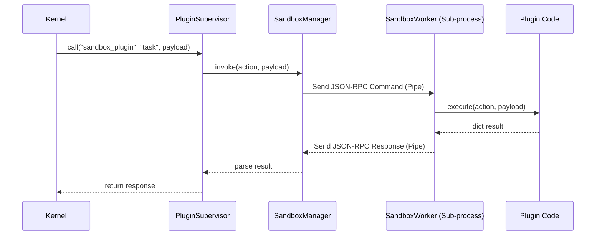
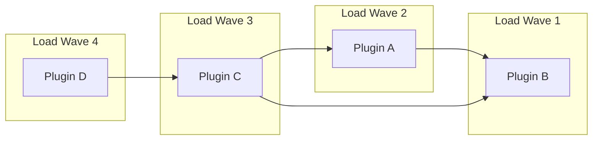

# Advanced Architecture Deep Dive

This guide provides an exhaustive technical analysis of XCore's internal mechanisms, intended for core developers and framework integrators.

## 1. The Kernel Orchestration

The **Xcore** class is the central orchestrator. Its lifecycle involves several distinct phases:
1.  **Configuration Loading**: Parsed via `XcoreConfig` into typed dataclasses.
2.  **Service Initialization**: Ordered boot of Databases -> Caches -> Schedulers -> Extensions.
3.  **Plugin Discovery**: The `PluginLoader` scans the designated directory and parses manifests.
4.  **Dependency Resolution**: A directed acyclic graph (DAG) is built to determine the topological load order.
5.  **Activation**: Depending on the `execution_mode`, plugins are activated via `TrustedActivator` or `SandboxedActivator`.
6.  **FastAPI Integration**: Routers are collected and mounted under the specified prefix.

## 2. Plugin Supervisor & Middleware Pipeline

Every cross-plugin call (`supervisor.call`) is processed through a strict middleware stack to ensure security, observability, and resilience.

### Middleware Execution Order:
1.  **TracingMiddleware**: Generates or propagates OpenTelemetry spans.
2.  **RateLimitMiddleware**: Enforces per-plugin throughput limits defined in the manifest.
3.  **PermissionMiddleware**: Validates the caller's rights against the target resource using the `PermissionEngine`.
4.  **RetryMiddleware**: Automatically retries failed calls based on the plugin's `runtime.retry` configuration.
5.  **Final Dispatch**: Executes the call on the actual `PluginHandler`.

## 3. Sandboxing & Isolation Mechanism

XCore's sandboxing is multi-layered, providing a "Defense in Depth" approach.

### Layer 1: Static Analysis (AST Scanner)
Before execution, the `ASTScanner` parses the plugin's source code. It blocks:
- **Forbidden Imports**: Modules like `os`, `subprocess`, `socket`, `shutil`.
- **Dangerous Built-ins**: `eval`, `exec`, `__import__`, `open`.
- **Sensitive Attribute Access**: `__class__`, `__globals__`, `__subclasses__` to prevent sandbox escapes.

### Layer 2: Process Isolation
Sandboxed plugins run in a separate OS process via `SandboxProcessManager`.
- **Communication**: Uses a JSON-RPC 2.0 compliant protocol over dedicated IPC pipes.
- **Worker Process**: The `SandboxWorker` acts as the shim, receiving calls, executing them in an isolated thread, and returning serialized results.

### Layer 3: Resource Constraints
Process-level limits are enforced:
- **Memory**: Max RSS (Resident Set Size) is monitored and capped.
- **Timeouts**: The IPC channel includes a hard timeout; if exceeded, the worker is terminated.
- **Filesystem**: Access is restricted to the plugin's `data/` directory via logical validation.

## 4. The Event System (Observer Pattern)

The `EventBus` is an asynchronous implementation of the Observer pattern.

### Advanced Features:
- **Priorities**: Handlers with higher priority integers are executed first.
- **Propagation Control**: Handlers can call `event.stop_propagation()` to prevent the event from reaching subsequent handlers.
- **System Hooks**: Internal kernel events (e.g., `xcore.plugins.booted`) allow services to react to the framework's state changes.
- **Async & Sync Emission**: Supports `await bus.emit()` (parallel execution) and `bus.emit_sync()` (fire-and-forget).

## 5. Service Lifecycle & Dependency Injection

The `ServiceContainer` manages shared resources.
- **Init Order**: Database -> Cache -> Scheduler -> Extensions.
- **Shutdown Order**: Inverse of initialization.
- **Scoping**: Services can be `public` (accessible to all plugins) or `private` (restricted to the kernel).
- **Injection**: Plugins receive a reference to the container via `self.ctx.services`.

## 6. Logic Flow Diagrams

### Plugin Call Sequence (JSON-RPC over IPC)

### Dependency Resolution (Kahn's Algorithm)

