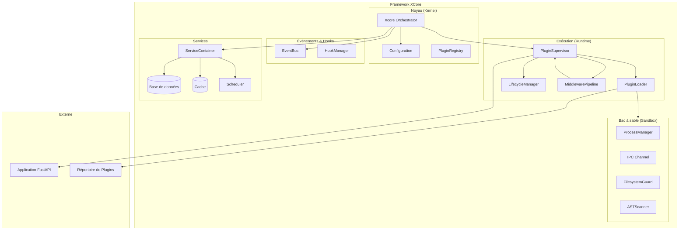
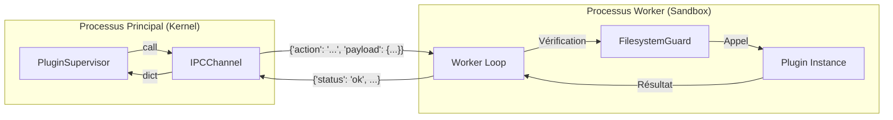

# Présentation de l'Architecture XCore v2

Comprendre l'architecture et les principes de conception de XCore v2 pour construire des applications robustes et performantes.

---

## 1. Philosophie de Conception

XCore suit ces principes fondamentaux :

1. **Plugin-First** : Le framework lui-même est minimal ; presque toutes les fonctionnalités sont apportées par des plugins.
2. **Sécurité par Défaut** : Exécution isolée (Sandboxing) avec limites de ressources strictes (CPU/RAM).
3. **Services Intégrés** : Infrastructure commune (DB, Cache, Scheduler) prête à l'emploi.
4. **Communication Découplée** : Architecture pilotée par les événements (Event Bus) et IPC (JSON-RPC).
5. **Observabilité Native** : Logs structurés, métriques et traces distribuées dès le premier jour.

---

## 2. Architecture Système (Vue d'ensemble)



---

## 3. Flux de Démarrage (Boot Flow)

L'orchestrateur coordonne l'initialisation de tous les sous-systèmes dans un ordre strict pour garantir que les dépendances sont satisfaites.

```mermaid
sequenceDiagram
    participant App as Application
    participant X as Xcore
    participant SC as ServiceContainer
    participant EB as EventBus
    participant PS as PluginSupervisor
    participant PL as PluginLoader
    participant FA as FastAPI

    App->>+X: boot(app)

    X->>+SC: init()
    Note over SC: Initialisation DB, Cache, Scheduler
    SC-->>-X: Services prêts

    X->>EB: init(EventBus, HookManager)

    X->>+PS: boot()
    PS->>+PL: load_all()
    Note over PL: Résolution topologique (Algorithme de Kahn)
    PL-->>-PS: Plugins chargés
    PS-->>-X: Supervisor prêt

    X->>+FA: attach_router(system_ipc_router)
    X->>FA: mount_plugin_routers()
    X-->>-App: Système prêt
```

---

## 4. Communication Inter-Processus (IPC)

La communication entre le Noyau et les plugins sandboxed utilise un protocole JSON-RPC léger sur les flux standards (stdin/stdout).



- **Sécurité** : Chaque message est une ligne JSON unique.
- **Isolation** : Le worker ne peut pas initier de commandes vers le noyau.
- **Robustesse** : Utilisation d'un lock IPC pour garantir l'atomicité des échanges.

---

## 5. Performance et Optimisations

XCore est optimisé pour les environnements de production à haute charge :

- **Middleware Pipeline** : Le pipeline est pré-compilé en fermetures imbriquées (closures) au boot, éliminant l'overhead de récursivité lors de chaque appel (gain de ~12-18% sur la latence).
- **Fast-Path Permissions** : Le moteur de permissions utilise des sets d'actions pré-calculés et une égalité de chaîne littérale avant de recourir aux regex complexes.
- **Concurrent Execution** : Suppression des transitions d'états inutiles dans le `LifecycleManager` pour permettre le traitement asynchrone massif sans blocage du supervisor.
- **Minimal Overhead (Trusted)** : Un appel vers un plugin `trusted` ajoute un overhead de moins de **1µs** par rapport à un appel de fonction Python direct.
