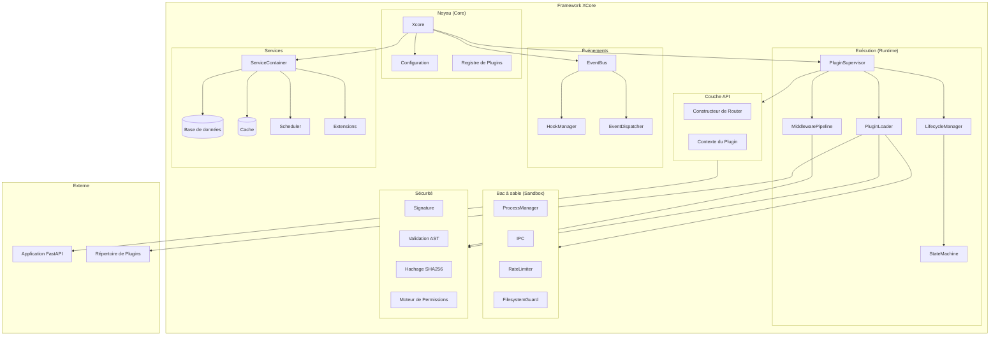
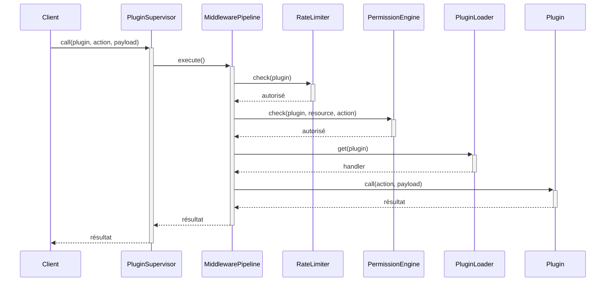
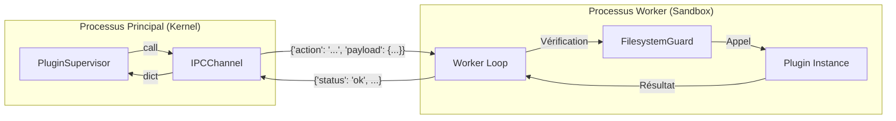
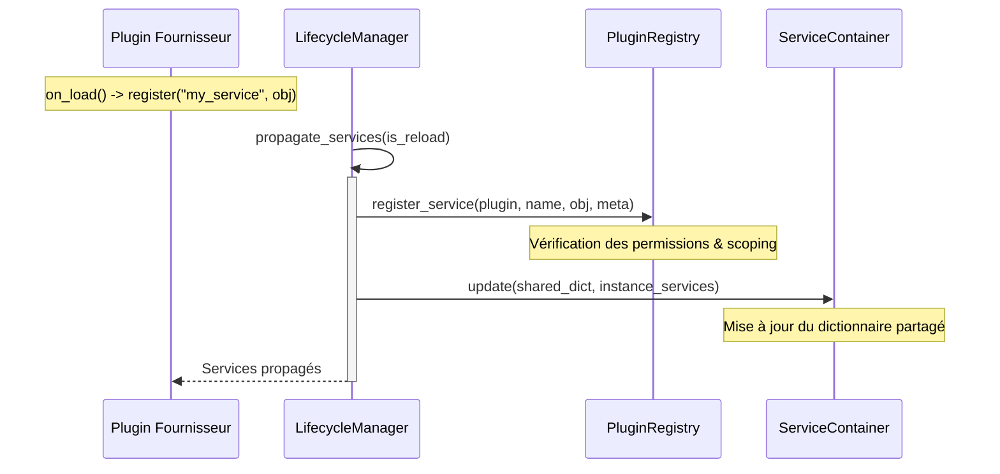
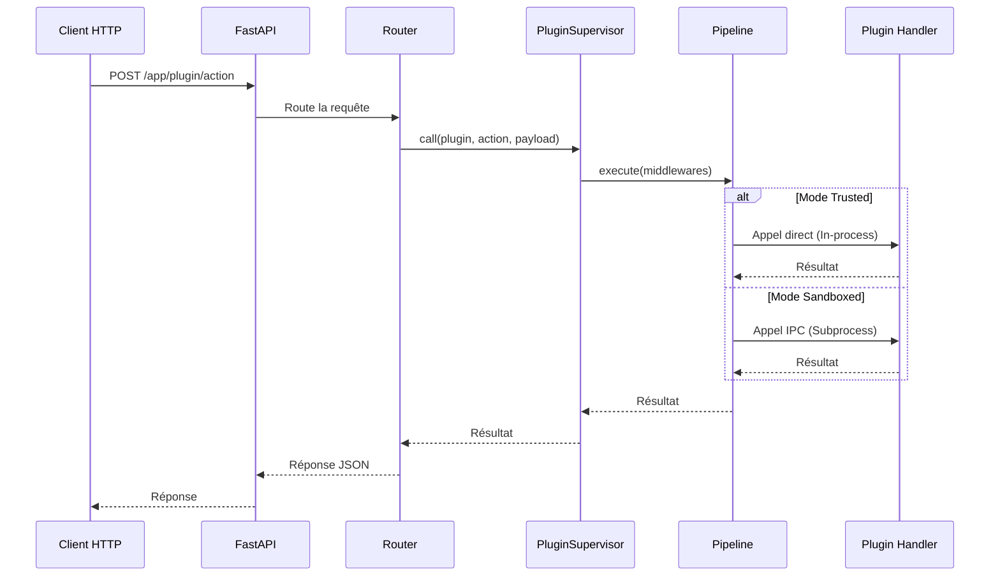

# Présentation de l'Architecture

Comprendre l'architecture et les principes de conception de XCore v2.

## Philosophie de Conception

XCore suit ces principes fondamentaux :

1. **Plugin-First** : Tout est un plugin. Les fonctionnalités du noyau sont minimales.
2. **Sécurité par Défaut** : Exécution sandboxée avec limites de ressources strictes.
3. **Orienté Services** : Services partagés pour les besoins courants (DB, Cache, Scheduler).
4. **Piloté par les Événements** : Couplage faible via un bus d'événements haute performance.
5. **Prêt pour la Production** : Observabilité, métriques et journalisation structurée intégrées.

## Architecture Système



## Détails des Composants

### Composants du Noyau

#### Xcore (Orchestrateur)

**Emplacement** : `xcore/__init__.py`

L'orchestrateur principal est le point d'entrée unique du framework. Il coordonne l'initialisation de tous les sous-systèmes dans un ordre strict pour garantir que les dépendances sont satisfaites.

**Flux de démarrage détaillé (Boot Flow) :**

1.  **Chargement de la Configuration** : Utilise `ConfigLoader` pour fusionner `xcore.yaml`, les variables d'environnement (`XCORE__*`) et les valeurs par défaut.
2.  **Initialisation de l'Observabilité** : Mise en place du `MetricsRegistry`, du `Tracer` et du `HealthChecker`.
3.  **Démarrage des Services** : Le `ServiceContainer` initialise les connexions aux bases de données, au cache Redis et au planificateur de tâches.
4.  **Bus d'Événements** : Instanciation de l' `EventBus` et du `HookManager` pour la communication inter-plugins.
5.  **Supervisor & Registry** : Le `PluginSupervisor` prend le relais pour charger les plugins, tandis que le `PluginRegistry` indexe leurs capacités.
6.  **Exposition API** : Si une application FastAPI est fournie, XCore y attache automatiquement le router système et les routers personnalisés des plugins.

```mermaid
sequenceDiagram
    participant App as Application
    participant X as Xcore
    participant Obs as Observability
    participant SC as ServiceContainer
    participant EB as EventBus
    participant PS as PluginSupervisor
    participant PL as PluginLoader
    participant FA as FastAPI

    App->>+X: boot(app)
    X->>Obs: init(Metrics, Tracer, Health)

    X->>+SC: init()
    SC->>SC: setup_databases()
    SC->>SC: setup_cache()
    SC-->>-X: services prêts

    X->>EB: init(Bus, Hooks)
    X->>X: init_registry()

    X->>+PS: boot()
    PS->>+PL: load_all()
    Note over PL: Résolution topologique des dépendances
    PL-->>-PS: plugins chargés
    PS-->>-X: supervisor prêt

    X->>+FA: attach_router(system_router)
    X->>FA: attach_plugin_routers()
    X-->>-App: Système prêt
```

### Composants Runtime

#### PluginSupervisor

**Emplacement** : `xcore/kernel/runtime/supervisor.py`

Gestion de haut niveau des plugins via un pipeline de middlewares :
- Cycle de vie des plugins.
- Routage des actions.
- Limites de débit (Rate limiting).
- Logique de tentative (Retry) avec backoff exponentiel.
- Vérification des permissions.



#### PluginLoader

**Emplacement** : `xcore/kernel/runtime/loader.py`

Le `PluginLoader` est responsable de la découverte et de l'instanciation des plugins. Il effectue plusieurs passes :
1.  **Scan** : Énumération des dossiers dans le répertoire des plugins.
2.  **Manifest Parsing** : Lecture de `plugin.yaml` pour chaque extension.
3.  **Dependency Graph** : Construction d'un graphe orienté des dépendances.
4.  **Topological Sort** : Calcul de l'ordre de chargement optimal.

##### Résolution des Dépendances (Algorithme de Kahn)

XCore utilise l'algorithme de **Kahn** (`xcore/kernel/runtime/dependency.py`) pour résoudre l'ordre de chargement des plugins en fonction de leurs dépendances déclarées (`requires` dans le manifeste).

-   Le système construit un graphe acyclique dirigé (DAG).
-   Les nœuds sans dépendances sont chargés en premier.
-   Si une boucle de dépendance est détectée (ex: A dépend de B, B dépend de A), le framework lève une `ValueError` et refuse de démarrer pour éviter les états instables.

### Composants Sandbox

#### ProcessManager

**Emplacement** : `xcore/kernel/sandbox/process_manager.py`

Le `ProcessManager` orchestre l'exécution des plugins en mode `sandboxed`. Chaque plugin tourne dans un processus Python distinct, garantissant une isolation mémoire et CPU totale par rapport au noyau.

##### Mécanisme IPC (Inter-Process Communication)

La communication entre le Kernel et les Workers sandboxed s'effectue via un canal IPC sécurisé (`xcore/kernel/sandbox/ipc.py`) :

-   **Protocole** : JSON-RPC léger sur flux `stdin` / `stdout`.
-   **Transport** : Chaque message est une ligne JSON unique terminée par un retour à la ligne (`\n`), permettant un parsing efficace et asynchrone via `asyncio.StreamReader`.
-   **Sécurité** :
    -   Le Worker ne peut jamais initier de commande vers le Kernel (modèle Pull/Response).
    -   Les réponses trop volumineuses (> 512 Ko par défaut) sont rejetées pour éviter les attaques par déni de service mémoire.
    -   Un verrou (`asyncio.Lock`) garantit que les échanges sont atomiques et qu'aucune collision de message ne se produit.



### Système de Sécurité

#### FilesystemGuard

**Emplacement** : `xcore/kernel/sandbox/worker.py`

Protection du système de fichiers par monkey-patching :
- Intercepte `open()`, `os.open()`, `pathlib.Path.open()`, etc.
- Valide les chemins par rapport à une politique `allowed_paths` / `denied_paths`.
- Empêche l'évasion par résolution de chemins absolus ou relatifs complexes.

#### ASTScanner

**Emplacement** : `xcore/kernel/security/validation.py`

Analyse statique du code source :
- Bloque les imports dangereux (`os`, `sys`, `subprocess`).
- Interdit les built-ins sensibles (`eval`, `exec`, `getattr`, `hasattr`).
- Empêche l'accès aux attributs internes (`__class__`, `__globals__`, `__subclasses__`).

## Flux de Données

### Propagation des Services

La propagation des services est le mécanisme par lequel un plugin expose des fonctionnalités à d'autres plugins. Ce flux garantit que les services sont enregistrés et disponibles dans le container global avant que les plugins dépendants ne soient chargés.



- **Isolation** : Un plugin ne peut pas écraser les services "Core" (db, cache, scheduler).
- **Vagues** : La propagation a lieu après chaque vague de chargement topologique.

### Flux d'Action de Plugin (IPC)



## Performance et Optimisations

XCore est optimisé pour les environnements à haute charge :
- **Appels concurrents** : La machine à états a été simplifiée pour permettre plusieurs appels simultanés sur le même plugin.
- **Overhead minimal** : Un appel en mode Trusted prend environ **~0.8µs** (hors logique métier).
- **Batching** : Support des opérations groupées (`mget`, `mset`) pour réduire la latence réseau des services (Redis).
- **Caching** : Mémoïsation des vérifications de permissions et des types de fonctions.
