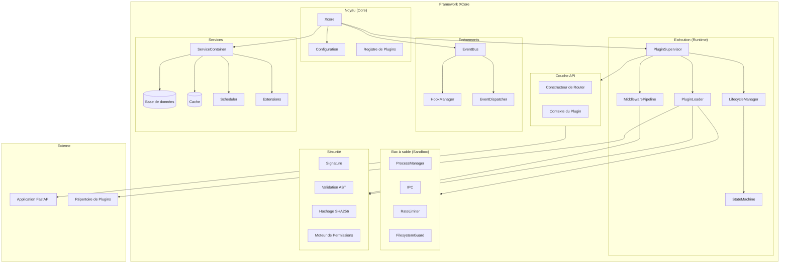
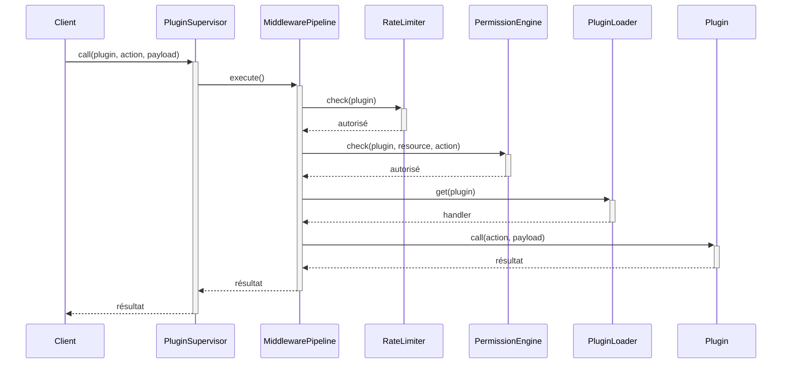
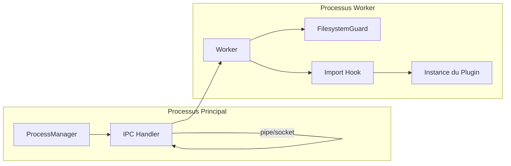
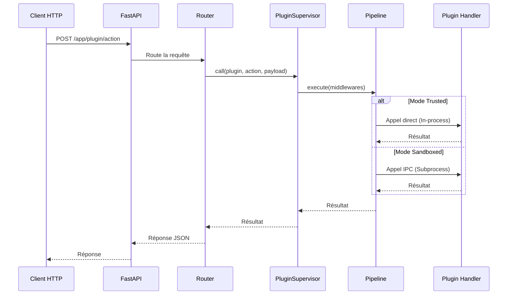

# Présentation de l'Architecture

Comprendre l'architecture et les principes de conception de XCore v2.

## Philosophie de Conception

XCore suit ces principes fondamentaux :

1. **Plugin-First** : Tout est un plugin. Les fonctionnalités du noyau sont minimales.
2. **Sécurité par Défaut** : Exécution sandboxée avec limites de ressources strictes.
3. **Orienté Services** : Services partagés pour les besoins courants (DB, Cache, Scheduler).
4. **Piloté par les Événements** : Couplage faible via un bus d'événements haute performance.
5. **Prêt pour la Production** : Observabilité, métriques et journalisation structurée intégrées.

## Architecture Système



## Détails des Composants

### Composants du Noyau

#### Xcore (Orchestrateur)

**Emplacement** : `xcore/__init__.py`

L'orchestrateur principal qui :
- Charge la configuration.
- Initialise les services.
- Démarre le système de plugins.
- Attache les routeurs FastAPI.

```mermaid
sequenceDiagram
    participant App as Application
    participant X as Xcore
    participant SC as ServiceContainer
    participant PS as PluginSupervisor
    participant FA as FastAPI

    App->>+X: __init__(config_path)
    X->>X: load_config()
    X-->>-App: instance

    App->>+X: boot(app)
    X->>+SC: init()
    SC->>SC: init_databases()
    SC->>SC: init_cache()
    SC->>SC: init_scheduler()
    SC-->>-X: services prêts

    X->>X: init_events()
    X->>X: init_hooks()
    X->>X: init_registry()

    X->>+PS: boot()
    PS->>PS: load_all_plugins()
    PS-->>-X: plugins prêts

    X->>FA: attach_router()
    X-->>-App: prêt
```

### Composants Runtime

#### PluginSupervisor

**Emplacement** : `xcore/kernel/runtime/supervisor.py`

Gestion de haut niveau des plugins via un pipeline de middlewares :
- Cycle de vie des plugins.
- Routage des actions.
- Limites de débit (Rate limiting).
- Logique de tentative (Retry) avec backoff exponentiel.
- Vérification des permissions.



#### PluginLoader

**Emplacement** : `xcore/kernel/runtime/loader.py`

Logique de chargement des plugins :
- Scan des répertoires.
- Analyse des manifestes (YAML/JSON).
- Résolution des dépendances.
- Tri topologique pour l'ordre de chargement.
- Chargement spécifique au mode (Trusted/Sandboxed).

### Composants Sandbox

#### ProcessManager

**Emplacement** : `xcore/kernel/sandbox/process_manager.py`

Exécution isolée :
- Lancement de sous-processus.
- Communication IPC via JSON-RPC.
- Surveillance des ressources (Mémoire via RLIMIT_AS).
- Gestion des délais d'expiration (Timeouts).



### Système de Sécurité

#### FilesystemGuard

**Emplacement** : `xcore/kernel/sandbox/worker.py`

Protection du système de fichiers par monkey-patching :
- Intercepte `open()`, `os.open()`, `pathlib.Path.open()`, etc.
- Valide les chemins par rapport à une politique `allowed_paths` / `denied_paths`.
- Empêche l'évasion par résolution de chemins absolus ou relatifs complexes.

#### ASTScanner

**Emplacement** : `xcore/kernel/security/validation.py`

Analyse statique du code source :
- Bloque les imports dangereux (`os`, `sys`, `subprocess`).
- Interdit les built-ins sensibles (`eval`, `exec`, `getattr`, `hasattr`).
- Empêche l'accès aux attributs internes (`__class__`, `__globals__`, `__subclasses__`).

## Flux de Données

### Flux d'Action de Plugin (IPC)



## Performance et Optimisations

XCore est optimisé pour les environnements à haute charge :
- **Appels concurrents** : La machine à états a été simplifiée pour permettre plusieurs appels simultanés sur le même plugin.
- **Overhead minimal** : Un appel en mode Trusted prend environ **~0.8µs** (hors logique métier).
- **Batching** : Support des opérations groupées (`mget`, `mset`) pour réduire la latence réseau des services (Redis).
- **Caching** : Mémoïsation des vérifications de permissions et des types de fonctions.
