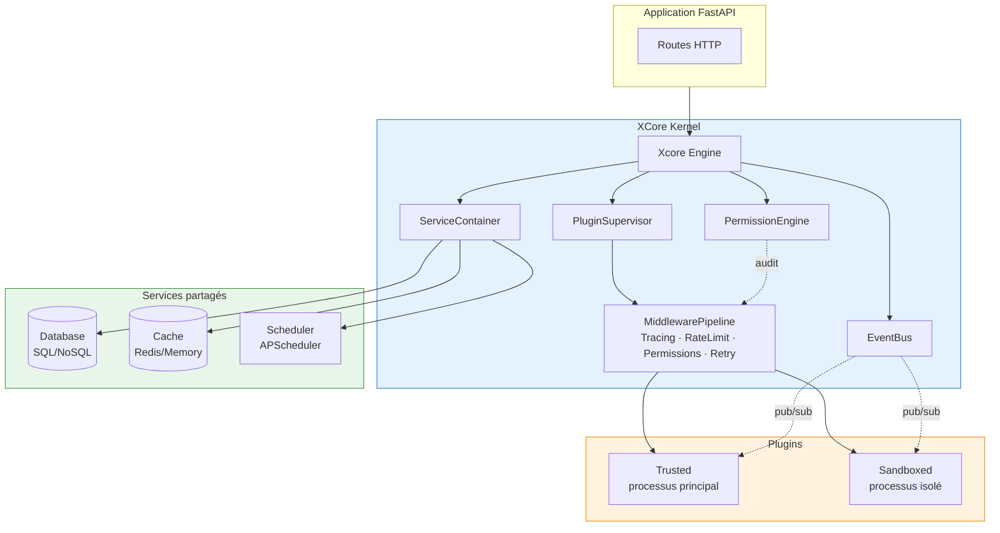
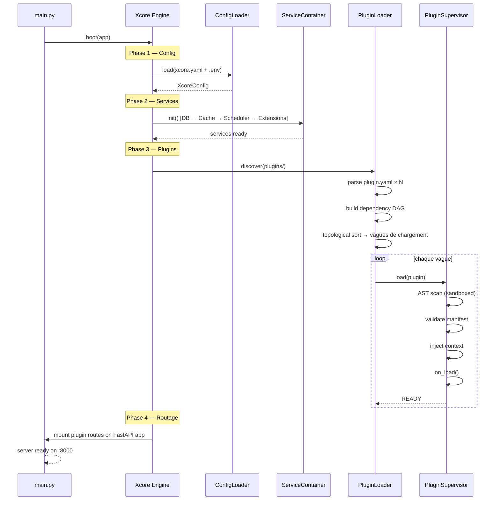
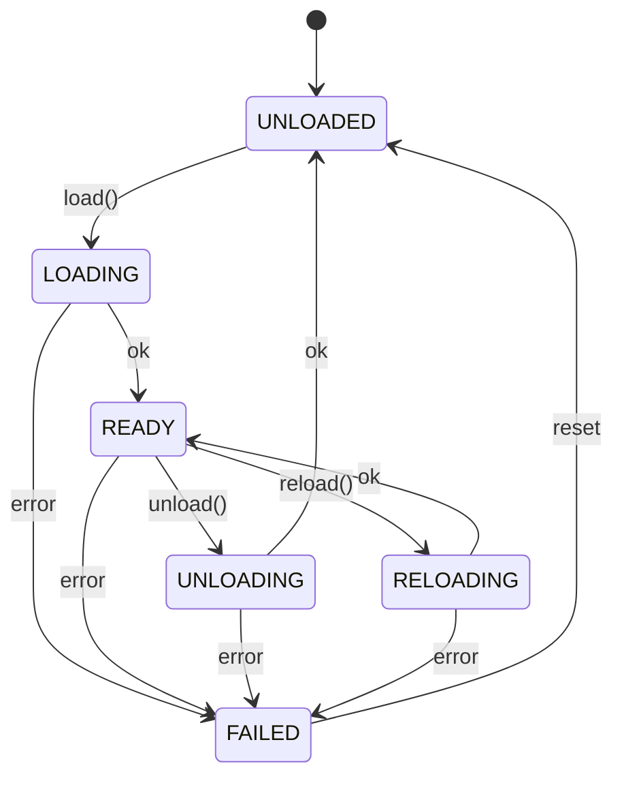

# Architecture

XCore suit le pattern **Modular Monolith** : tous les plugins s'exécutent dans un environnement orchestré unifié, isolés via des frontières logiques (permissions, injection de contexte) et physiques (sandbox OS pour les plugins `sandboxed`).

---

## Vue d'ensemble



---

## Composants principaux

| Composant | Module | Rôle |
|:----------|:-------|:-----|
| `Xcore` | `xcore/__init__.py` | Point d'entrée — orchestre le boot/shutdown |
| `PluginSupervisor` | `kernel/runtime/supervisor.py` | Lifecycle plugins + pipeline d'appels |
| `PluginLoader` | `kernel/runtime/loader.py` | Découverte, import, résolution du DAG |
| `StateMachine` | `kernel/runtime/state_machine.py` | FSM par plugin (UNLOADED→LOADING→READY…) |
| `ServiceContainer` | `services/container.py` | Registry DB, Cache, Scheduler |
| `EventBus` | `kernel/events/bus.py` | Messagerie async pub/sub avec wildcards |
| `HookManager` | `kernel/events/hooks.py` | Hooks before/after sur le cycle de vie |
| `PermissionEngine` | `kernel/permissions/engine.py` | PBAC avec cache LRU |
| `PluginRegistry` | `registry/index.py` | Métadonnées et dépendances |
| `ManifestValidator` | `kernel/security/validation.py` | Validation manifeste + scan AST |

---

## Séquence de boot



---

## Machine d'états des plugins



Transitions invalides lèvent `InvalidTransition`.

---

## Pipeline d'appel inter-plugins

Quand le Plugin A appelle le Plugin B via `call_plugin()`, l'appel transite par le `MiddlewarePipeline` :

```
Plugin A → TracingMiddleware → RateLimitMiddleware → PermissionMiddleware → RetryMiddleware → Plugin B
```

| Middleware | Rôle |
|:-----------|:-----|
| `TracingMiddleware` | Crée un span, propage le contexte |
| `RateLimitMiddleware` | Vérifie le quota de l'appelant (calls/période) |
| `PermissionMiddleware` | Vérifie la policy via `PermissionEngine` |
| `RetryMiddleware` | Retry exponentiel sur erreurs transitoires |

---

## Sandboxing (plugins `sandboxed`)

Trois couches de protection en cascade :

```
Couche 1 — AST Scan (statique, avant import)
  └─ modules interdits : os, subprocess, …
  └─ builtins interdits : eval, exec, …
  └─ attributs dangereux : __globals__, __subclasses__, …

Couche 2 — Isolation processus
  └─ processus OS dédié
  └─ IPC JSON-RPC 2.0 sur pipes stdin/stdout (pas de pickle)

Couche 3 — Limites de ressources
  └─ timeout CPU (kill si dépassé)
  └─ mémoire RSS max (kill si dépassée)
  └─ rate limit (429 si quota dépassé)
```

---

## Service Container — ordre d'initialisation

```
Database → Cache → Scheduler → Extensions
```

Shutdown dans l'ordre inverse :

```
Extensions → Scheduler → Cache → Database
```

Les connexions multiples à la même base (`db`, `analytics`, `redis_db`) sont toutes enregistrées dans le container sous leurs clés respectives. La première connexion déclarée est aussi enregistrée sous `"db"` comme alias par défaut.

---

## Résolution des dépendances entre plugins

`PluginLoader` construit un **DAG** (directed acyclic graph) à partir des champs `requires` de chaque manifeste. Un tri topologique détermine l'ordre de chargement par vagues :

- Les plugins d'une même vague sont chargés en parallèle.
- Un cycle de dépendances lève `CyclicDependencyError` au démarrage.
- Une dépendance manquante lève `MissingDependencyError`.

---

## Décisions architecturales

Voir [Decisions](decisions.md) pour les choix de design (pourquoi JSON-RPC plutôt que `multiprocessing.Queue`, pourquoi `fnmatch` pour les policies, etc.).
