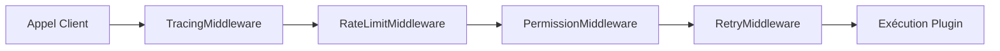
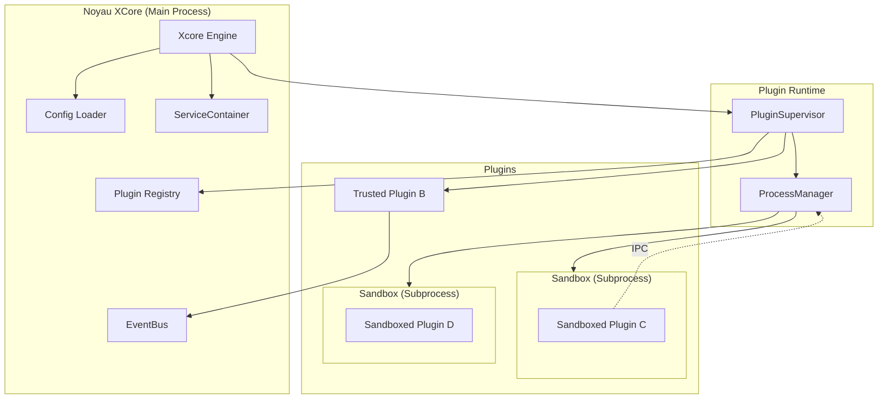

# Architecture Technique XCore

XCore est un framework de plugins conçu pour la performance, la sécurité et l'extensibilité.

## Principes de Conception

1. **Modularité Totale** : Le noyau (Core) est minimal. Tout est un plugin ou un service.
2. **Isolation par Défaut** : Les plugins tiers s'exécutent dans des sous-processus isolés.
3. **Zéro Confiance** : L'accès aux services et ressources est contrôlé par un système de permissions ACL.

## Composants Majeurs

### 1. Le Noyau (Xcore)
Le point d'entrée qui orchestre le chargement de la configuration, l'initialisation des services et le démarrage du `PluginSupervisor`.

### 2. PluginSupervisor
Gère le cycle de vie de tous les plugins. Chaque appel à un plugin passe par une **Pipeline de Middleware**.

### 3. ServiceContainer
Centralise l'accès aux ressources partagées. Les services sont chargés dans un ordre strict pour permettre la résolution des dépendances (ex: le Scheduler a besoin de la DB).

### 4. Sandbox (Isolated Runtime)
Pour les plugins en mode `sandboxed` :
- **ProcessManager** : Spawne et surveille les sous-processus.
- **IPC (Inter-Process Communication)** : Canal JSON-RPC asynchrone sur stdin/stdout.
- **FilesystemGuard** : Intercepteur d'appels `os` et `pathlib` pour limiter l'accès au dossier `data/`.
- **ASTScanner** : Analyseur de code statique qui bloque les imports et patterns dangereux.

## Flux de Données

### Appel d'Action (IPC/Internal)
Lorsqu'une action est appelée sur un plugin :
1. Le `PluginSupervisor` intercepte l'appel.
2. Le `PermissionMiddleware` vérifie si l'appelant a le droit de demander cette action.
3. Le `RateLimitMiddleware` vérifie les quotas.
4. Si le plugin est `trusted`, l'appel est direct (asynchrone).
5. Si le plugin est `sandboxed`, l'appel est envoyé via le canal IPC au worker dédié.

### Événements (EventBus)
L' `EventBus` est asynchrone et supporte les wildcards (`*`). Les événements sont diffusés à tous les souscripteurs par ordre de priorité.

## Schéma d'Architecture Global

## Performance et Optimisations

XCore est optimisé pour les environnements de production :
- **Middleware pré-compilés** : Pas de récursion dynamique par appel.
- **Rate Limiting synchrone** : 0 overhead d'asyncio lock sur le chemin critique.
- **Shared Service Connections** : Réutilisation des pools de connexions DB et Redis.
- **Lazy Loading** : Les plugins ne sont chargés que lorsque nécessaire (si configuré).
