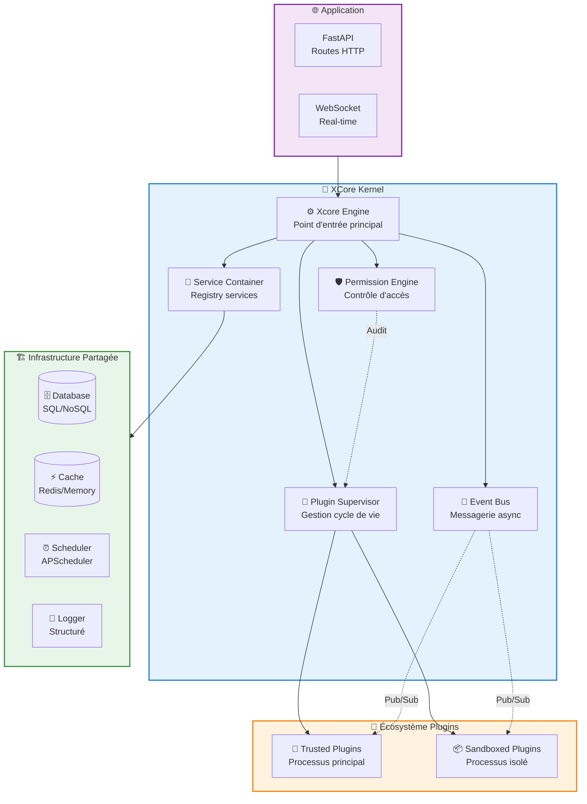
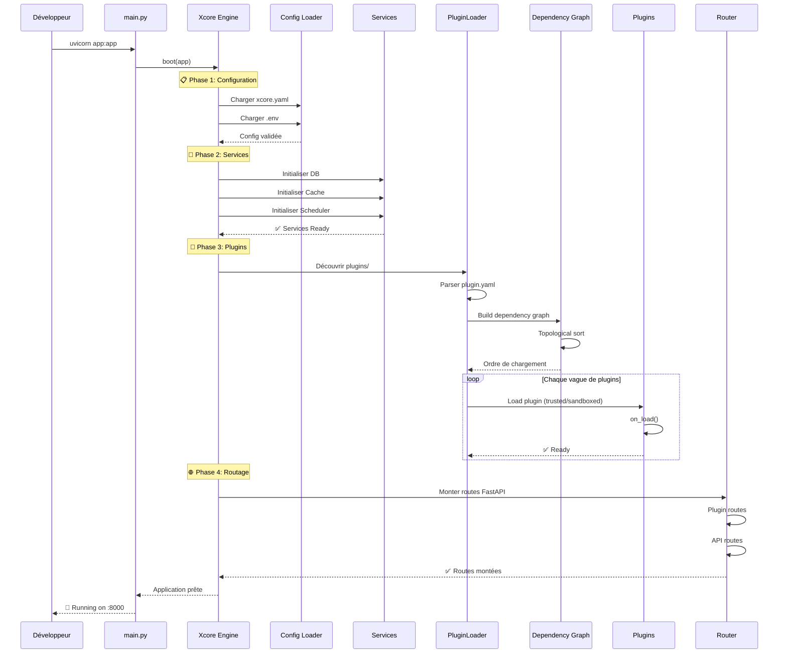
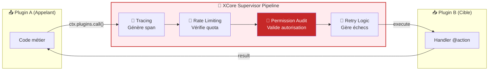
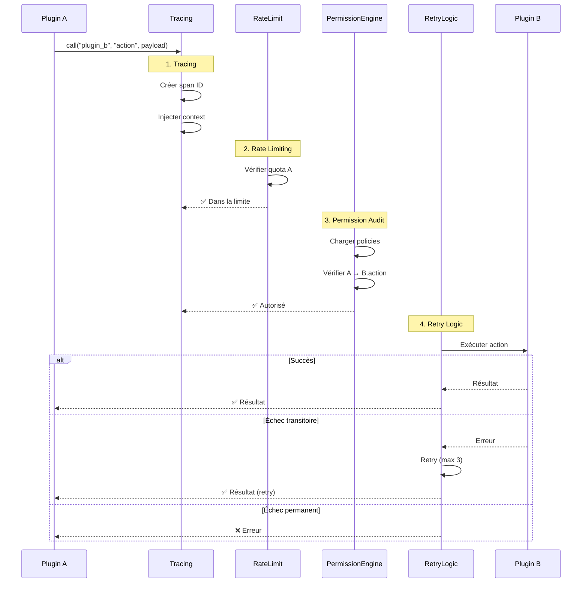
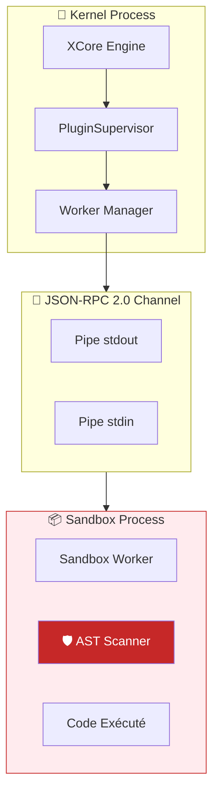
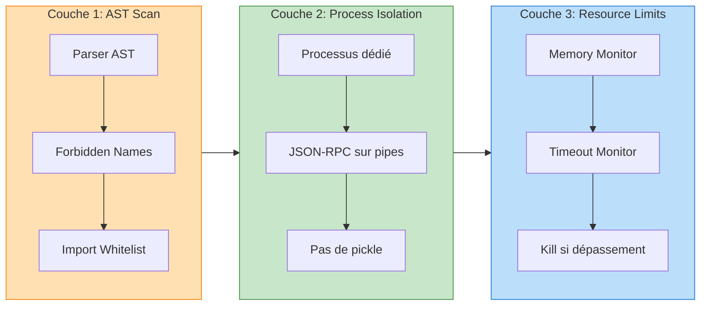
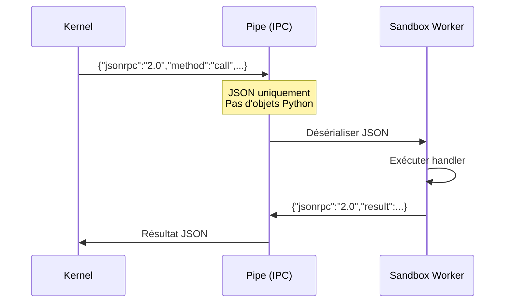
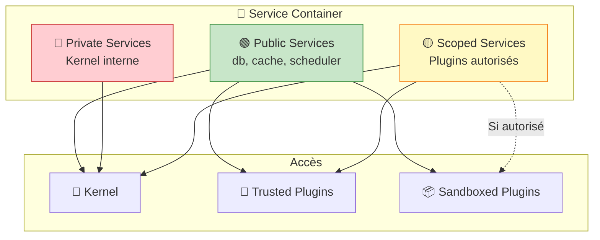
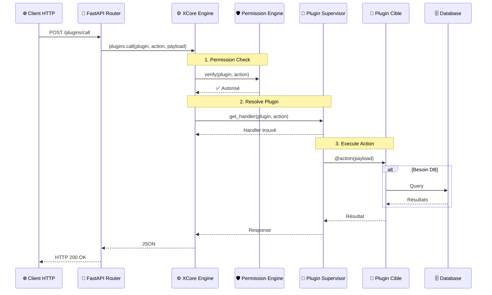

# Architecture Overview

Plongée approfondie dans l'architecture interne de XCore : comment le kernel, les services et les plugins interagissent.

---

## 1. Vue d'Ensemble Haute Niveau

XCore suit le pattern **Modular Monolith**. Tous les plugins s'exécutent dans un environnement orchestré unifié, mais sont strictement isolés via des frontières logiques (injection de contexte) et physiques (sandbox au niveau processus).



### Composants Clés

| Composant | Rôle | Analogie |
| :--- | :--- | :--- |
| **Xcore Engine** | Point d'entrée, coordonne le boot | Chef d'orchestre |
| **PluginSupervisor** | Lifecycle, hot-reload, IPC | Gestionnaire de processus |
| **ServiceContainer** | Registry DB, Cache, Scheduler | Boîte à outils partagée |
| **EventBus** | Dispatcher async Observer pattern | Système de notification |
| **PermissionEngine** | Policy-based access control | Garde de sécurité |

---

## 2. Boot Sequence Détaillée

Le framework suit une séquence d'initialisation stricte pour garantir que toutes les dépendances sont résolues avant le démarrage des plugins.



### Détails des Phases

```mermaid
gantt
    title Boot Sequence Timeline
    dateFormat X
    axisFormat %L
    
    section Configuration
    Charger YAML      :a1, 0, 10
    Charger ENV       :a2, after a1, 5
    Validation        :a3, after a2, 5
    
    section Services
    Database          :b1, after a3, 20
    Cache             :b2, after a3, 15
    Scheduler         :b3, after a3, 10
    
    section Plugins
    Discovery         :c1, after b1, 10
    DAG Build         :c2, after c1, 15
    Load Wave 1       :c3, after c2, 30
    Load Wave 2       :c4, after c3, 30
    
    section Routing
    Mount Routes      :d1, after c4, 10
```



---

## 3. Machine d'État des Plugins

Chaque plugin est géré par une **Finite State Machine (FSM)** pour assurer des transitions sûres pendant les hot-reloads ou en cas d'échec.

```mermaid
stateDiagram-v2
    [*] --> UNLOADED: Découverte
    
    UNLOADED --> LOADING: supervisor.load()
    
    state LOADING {
        [*] --> SCANNING: AST Scan
        SCANNING --> VALIDATING: Scan OK
        VALIDATING --> INSTANTIATING: Manifest OK
        INSTANTIATING --> INITIALIZING: Entry point OK
        INITIALIZING --> READY: on_load() OK
    end
    
    LOADING --> FAILED: Erreur AST
    LOADING --> FAILED: Erreur Manifest
    LOADING --> FAILED: Erreur on_load()
    
    READY --> RELOADING: supervisor.reload()
    
    state RELOADING {
        [*] --> UNLOADING: on_unload()
        UNLOADING --> RELOADING_CODE: Recharger code
        RELOADING_CODE --> RE_INITIALIZING: Nouveau on_load()
        RE_INITIALIZING --> READY: Succès
    end
    
    RELOADING --> FAILED: Échec reload
    
    READY --> UNLOADED: supervisor.unload()
    FAILED --> UNLOADED: Cleanup
    FAILED --> RELOADING: Retry (max 3)
    
    note right of READY
        🟢 État stable
        - Routes actives
        - Événements abonnés
        - Services connectés
    end note
    
    note right of FAILED
        🔴 État terminal
        - Erreur enregistrée
        - Cleanup requis
        - Notification envoyée
    end note
    
    note right of UNLOADED
        ⚪ État initial/final
        - Code non chargé
        - Aucune ressource
    end note
```

### Codes d'État

| État | Signification | Actions Possibles |
| :--- | :--- | :--- |
| `UNLOADED` | Plugin découvert mais non chargé | `load()` |
| `LOADING` | Initialisation en cours | Attendre |
| `READY` | Plugin opérationnel | `reload()`, `unload()`, `call()` |
| `RELOADING` | Mise à jour à chaud | Attendre |
| `FAILED` | Erreur irrécupérable | `unload()`, `reload()` (retry) |

---

## 4. Communication Inter-Plugins (IPC)

Quand le **Plugin A** appelle le **Plugin B**, l'appel n'est **jamais direct**. Il transite par le **Supervisor Pipeline** du kernel.

### Architecture du Pipeline



### Détail des Étapes du Pipeline



### Middleware Stack Détaillé

| Étape | Rôle | Détails |
| :--- | :--- | :--- |
| **Tracing** | Observabilité | Génère un span OpenTelemetry, propage le context |
| **Rate Limiting** | Protection | Vérifie le quota du caller (calls/période) |
| **Permission Audit** | Sécurité | Valide la policy `resource: action` |
| **Retry Logic** | Résilience | Retry exponentiel sur erreurs transitoires |

---

## 5. Modèle de Sandboxing

Les plugins sandboxed s'exécutent dans un **processus OS dédié**. C'est le niveau d'isolation le plus élevé.

### Architecture du Sandbox



### Les 3 Couches de Protection



#### Couche 1: Analyse Statique (AST)

Avant exécution, l'`ASTScanner` parse l'arbre syntaxique du plugin :

```python
# Ce qui est BLOQUÉ :
import os          # ❌ Forbidden module
import subprocess  # ❌ Forbidden module
eval()             # ❌ Forbidden name
exec()             # ❌ Forbidden name
__class__          # ❌ Forbidden attribute
__globals__        # ❌ Forbidden attribute
__subclasses__()   # ❌ Forbidden attribute (sandbox escape)
```

#### Couche 2: Isolation Processus



#### Couche 3: Limites de Ressources

| Ressource | Limite | Action |
| :--- | :--- | :--- |
| **Mémoire (RSS)** | `max_memory_mb` | Kill process si dépassement |
| **Temps CPU** | `timeout_seconds` | Kill + timeout error |
| **Appels** | `rate_limit` | 429 Too Many Requests |

---

## 6. Service Scoping

Les services enregistrés dans le `ServiceContainer` ont différents niveaux de visibilité :



### Matrice d'Accès

| Scope | Description | Accès | Exemple |
| :--- | :--- | :--- | :--- |
| **Public** | Infrastructure générale | Kernel + Tous plugins | `db`, `cache`, `scheduler` |
| **Private** | Services kernel internes | Kernel uniquement | `permission_engine`, `plugin_supervisor` |
| **Scoped** | Restreint à plugins spécifiques | Plugins autorisés uniquement | `stripe_api` (plugin paiement) |

### Exemple de Configuration

```yaml
# xcore.yaml
services:
  # Service public - accessible par tous
  db:
    scope: public
    backend: postgresql
    url: ${DATABASE_URL}
  
  # Service scoped - accessible uniquement par authorized plugins
  payment_db:
    scope: scoped
    authorized_plugins:
      - stripe_plugin
      - billing_plugin
    backend: postgresql
    url: ${PAYMENT_DATABASE_URL}
  
  # Service private - kernel uniquement
  audit_log:
    scope: private
    backend: sqlite
```

---

## 7. Flux de Données Complet

Voici le flux complet d'une requête HTTP à travers XCore :



---

## Prochaines Lectures

| 📚 Document | Objectif |
| :--- | :--- |
| [Technical Decisions](decisions.md) | Comprendre les choix architecturaux |
| [Security Deep Dive](../guides/security.md) | Détails du sandboxing |
| [Scaling Analysis](../guides/scaling.md) | Passage à l'échelle |
