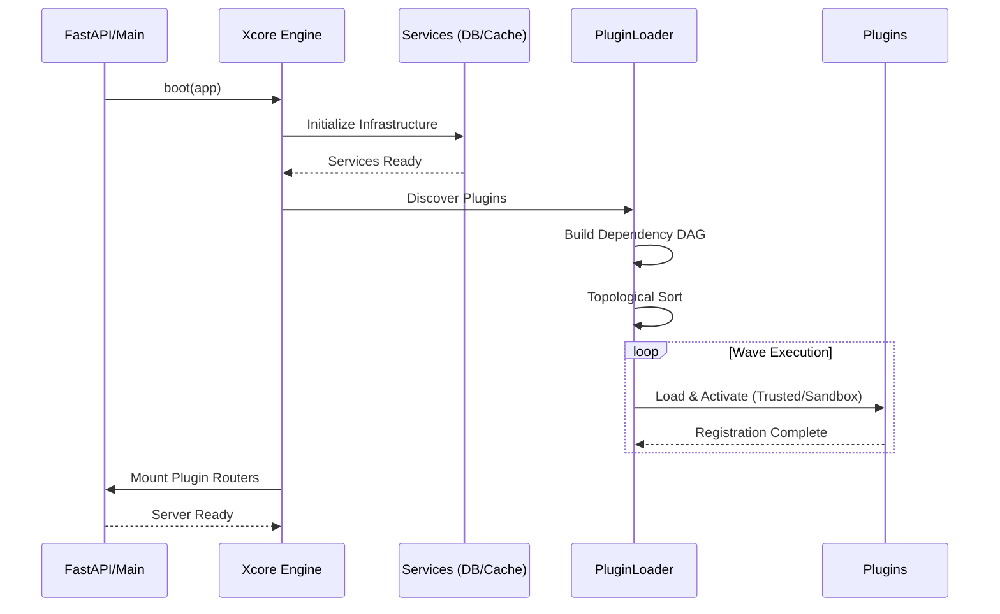
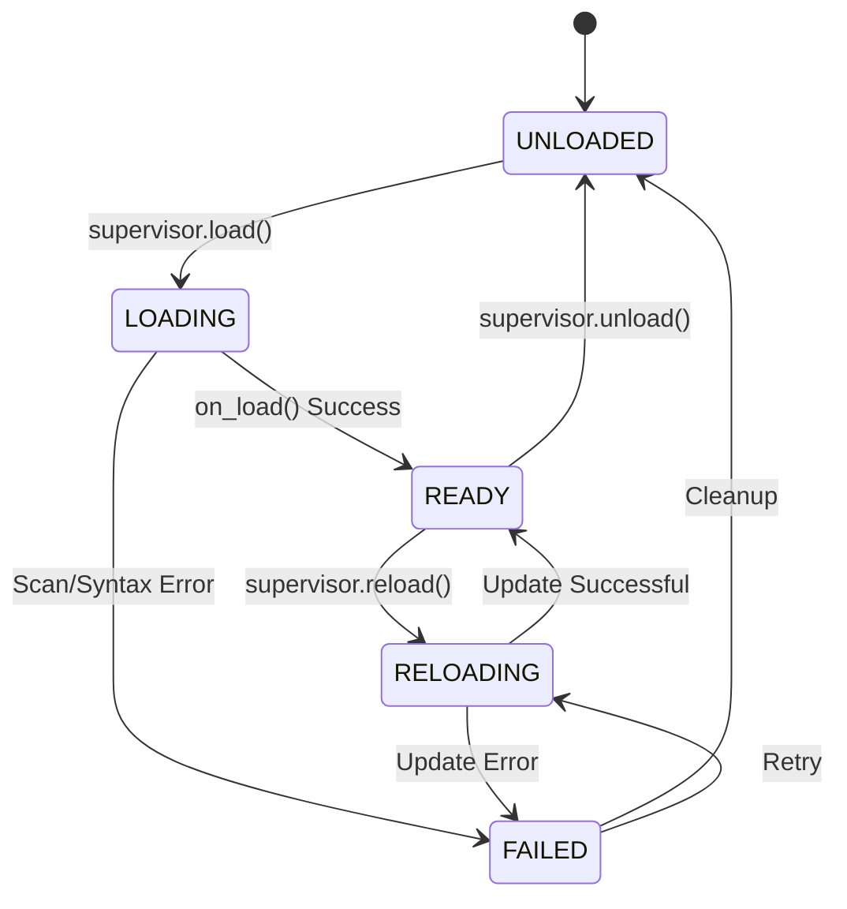
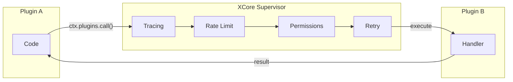

# Architecture Overview

This document provides a deep dive into the internal architecture of XCore, explaining how the kernel, services, and plugins interact.

## 1. High-Level Design

XCore is designed around the **Modular Monolith** pattern. While all plugins run in the same orchestrated environment, they are strictly isolated through both logical (context injection) and physical (process-level sandboxing) boundaries.

### Core Components

-   **Xcore Engine**: The entry point that boots the system, loads configuration, and coordinates other kernel components.
-   **PluginSupervisor**: Manages the lifecycle of all plugins. It handles loading, unloading, hot-reloading, and cross-plugin calls via a middleware pipeline.
-   **ServiceContainer**: A centralized registry for shared infrastructure (DB, Cache, Scheduler). It enforces service scoping (public vs. private).
-   **EventBus**: An asynchronous dispatcher for system-wide events using the Observer pattern.
-   **PermissionEngine**: A policy-based access control system that evaluates every inter-plugin call and service access.

---

## 2. Framework Boot Flow

The framework follows a strict initialization sequence to ensure all dependencies are resolved before plugins start.

---

## 3. Plugin Lifecycle State Machine

Each plugin is managed by a Finite State Machine (FSM) to ensure safe transitions during hot-reloads or failures.

---

## 4. Cross-Plugin Communication (IPC)

When Plugin A calls Plugin B, the call is never direct. It passes through the kernel's **Supervisor Pipeline**.

### The Middleware Stack
1.  **Tracing**: Generates a new span (or continues an existing one).
2.  **Rate Limiting**: Checks if the caller has exceeded its quota.
3.  **Permission Audit**: Validates if the caller is authorized to call the target action.
4.  **Retry Logic**: Wraps the call to handle transient failures.

---

## 5. Sandboxing Model

Sandboxed plugins run in a dedicated OS process. This provides the highest level of isolation.

-   **Transport**: JSON-RPC 2.0 over OS Pipes (stdin/stdout).
-   **Security**: The kernel performs AST (Abstract Syntax Tree) scanning on the plugin code before spawning the process to block dangerous modules (e.g., `os`, `subprocess`) and attributes (e.g., `__class__`).
-   **Resources**: Memory and execution time are monitored by the kernel; workers are killed if they exceed limits.

---

## 6. Service Scoping

Services registered in the `ServiceContainer` can have different visibility levels:

| Scope | Description | Access |
| :--- | :--- | :--- |
| **Public** | General infrastructure. | All plugins + Kernel. |
| **Private** | Kernel-internal services. | Kernel only. |
| **Scoped** | Restricted to specific plugins. | Authorized plugins only. |

By default, core services like `db` and `cache` are **Public**, allowing all plugins to benefit from shared connections and caching strategies.
