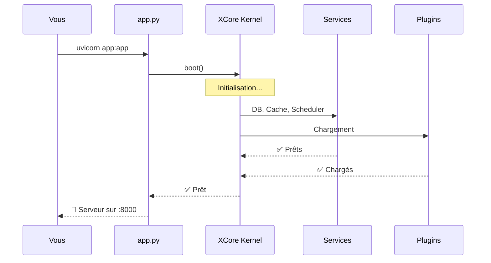
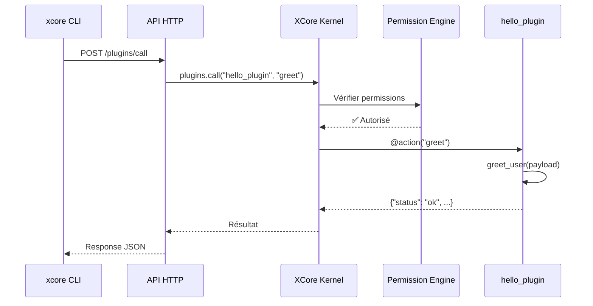

# Quick Start Guide

Créez votre première application XCore et votre premier plugin en **moins de 5 minutes**.

---

## Vue d'Ensemble du Flux


---

## Étape 1 : Initialiser l'Application

Créez un fichier `app.py` qui servira de point d'entrée à votre serveur FastAPI :

```python
# app.py
from fastapi import FastAPI
from xcore import Xcore

# 📦 Initialisation
app = FastAPI(title="Mon App XCore")
core = Xcore(config_path="xcore.yaml")

# 🚀 Démarrage du kernel
@app.on_event("startup")
async def startup():
    await core.boot(app)
    # Le kernel initialise :
    # 1. ✅ Les services (DB, Cache, Scheduler)
    # 2. ✅ Les plugins découverts
    # 3. ✅ Les routes HTTP

# 🛑 Arrêt propre
@app.on_event("shutdown")
async def shutdown():
    await core.shutdown()
```

### Ce qui se passe au démarrage :



---

## Étape 2 : Créer Votre Premier Plugin

### A. Structure du Dossier

```bash
# Créez l'arborescence
mkdir -p plugins/hello_plugin/src

# Créez les fichiers
touch plugins/hello_plugin/plugin.yaml
touch plugins/hello_plugin/src/main.py
```

```
plugins/hello_plugin/
├── plugin.yaml          # 📋 Manifeste (métadonnées)
└── src/
    └── main.py          # 💡 Logique métier
```

### B. Le Manifeste (`plugin.yaml`)

```yaml
# 📋 Identification
name: hello_plugin
version: "1.0.0"
author: Votre Nom
description: "Mon premier plugin XCore"

# ⚙️ Configuration
execution_mode: trusted        # trusted | sandboxed
entry_point: src/main.py

# 🔐 Permissions (optionnel)
permissions:
  - resource: "cache.*"
    actions: ["read", "write"]
    effect: allow

# 📊 Ressources (limites)
resources:
  timeout_seconds: 30
  rate_limit:
    calls: 100
    period_seconds: 60
```

### C. La Logique (`src/main.py`)

```python
from xcore.sdk import TrustedBase, AutoDispatchMixin, action, ok, error

class Plugin(AutoDispatchMixin, TrustedBase):
    """
    Plugin de démonstration qui salue les utilisateurs.
    """
    
    async def on_load(self):
        """🎯 Appelé quand le plugin est chargé."""
        self.logger.info("✨ Hello plugin est prêt !")
    
    async def on_unload(self):
        """🧹 Appelé quand le plugin est déchargé."""
        self.logger.info("👋 Hello plugin est déchargé")
    
    @action("greet")
    async def greet_user(self, payload: dict):
        """
        🎯 Action: greet
        
        Args:
            payload: {"name": "Votre nom"}
        
        Returns:
            {"status": "ok", "message": "Hello, X !"}
        """
        name = payload.get("name", "World")
        self.logger.info(f"Salutation de: {name}")
        return ok(message=f"Hello, {name} !")
    
    @action("ping")
    async def ping(self, payload: dict):
        """Test de connectivité."""
        return ok(status="alive")
```

---

## Étape 3 : Démarrer et Tester

### Démarrer le Serveur

```bash
# Dans le terminal 1
uvicorn app:app --reload --host 0.0.0.0 --port 8000
```

```
INFO:     Started server process [12345]
INFO:     Waiting for application startup.
INFO:     XCore Kernel booting...
INFO:     Services initialized: db, cache, scheduler
INFO:     Plugins loaded: hello_plugin (v1.0.0)
INFO:     Application startup complete.
INFO:     Uvicorn running on http://0.0.0.0:8000
```

### Tester via CLI

```bash
# Dans le terminal 2
xcore plugin call hello_plugin greet '{"name": "Développeur"}'
```

**Réponse :**
```json
{
  "status": "ok",
  "message": "Hello, Développeur !"
}
```

### Tester via HTTP

Si vous avez ajouté des routes HTTP :

```bash
curl http://localhost:8000/plugin/hello_plugin/hello/Dev
```

### Flux Complet d'un Appel



---

## Étape 4 : Aller Plus Loin

### Ajouter une Route HTTP

```python
from xcore.sdk import TrustedBase, RoutedPlugin, route

class Plugin(RoutedPlugin, TrustedBase):
    
    @route("/hello/{name}", methods=["GET"])
    async def hello_api(self, name: str):
        """Route HTTP accessible directement."""
        return {"message": f"Hello, {name} !"}
    
    @route("/status", methods=["GET"])
    async def status(self):
        """Endpoint de santé du plugin."""
        return {
            "plugin": self.name,
            "version": self.version,
            "status": "healthy"
        }
```

**Routes disponibles :**
- `GET /plugin/hello_plugin/hello/{name}`
- `GET /plugin/hello_plugin/status`

### Utiliser le Cache

```python
from xcore.sdk import TrustedBase, AutoDispatchMixin, action, ok

class Plugin(AutoDispatchMixin, TrustedBase):
    
    async def on_load(self):
        self.cache = self.get_service("cache")
    
    @action("greet_cached")
    async def greet_cached(self, payload: dict):
        name = payload.get("name", "World")
        cache_key = f"greeting:{name}"
        
        # Vérifier le cache
        cached = await self.cache.get(cache_key)
        if cached:
            return ok(message=cached, source="cache")
        
        # Générer et caster
        message = f"Hello, {name} !"
        await self.cache.set(cache_key, message, ttl=60)
        
        return ok(message=message, source="generated")
```

### Émettre un Événement

```python
from xcore.sdk import TrustedBase, AutoDispatchMixin, action, ok

class Plugin(AutoDispatchMixin, TrustedBase):
    
    @action("create_user")
    async def create_user(self, payload: dict):
        # ... logique de création ...
        
        # 📡 Émettre un événement
        await self.ctx.events.emit("user.created", {
            "id": user_id,
            "email": payload.get("email")
        })
        
        return ok(user_id=user_id)
```

---

## Résumé des Commandes

| Commande | Description |
| :--- | :--- |
| `xcore plugin list` | Lister tous les plugins chargés |
| `xcore plugin load hello_plugin` | Charger un plugin |
| `xcore plugin reload hello_plugin` | Recharger à chaud |
| `xcore plugin unload hello_plugin` | Décharger un plugin |
| `xcore plugin call hello_plugin greet '{}'` | Appeler une action |
| `xcore health` | Vérifier la santé du système |

---

## Prochaines Étapes

| 📚 Guide | Objectif |
| :--- | :--- |
| [📖 SDK Reference](../reference/sdk.md) | Découvrir tous les décorateurs |
| [🛡️ Sécurité](../guides/security.md) | Comprendre le sandboxing |
| [📡 Événements](../guides/events.md) | Maîtriser le système d'événements |
| [💾 Services](../guides/services.md) | Utiliser DB et Cache |

---

> 💡 **Astuce** : Pour le développement, utilisez `execution_mode: trusted` pour un débogage plus facile. En production, passez à `sandboxed` pour une isolation maximale.
