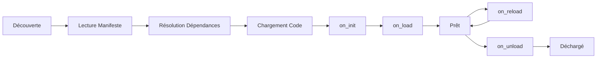

# Création de Plugins XCore

Ce guide vous accompagne dans la conception, le développement et la validation de plugins pour XCore.

## Structure d'un Plugin

Un plugin XCore est un répertoire organisé de manière standard :

```text
mon_plugin/
├── plugin.yaml          # Le manifeste (métadonnées & configuration)
├── src/
│   └── main.py          # Le point d'entrée (Code Python)
├── data/                # (Optionnel) Dossier accessible en mode Sandboxed
└── requirements.txt     # (Optionnel) Dépendances Python spécifiques
```

---

## 1. Le Manifeste (`plugin.yaml`)

Le manifeste est le fichier central qui définit l'identité, les dépendances et les droits de votre plugin.

```yaml
# Informations générales
name: mon_plugin
version: "1.0.0"
author: "XCore Team"
description: "Un plugin d'exemple complet"

# Configuration d'exécution
execution_mode: "trusted"  # "trusted" (rapide) ou "sandboxed" (sécurisé)
entry_point: "src/main.py"  # Chemin relatif vers le point d'entrée
framework_version: ">=2.0.0"

# Dépendances sur d'autres plugins
requires:
  - auth_plugin >= 1.2.0
  - database_helper

# Permissions déclaratives (pour le moteur RBAC)
permissions:
  - resource: "cache.*"
    actions: ["read", "write"]
    effect: allow
  - resource: "db.users"
    actions: ["read"]
    effect: allow

# Ressources et limites (principalement pour le mode Sandboxed)
resources:
  timeout_seconds: 15
  max_memory_mb: 256
  max_calls_per_minute: 1000

# Configuration personnalisée (disponible via self.ctx.config)
extra:
  api_url: "https://api.external.com"
  retry_count: 3
```

---

## 2. Le Cycle de Vie du Plugin

Un plugin XCore traverse plusieurs étapes lors de son existence sur le serveur.



### Hooks de Cycle de Vie

```python
from xcore.sdk import TrustedBase

class Plugin(TrustedBase):
    async def on_init(self):
        """Appelé à l'instanciation initiale, avant l'accès aux services."""
        pass

    async def on_load(self):
        """Appelé une fois les services et dépendances prêts. Initialisez vos données ici."""
        self.db = self.get_service("db")
        print(f"Plugin {self.ctx.name} prêt !")

    async def on_reload(self):
        """Appelé lors d'un hot-reload sans redémarrage du framework."""
        pass

    async def on_unload(self):
        """Nettoyez les ressources (connexions, timers) ici."""
        pass
```

---

## 3. Implémentation : Trusted vs Sandboxed

### Mode **Trusted** (Confiance)
- S'exécute dans le même processus que le framework XCore.
- Accès total aux services et aux API Python (sans restriction).
- Haute performance (pas de latence IPC).
- **Utilisation** : Plugins officiels, infrastructure interne.

### Mode **Sandboxed** (Bac à sable)
- S'exécute dans un sous-processus isolé.
- Accès restreint via le `FilesystemGuard` et l'`ASTScanner`.
- Communication via JSON-RPC sur pipes (stdin/stdout).
- **Utilisation** : Plugins tiers, plugins de la Marketplace.

---

## 4. Utilisation du SDK Avancé

### Mixins pour une écriture simplifiée

XCore fournit des Mixins pour automatiser le dispatching des actions et des routes.

```python
from xcore.sdk import (
    TrustedBase,
    AutoDispatchMixin,
    RoutedPlugin,
    action,
    route,
    ok
)

class MonPlugin(RoutedPlugin, AutoDispatchMixin, TrustedBase):

    @action("calcul")
    async def faire_calcul(self, payload: dict):
        # handle("calcul", payload) appellera automatiquement cette méthode
        val = payload.get("val", 0) * 2
        return ok(result=val)

    @route("/status", method="GET")
    async def status_http(self):
        # Route montée sous /plugin/mon_plugin/status
        return {"active": True, "ver": self.ctx.version}
```

---

## 5. Validation et Test

Avant de déployer un plugin, validez sa conformité avec la CLI XCore :

```bash
# Vérifier la syntaxe du manifeste et du code
xcore plugin validate ./plugins/mon_plugin

# Tester l'exécution en mode sandbox simulé
xcore sandbox run mon_plugin
```

---

## Bonnes Pratiques

1. **Isolation des Données** : Utilisez le dossier `data/` de votre plugin pour stocker des fichiers locaux. En mode sandbox, c'est le seul dossier accessible en écriture.
2. **Gestion des Erreurs** : Utilisez toujours le helper `error()` pour retourner des messages clairs en cas d'échec d'une action.
3. **Dépendances** : Déclarez explicitement les plugins dont vous dépendez dans `requires` pour garantir un ordre de chargement correct.
4. **Permissions** : Suivez le principe du moindre privilège en demandant uniquement les permissions `resource.*` nécessaires.
