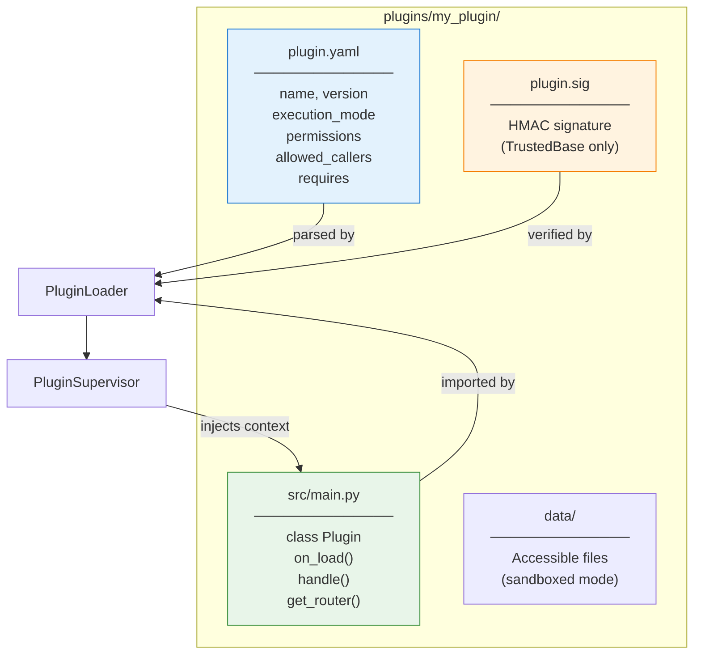
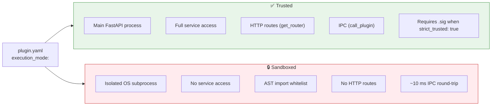
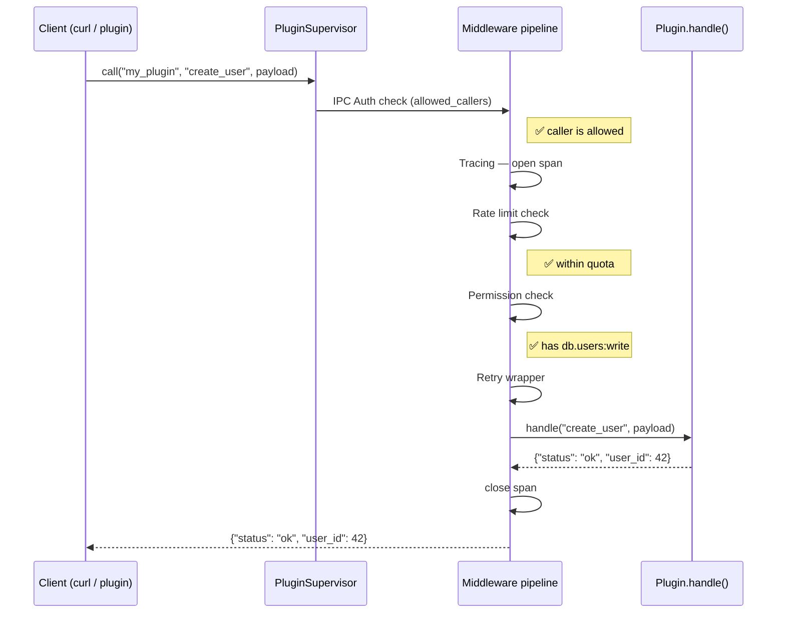

# Creating a Plugin

This guide walks you through designing, developing, and validating XCore plugins.

---

## Plugin anatomy



---

## Execution modes



| | Trusted | Sandboxed |
|:--|:--------|:---------|
| **Process** | Main FastAPI | Isolated subprocess |
| **`get_service()`** | ✅ Full | ❌ None |
| **`call_plugin()`** | ✅ Yes | ❌ No |
| **`get_router()`** | ✅ Yes | ❌ No |
| **Import restriction** | None | AST whitelist |
| **Overhead** | ~0 ms | ~10 ms |
| **Use case** | Internal features | Third-party / untrusted code |

---

## 1. The Manifest (`plugin.yaml`)

```yaml title="plugins/my_plugin/plugin.yaml"
# ── Identity ──────────────────────────────────────────────────────
name: my_plugin                # (1)!
version: "1.0.0"               # (2)!
author: "XCore Team"
description: "What this plugin does"
framework_version: ">=2.0"

# ── Execution ──────────────────────────────────────────────────────
execution_mode: trusted        # (3)!
entry_point: src/main.py

# ── Dependencies ───────────────────────────────────────────────────
requires:                      # (4)!
  - auth_plugin
  - name: database_helper
    version: ">=1.2,<2.0"

# ── Permissions ────────────────────────────────────────────────────
permissions:                   # (5)!
  - resource: "cache.*"
    actions: ["read", "write"]
    effect: allow
  - resource: "db.users"
    actions: ["read"]
    effect: allow

# ── IPC access control ─────────────────────────────────────────────
allowed_callers:               # (6)!
  - auth_plugin
  - dashboard_plugin

# ── Resource limits ────────────────────────────────────────────────
resources:
  timeout_seconds: 10
  rate_limit:
    calls: 200
    period_seconds: 60
```

1. Must be unique across all plugins. Used as the key in `call_plugin("my_plugin", ...)`.
2. Semver string. Used for `requires:` version resolution.
3. `trusted` | `sandboxed` | `legacy`.
4. Plugins listed here will load before this plugin. Circular dependencies raise an error at boot.
5. Deny-by-default: only explicitly allowed resources are accessible.
6. IPC deny-by-default: empty list = no plugin can call this one.

---

## 2. TrustedBase plugin — step by step

### Skeleton

```python title="plugins/my_plugin/src/main.py"
from xcore import TrustedBase
from xcore.sdk.decorators import action
from xcore.sdk.mixin.ipc import AutoDispatchMixin
from xcore.kernel.api.contract import ok, error

class Plugin(AutoDispatchMixin, TrustedBase):

    async def on_load(self) -> None:
        pass   # set up services here

    @action("ping")
    async def ping(self, payload: dict) -> dict:
        return ok(pong=True)
```

### Add services

```python title="plugins/my_plugin/src/main.py" hl_lines="7-10"
from xcore import TrustedBase
from xcore.sdk.decorators import action
from xcore.sdk.mixin.ipc import AutoDispatchMixin
from xcore.kernel.api.contract import ok, error

class Plugin(AutoDispatchMixin, TrustedBase):

    async def on_load(self) -> None:
        self.db        = self.get_service("db")        # AsyncSQLAdapter
        self.cache     = self.get_service("cache")     # CacheService
        self.scheduler = self.get_service("scheduler") # SchedulerService
        self.worker    = self.get_service("worker")    # WorkerService
```

### Add Pydantic validation

```python title="plugins/my_plugin/src/main.py"
from pydantic import BaseModel
from xcore.sdk.decorators import action, validate_payload

class CreateUserPayload(BaseModel):
    name: str
    email: str
    role: str = "user"           # optional field with default

class Plugin(AutoDispatchMixin, TrustedBase):

    @action("create_user")
    @validate_payload(CreateUserPayload)             # (1)!
    async def create_user(self, payload: CreateUserPayload) -> dict:
        # payload is already a validated Pydantic model here
        return ok(name=payload.name, email=payload.email)
```

1. If validation fails, returns `{"status": "error", "code": "validation_error", "msg": "..."}` automatically.

### Add schema versioning

```python title="plugins/my_plugin/src/main.py"
from xcore.sdk.decorators import action, schema, validate_payload

class Plugin(AutoDispatchMixin, TrustedBase):

    @action("create_user")
    @schema(                                   # (1)!
        version="1.0",
        input={
            "name":  (str, ...),               # required
            "email": (str, ...),               # required
            "role":  (str, "user"),            # optional, default "user"
        },
        output={"user_id": (int, ...)},
        description="Create a new user.",
    )
    @validate_payload(CreateUserPayload)
    async def create_user(self, payload: CreateUserPayload) -> dict:
        ...
```

1. Registers metadata in `SchemaRegistry`. Powers IPC validation and API documentation.

### Add HTTP routes

```python title="plugins/my_plugin/src/main.py"
class Plugin(AutoDispatchMixin, TrustedBase):

    def get_router(self):                           # (1)!
        from fastapi import APIRouter, HTTPException

        router = APIRouter(prefix="/v1", tags=["my_plugin"])

        @router.get("/users/{user_id}")
        async def get_user(user_id: int):
            result = await self.get_user({"user_id": user_id})
            if result["status"] == "error":
                raise HTTPException(404, result["msg"])
            return result

        @router.post("/users")
        async def create_user(body: CreateUserPayload):
            return await self.create_user(body)

        return router
```

1. Auto-mounted at `/app/my_plugin/v1/`. The route appears in Swagger `/docs` with the configured tags.

### Add IPC calls

```python title="plugins/my_plugin/src/main.py"
class Plugin(AutoDispatchMixin, TrustedBase):

    @action("register")
    async def register(self, payload: dict) -> dict:
        # 1. Create the user locally
        user_id = await self._insert_user(payload)

        # 2. Call another plugin via IPC          # (1)!
        session = await self.call_plugin(
            "auth_plugin",          # target plugin name
            "create_session",       # action name
            {"user_id": user_id},   # payload
        )

        return ok(user_id=user_id, token=session.get("token"))
```

1. The call goes through the full middleware pipeline: IPC auth → tracing → rate limit → permissions → retry.

---

## 3. Sandboxed plugin

```python title="plugins/calculator/src/main.py"
import math
import statistics                        # (1)!
from xcore.kernel.api.contract import ok, error

class Plugin:                            # (2)!
    _config: dict                        # injected from plugin.yaml

    async def handle(self, action: str, payload: dict) -> dict:
        if action == "sqrt":
            v = payload.get("value", 0)
            if v < 0:
                return error("Cannot take sqrt of negative", "domain_error")
            return ok(result=math.sqrt(v))

        if action == "mean":
            data = payload.get("data", [])
            return ok(result=statistics.mean(data))

        return error(f"Unknown action: {action}", "unknown_action")

    async def on_init(self) -> None: ...
    async def on_start(self) -> None: ...
    async def on_stop(self) -> None: ...
```

1. `statistics` is in `plugin.yaml → allowed_imports`. The AST scanner validates this at load time.
2. No inheritance from `TrustedBase`. Duck typing — only `handle()` is required.

```yaml title="plugins/calculator/plugin.yaml"
name: calculator
version: "1.0.0"
execution_mode: sandboxed

allowed_imports:
  - statistics

resources:
  timeout_seconds: 5
  max_memory_mb: 64
```

---

## 4. Response helpers

Always use the standard response helpers — they ensure consistent `status` fields:

=== "ok()"

    ```python
    from xcore.kernel.api.contract import ok

    return ok(user_id=42, name="Alice")
    # → {"status": "ok", "user_id": 42, "name": "Alice"}

    return ok({"items": [1, 2, 3]})
    # → {"status": "ok", "items": [1, 2, 3]}
    ```

=== "error()"

    ```python
    from xcore.kernel.api.contract import error

    return error("User not found", code="not_found")
    # → {"status": "error", "msg": "User not found", "code": "not_found"}

    return error("Validation failed", code="invalid_input", field="email")
    # → {"status": "error", "msg": "Validation failed", "code": "invalid_input", "field": "email"}
    ```

---

## 5. Plugin call flow



---

## 6. Signing (production)

When `plugins.strict_trusted: true`, every trusted plugin needs a `.sig` file:

```bash
# Sign
poetry run xcore plugin sign plugins/my_plugin --secret "your-hmac-secret"
# → creates plugins/my_plugin/plugin.sig

# Verify
poetry run xcore plugin verify plugins/my_plugin --secret "your-hmac-secret"
# → ✅ signature valid

# Programmatic
from xcore.kernel.security.signature import sign_plugin, verify_plugin
sign_plugin("plugins/my_plugin", secret="your-hmac-secret")
ok = verify_plugin("plugins/my_plugin", secret="your-hmac-secret")
```

---

## 7. Plugin management CLI

```bash
poetry run xcore plugin list           # show all plugins + status
poetry run xcore plugin info hello     # inspect a plugin
poetry run xcore plugin reload hello   # hot-reload (no server restart)
poetry run xcore plugin health         # validate all manifests + AST
```

!!! tip "Hot reload"
    Edit any file inside `src/` → XCore detects the change within `plugins.interval` seconds and reloads automatically.
    Changes to `plugin.yaml` (permissions, mode, entry point) require a full server restart.
