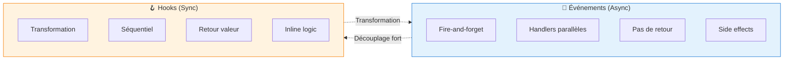
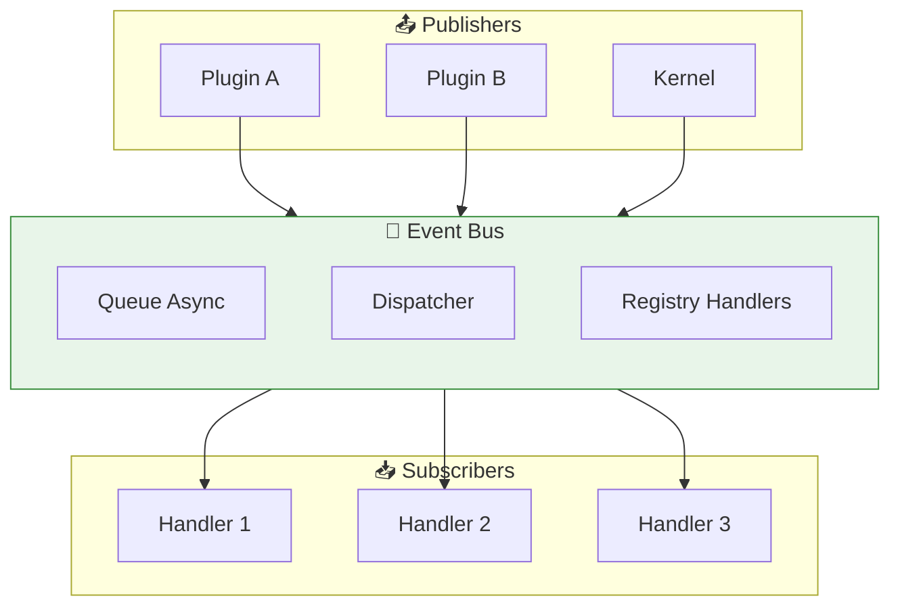
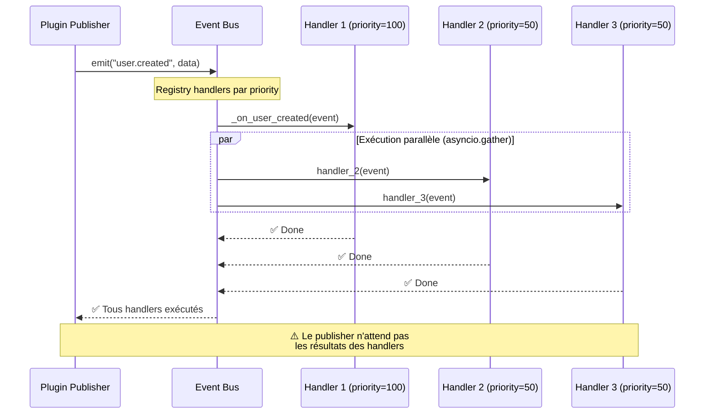
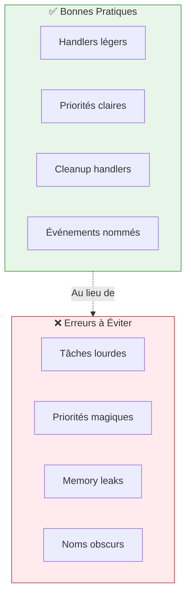
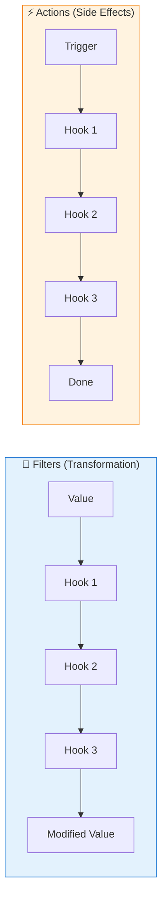
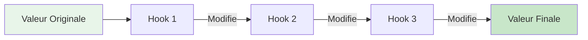
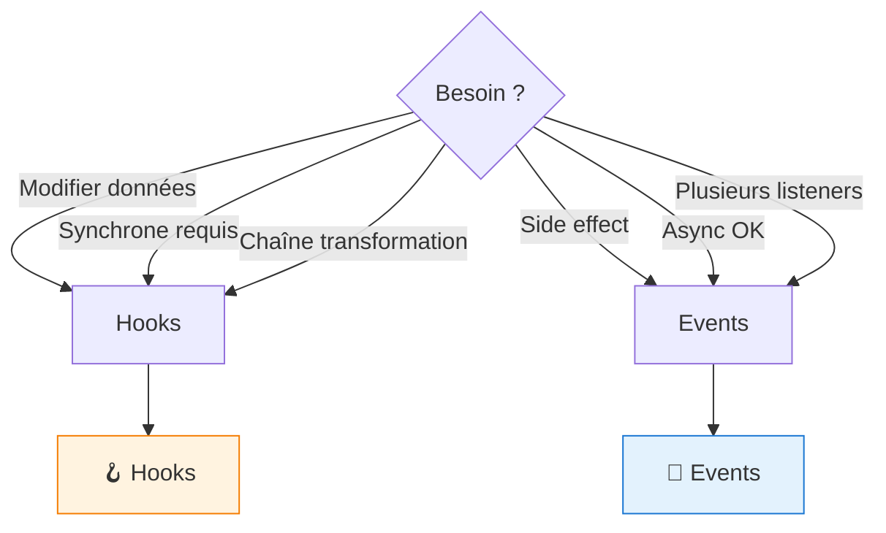

# Event & Hook System

XCore propose deux mécanismes de communication découplée : les **Événements** (asynchrones, side-effects) et les **Hooks** (synchrones, transformation de données).

---

## Vue d'Ensemble Comparative



---

## 1. Système d'Événements Asynchrones

L'Event Bus est utilisé pour la communication **"fire-and-forget"**. Idéal pour déclencher des side effects (logging, emails, cache) après une action.

### Architecture de l'Event Bus



### Concepts Clés

| Concept | Description | Usage |
| :--- | :--- | :--- |
| **Priority** | Les handlers avec priorité haute (100) s'exécutent avant les bas (50) | Ordonnancer l'exécution |
| **Propagation** | Un handler peut appeler `event.stop_propagation()` | Stopper la chaîne |
| **Gather** | Par défaut, handlers exécutés en parallèle via `asyncio.gather` | Performance |

---

### S'abonner à un Événement

```python
from xcore.sdk import TrustedBase, on, Event

class Plugin(TrustedBase):
    
    async def on_load(self):
        # Méthode 1: Décorateur (recommandé)
        # Le handler est automatiquement abonné
        
        # Méthode 2: Subscription manuelle
        self.ctx.events.on("user.created", self._on_user_created, priority=100)
    
    @on("user.created", priority=100)
    async def _on_user_created(self, event: Event):
        """
        Handler pour l'événement user.created
        
        Args:
            event: Contient data, timestamp, source
        """
        user_id = event.data.get("id")
        email = event.data.get("email")
        
        self.logger.info(f"Nouvel utilisateur créé: {user_id}")
        
        # Side effect: envoyer email de bienvenue
        await self._send_welcome_email(email)
        
        # Optionnel: stopper la propagation
        # event.stop_propagation()
    
    async def _send_welcome_email(self, email: str):
        # ... logique d'envoi ...
        pass
```

### Émettre un Événement

```python
from xcore.sdk import TrustedBase, action, ok

class Plugin(TrustedBase):
    
    @action("create_user")
    async def create_user(self, payload: dict):
        # 1. Créer l'utilisateur
        user_id = await self._create_in_db(payload)
        
        # 2. Émettre l'événement
        await self.ctx.events.emit("user.created", {
            "id": user_id,
            "email": payload.get("email"),
            "created_at": self._now()
        })
        
        # 3. Retourner résultat (l'événement est fire-and-forget)
        return ok(user_id=user_id)
```

### Flux d'un Événement



---

## 2. Événements Système Built-in

XCore émet plusieurs événements système que vous pouvez subscriber.

### Tableau des Événements Système

| Événement | Quand | Payload | Usage Typique |
| :--- | :--- | :--- | :--- |
| `xcore.plugins.booted` | Tous plugins chargés | `{"report": {...}}` | Initialisation globale |
| `plugin.<name>.loaded` | Plugin chargé | `{"name", "version"}` | Logging, metrics |
| `plugin.<name>.reloaded` | Plugin rechargé | `{"name"}` | Refresh cache |
| `plugin.<name>.unloaded` | Plugin déchargé | `{"name"}` | Cleanup |
| `permission.deny` | Permission refusée | `{"plugin", "resource", "action"}` | Audit sécurité |
| `security.violation` | Scan AST échoué | `{"plugin", "errors"}` | Alertes sécurité |
| `user.created` | Custom: utilisateur créé | `{"id", "email"}` | Welcome email |
| `user.deleted` | Custom: utilisateur supprimé | `{"id"}` | Cleanup données |

### Exemple: Subscriber aux Événements Système

```python
from xcore.sdk import TrustedBase, on, Event

class Plugin(TrustedBase):
    
    @on("xcore.plugins.booted", priority=200)
    async def _on_system_boot(self, event: Event):
        """Exécuté quand TOUS les plugins sont chargés."""
        report = event.data.get("report", {})
        loaded_count = report.get("loaded", 0)
        self.logger.info(f"🚀 Système prêt : {loaded_count} plugins chargés")
    
    @on("plugin.auth_plugin.loaded", priority=100)
    async def _on_auth_ready(self, event: Event):
        """Exécuté quand le plugin auth est prêt."""
        self.logger.info("✅ Plugin auth disponible")
        # Initialiser la connexion avec le plugin auth
    
    @on("permission.deny", priority=50)
    async def _on_permission_denied(self, event: Event):
        """Logging de toutes les permissions refusées."""
        plugin = event.data.get("plugin")
        resource = event.data.get("resource")
        self.logger.warning(f"🚫 Permission refusée: {plugin} → {resource}")
```

---

## 3. Best Practices pour les Événements



### 1. Handlers Légers

```python
# ❌ MAUVAIS: Handler lourd (bloque l'event loop)
@on("user.created")
async def bad_handler(self, event):
    # Envoi email synchrone (lent !)
    send_email_sync(event.data["email"])
    
    # Traitement lourd
    for i in range(1000000):
        process(i)

# ✅ BON: Déléguer au scheduler
@on("user.created")
async def good_handler(self, event):
    # Quick: queue la tâche
    await self.scheduler.add_job(
        self._send_welcome_email,
        args=[event.data["email"]]
    )
```

### 2. Priorités Explicites

```python
# ❌ MAUVAIS: Priorités arbitraires
@on("user.created", priority=42)
@on("user.created", priority=99)

# ✅ BON: Priorités sémantiques
PRIORITY_LOGGING = 100      # Logging en premier
PRIORITY_BUSINESS = 50      # Logique métier
PRIORITY_CLEANUP = 10       # Cleanup en dernier

@on("user.created", priority=PRIORITY_LOGGING)
@on("user.created", priority=PRIORITY_BUSINESS)
```

### 3. Nommage des Événements

```python
# ❌ MAUVAIS: Noms obscurs
await self.ctx.events.emit("stuff.happened", data)
await self.ctx.events.emit("do_thing", data)

# ✅ BON: Noms sémantiques (domain.event)
await self.ctx.events.emit("user.created", data)
await self.ctx.events.emit("user.deleted", data)
await self.ctx.events.emit("order.completed", data)
```

### 4. Stop Propagation (Usage Avancé)

```python
from xcore.sdk import TrustedBase, on, Event

class Plugin(TrustedBase):
    
    @on("user.created", priority=100)
    async def validate_user(self, event: Event):
        """Validation en premier, peut bloquer les autres handlers."""
        if not self._is_valid(event.data):
            self.logger.error("Utilisateur invalide")
            event.stop_propagation()  # ⚠️ Stop les handlers suivants
            return
        
    @on("user.created", priority=50)
    async def send_welcome(self, event: Event):
        """Ne s'exécute que si validation passe."""
        if event.propagation_stopped:
            self.logger.debug("Propagation stoppée, skip welcome")
            return
        
        # Envoyer email...
```

---

## 4. Hooks Synchrones

Les hooks permettent de modifier des données ou d'exécuter de la logique synchrone pendant un processus spécifique.

### Architecture du HookManager



### A. Filters (Transformation de Données)

Les filters permettent de "faire passer une valeur dans une chaîne" pour laisser d'autres plugins la modifier.



```python
# Côté Kernel ou Plugin
class Plugin(TrustedBase):
    
    async def render_page(self):
        # 1. Valeur de base
        title = "Bienvenue sur XCore"
        
        # 2. Appliquer les filters
        title = self.ctx.hooks.apply_filters("page_title", title)
        
        # title peut maintenant être modifié par d'autres plugins
        # Ex: "Bienvenue sur XCore | Dashboard"
        
        return f"<h1>{title}</h1>"
    
    # 3. Enregistrer un filter
    @filter("page_title")
    def modify_title(self, title: str) -> str:
        """Ajoute le suffixe au titre."""
        return f"{title} | Mon App"
```

### B. Actions (Side Effects Sync)

Les actions sont des side effects synchrones qui ne retournent pas de valeur.

```python
# Côté Kernel ou Plugin
class Plugin(TrustedBase):
    
    async def render_template(self, template_name: str):
        # 1. Trigger action avant rendu
        self.ctx.hooks.do_action("before_render", template=template_name)
        
        # 2. Rendu du template
        result = self._render(template_name)
        
        # 3. Trigger action après rendu
        self.ctx.hooks.do_action("after_render", template=template_name, result=result)
        
        return result
    
    # 4. Enregistrer un action hook
    @action_hook("before_render")
    def on_before_render(self, template: str):
        """Log chaque rendu de template."""
        self.logger.debug(f"Rendu du template: {template}")
```

---

## 5. Différence Entre Events et Hooks

| Caractéristique | Events | Hooks |
| :--- | :--- | :--- |
| **Exécution** | Asynchrone (`async def`) | Synchrone (`def`) |
| **Retourne Valeur** | ❌ Non | ✅ Oui (Filters) |
| **Parallèle** | ✅ Oui (`asyncio.gather`) | ❌ Non (Séquentiel) |
| **Propagation** | ✅ `stop_propagation()` | ❌ N/A |
| **Priorités** | ✅ Oui | ⚠️ Ordre d'enregistrement |
| **Use Case** | Side effects découplés | Transformation de données |

### Quand Utiliser Quoi ?



### Exemple Comparatif

```python
# 📡 EVENT: Pour side effect découplé
@on("user.created")
async def send_welcome_email(self, event):
    # Envoi email async (ne modifie pas les données)
    await self.email_service.send(event.data["email"])

# 🪝 HOOK FILTER: Pour modifier des données
@filter("user.profile_data")
def add_premium_badge(self, profile_data: dict) -> dict:
    # Modifie les données avant retour
    if self._is_premium(user_id):
        profile_data["badge"] = "premium"
    return profile_data

# 🪝 HOOK ACTION: Pour side effect synchrone
@action_hook("before_user_save")
def log_user_change(self, user_data: dict):
    # Logging synchrone
    self.logger.debug(f"User update: {user_data}")
```

---

## 6. Exemple Complet: Système de Notification

```python
from xcore.sdk import TrustedBase, on, action, ok, filter

class NotificationPlugin(TrustedBase):
    """
    Plugin de notification qui démontre Events + Hooks.
    """
    
    async def on_load(self):
        # S'abonner aux événements système
        self.ctx.events.on("user.created", self._on_user_created, priority=50)
        self.ctx.events.on("order.completed", self._on_order_completed, priority=50)
    
    @on("user.created")
    async def _on_user_created(self, event):
        """Envoyer email de bienvenue."""
        email = event.data.get("email")
        await self._send_email(email, "Bienvenue !")
    
    @on("order.completed")
    async def _on_order_completed(self, event):
        """Envoyer confirmation de commande."""
        email = event.data.get("email")
        await self._send_email(email, "Commande confirmée !")
    
    @filter("notification.message")
    def add_disclaimer(self, message: str) -> str:
        """Ajouter un disclaimer à tous les messages."""
        return f"{message}\n\n-- Ceci est un message automatique"
    
    @action("send_notification")
    async def send_notification(self, payload: dict):
        """Action publique pour envoyer une notification."""
        # Appliquer les filters
        message = self.ctx.hooks.apply_filters(
            "notification.message",
            payload.get("message", "")
        )
        
        # Émettre un événement pour logging
        await self.ctx.events.emit("notification.sent", {
            "to": payload.get("to"),
            "message": message
        })
        
        return ok(status="sent")
```

---

## 7. Debugging et Monitoring

### Voir les Handlers Enregistrés

```bash
# Lister tous les handlers d'événements
xcore events list

# Lister tous les hooks
xcore hooks list
```

### Tracing des Événements

```python
# Activer le debug logging
# xcore.yaml
logging:
  level: DEBUG
  events: true  # Log tous les événements émis
```

### Diagnostic des Problèmes

| Problème | Cause Possible | Solution |
| :--- | :--- | :--- |
| Handler non appelé | Mauvais nom d'événement | Vérifier le nom exact |
| Handler appelé trop tard | Priorité trop basse | Augmenter priority |
| Memory leak | Handler non unsubscribed | Unsubscribe dans `on_unload` |
| Event loop bloquée | Handler trop lourd | Déléguer au scheduler |

---

## Prochaines Lectures

| 📚 Guide | Objectif |
| :--- | :--- |
| [Creating Plugins](creating-plugins.md) | Développer des plugins |
| [Services](services.md) | Utiliser les services partagés |
| [Monitoring](monitoring.md) | Observer les événements en prod |
