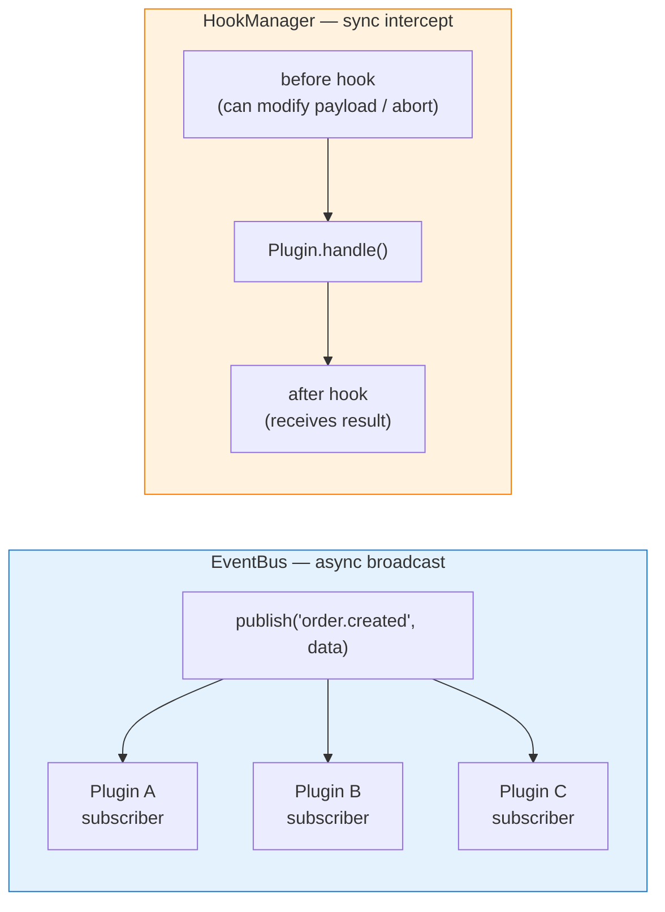
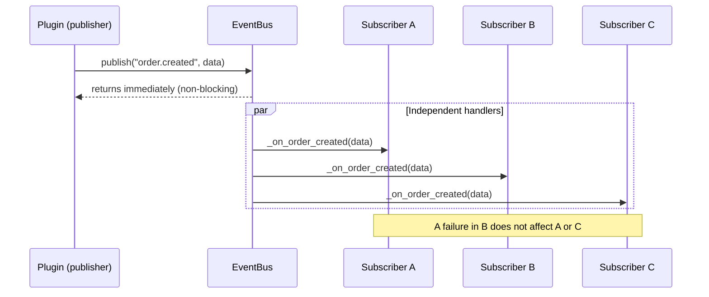
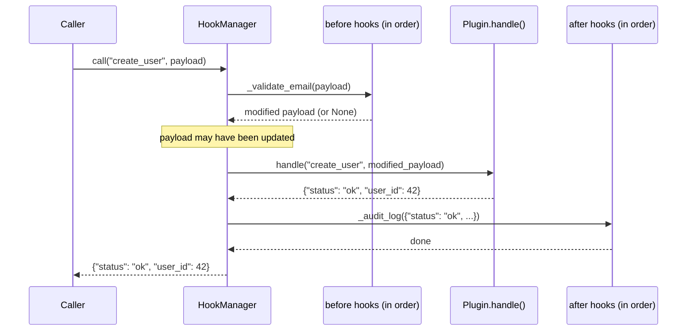

# Events & Hooks

XCore has two decoupled communication mechanisms: the **EventBus** for fire-and-forget async notifications, and **HookManager** for synchronous intercepts that can modify or abort an action.



---

## EventBus

### Publish

```python title="Publishing an event"
class Plugin(AutoDispatchMixin, TrustedBase):

    @action("create_order")
    async def create_order(self, payload: dict) -> dict:
        order = await self._persist_order(payload)

        # Fire-and-forget — non-blocking
        await self.ctx.events.publish("order.created", {   # (1)!
            "order_id": order.id,
            "user_id":  payload["user_id"],
            "total":    order.total,
        })

        return ok(order_id=order.id)
```

1. Any plugin that subscribed to `"order.created"` will be called after this returns. Failures in subscribers are isolated and do not affect the caller.

### Subscribe

```python title="Subscribing to an event"
class Plugin(AutoDispatchMixin, TrustedBase):

    async def on_load(self) -> None:
        self.ctx.events.subscribe("order.created", self._on_order_created)   # (1)!

    async def on_unload(self) -> None:
        self.ctx.events.unsubscribe("order.created", self._on_order_created) # (2)!

    async def _on_order_created(self, data: dict) -> None:
        order_id = data["order_id"]
        user_id  = data["user_id"]
        # Send confirmation email, update metrics, invalidate cache…
        await self.get_service("ext.email").send(
            to=data.get("email"),
            subject=f"Order #{order_id} confirmed",
            body="Your order is being processed.",
        )
```

1. Register handlers in `on_load` — services are available at that point.
2. Unsubscribe in `on_unload` to avoid memory leaks on hot-reload.

### Fan-out dispatch flow



---

## HookManager

Hooks are **synchronous intercepts** around a named action. A `before` hook can transform the payload or abort the call; an `after` hook receives the result.

### Register hooks

```python title="Registering hooks in on_load()"
class Plugin(AutoDispatchMixin, TrustedBase):

    async def on_load(self) -> None:
        # Before: runs before "create_user" on any plugin
        self.ctx.hooks.register_before("create_user", self._validate_email)

        # After: runs after "create_user" succeeds
        self.ctx.hooks.register_after("create_user", self._audit_log)
```

### Before hook

```python
async def _validate_email(self, payload: dict) -> dict | None:
    """
    Return value semantics:
      - None   → pass through unchanged
      - dict   → replace payload with this dict
      - raise  → abort the action (caller receives the exception)
    """
    email = payload.get("email", "")
    if "@" not in email:
        raise ValueError(f"Invalid email address: {email!r}")  # (1)!

    # Normalise email before it reaches the plugin
    return {**payload, "email": email.lower().strip()}          # (2)!
```

1. Raising an exception aborts the action. The error propagates to the caller.
2. Returning a dict replaces the payload for all subsequent hooks and the action itself.

### After hook

```python
async def _audit_log(self, result: dict) -> None:
    """Receives the action result. Cannot modify it."""
    if result.get("status") == "ok":
        self.logger.info(
            "create_user succeeded: user_id=%s",
            result.get("user_id"),
        )
```

### Hook execution flow



---

## Built-in kernel events

XCore publishes these events internally. Any plugin can subscribe to them.

| Event | Payload | When |
|:------|:--------|:-----|
| `plugin.loaded` | `{name, version, mode}` | After a plugin loads successfully |
| `plugin.unloaded` | `{name}` | After a plugin is removed |
| `plugin.failed` | `{name, error}` | After a plugin fails to load |
| `plugin.reloaded` | `{name}` | After a hot-reload |
| `xcore.booted` | `{}` | After the full boot sequence completes |
| `xcore.shutdown` | `{}` | Before the kernel shuts down |

```python title="Subscribing to kernel events"
async def on_load(self) -> None:
    self.ctx.events.subscribe("plugin.loaded",   self._on_plugin_up)
    self.ctx.events.subscribe("plugin.failed",   self._on_plugin_fail)
    self.ctx.events.subscribe("xcore.shutdown",  self._on_shutdown)

async def _on_plugin_up(self, data: dict) -> None:
    self.logger.info("Plugin online: %s v%s (%s)", data["name"], data["version"], data["mode"])

async def _on_plugin_fail(self, data: dict) -> None:
    self.logger.error("Plugin failed: %s — %s", data["name"], data["error"])

async def _on_shutdown(self, data: dict) -> None:
    await self._flush_pending_tasks()
```

---

## EventBus vs HookManager

| | EventBus | HookManager |
|:--|:--------|:------------|
| **Pattern** | Publish / Subscribe | Before / After intercept |
| **Direction** | Broadcast (1 → N) | Wrap (sequential) |
| **Blocking** | No (async, fire-and-forget) | Yes (sync, in call chain) |
| **Can abort action** | No | Yes (raise in before hook) |
| **Can modify payload** | No | Yes (return dict in before hook) |
| **Best for** | Side effects, notifications, metrics | Validation, normalisation, auditing |
