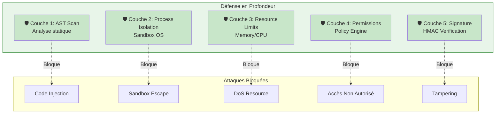
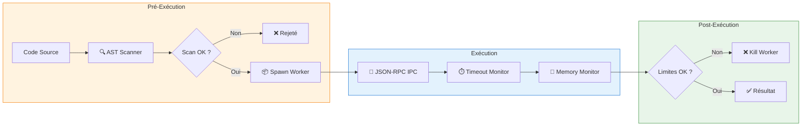
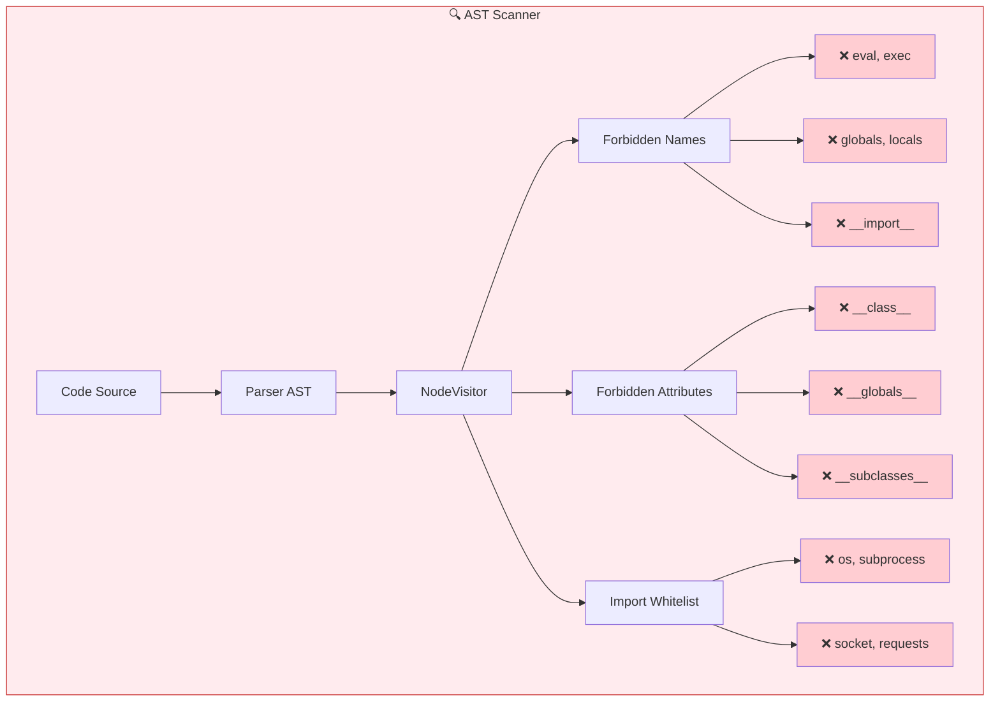
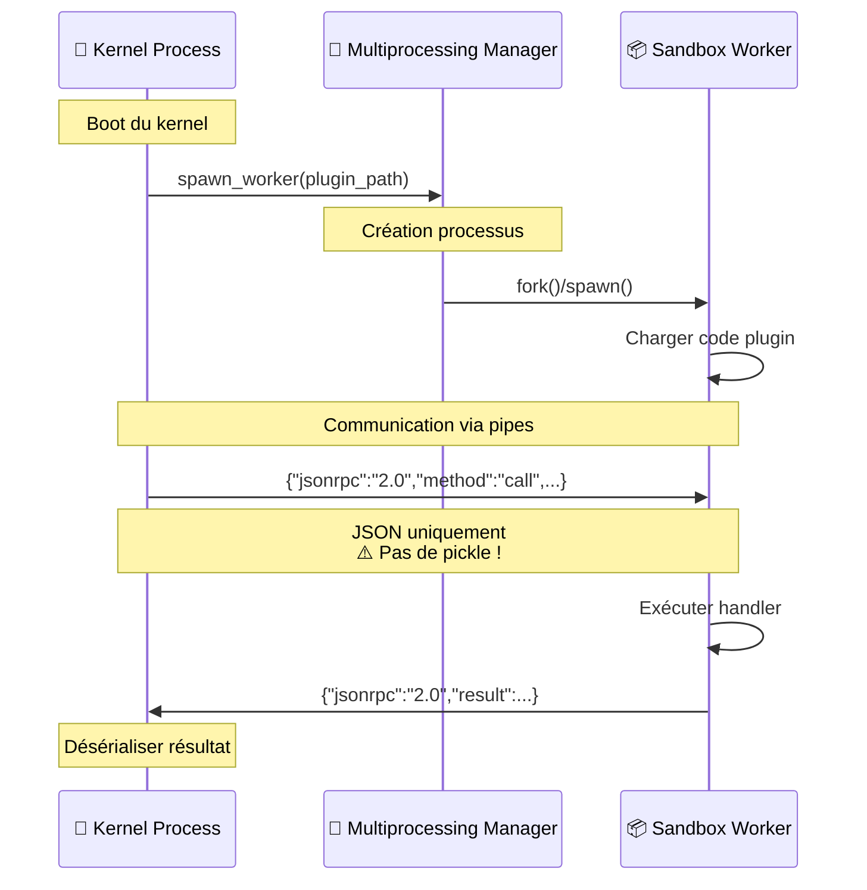
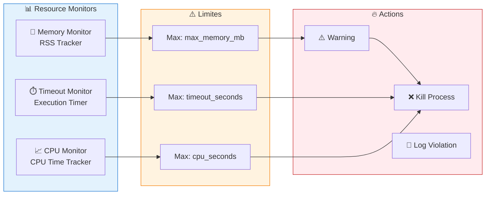
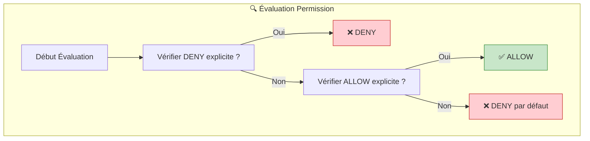
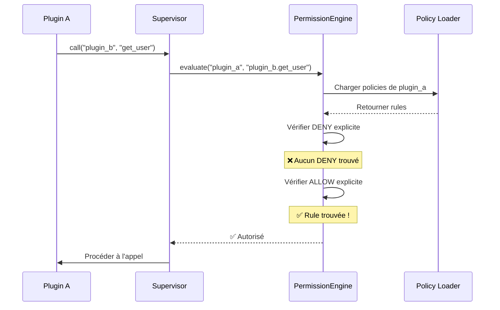
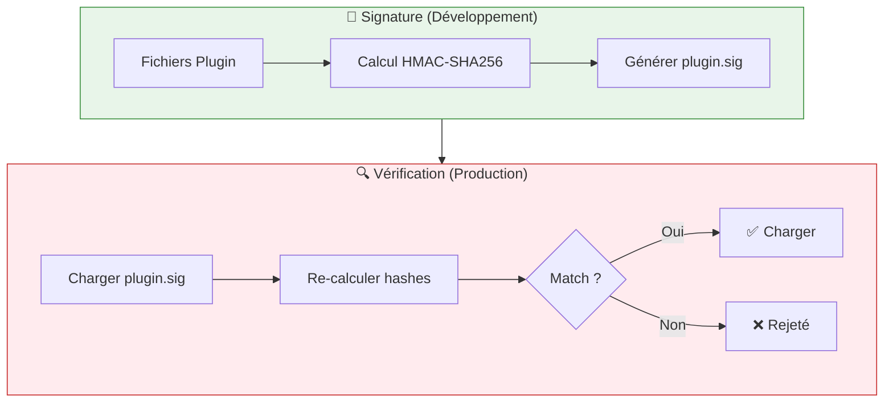
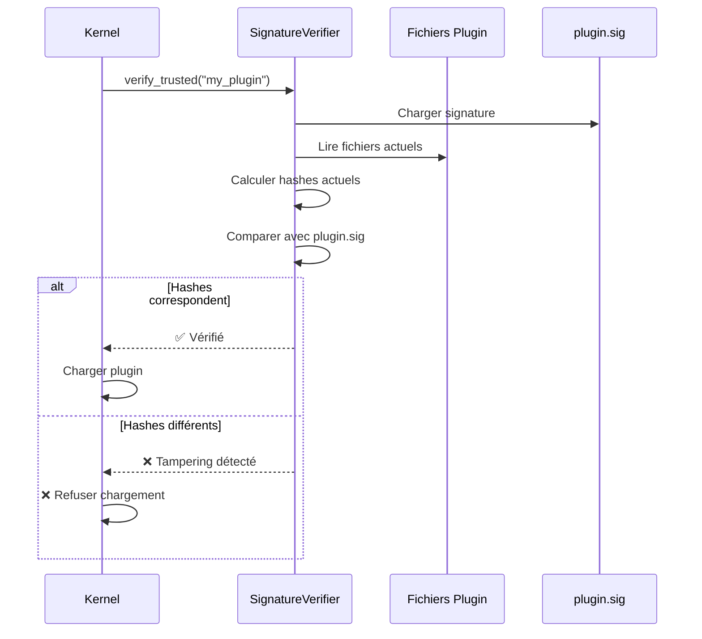
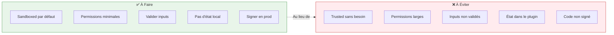

# Security Deep Dive

XCore suit un modèle **"Zero Trust"** pour les plugins. Même les plugins trusted sont restreints de modifier l'état du kernel, tandis que les plugins sandboxed sont isolés aux niveaux OS et Runtime.

---

## Vue d'Ensemble de la Sécurité



---

## 1. Le Multi-Layer Sandbox

Quand `execution_mode: sandboxed` est défini, le kernel applique **3 couches de protection** successives.

### Vue d'Ensemble du Flux



---

### Couche 1: Analyse Statique (AST)

Avant l'exécution, l'`ASTScanner` parse l'arbre syntaxique du plugin avec un `ast.NodeVisitor`.



#### Liste Complète des Restrictions

```python
# ❌ Forbidden Names (bloqués par l'AST)
FORBIDDEN_NAMES = {
    'eval', 'exec', 'compile',
    'globals', 'locals', 'vars',
    '__import__', 'open', 'input',
    'breakpoint', 'delattr', 'setattr'
}

# ❌ Forbidden Attributes (sandboxes escapes courants)
FORBIDDEN_ATTRIBUTES = {
    '__class__', '__bases__', '__subclasses__',
    '__globals__', '__code__', '__closure__',
    '__builtins__', '__import__', 'gi_frame',
    'cr_frame', 'f_globals', 'f_locals'
}

# ❌ Forbidden Modules (nécessite allowed_imports)
FORBIDDEN_MODULES = {
    'os', 'sys', 'subprocess', 'multiprocessing',
    'socket', 'requests', 'urllib', 'http',
    'pickle', 'marshal', 'shelve'
}
```

#### Exemple de Configuration

```yaml
# plugin.yaml
# Pour utiliser des modules normalement restreints
allowed_imports:
  - datetime      # ✅ Autorisé
  - json          # ✅ Autorisé
  - hashlib       # ✅ Autorisé (si besoin)
  - re            # ✅ Autorisé

# Tentative d'import bloqué :
# import os  # ❌ Erreur: Module 'os' non autorisé
```

---

### Couche 2: Isolation Processus

Les plugins sandboxed s'exécutent dans un **processus OS dédié** via le module `multiprocessing`.



#### Transport: JSON-RPC 2.0 sur Pipes OS

```python
# Format des messages Kernel → Worker
{
    "jsonrpc": "2.0",
    "id": "uuid-1234-5678",
    "method": "call",
    "params": {
        "action": "greet",
        "payload": {"name": "World"}
    }
}

# Format des messages Worker → Kernel
{
    "jsonrpc": "2.0",
    "id": "uuid-1234-5678",
    "result": {"status": "ok", "message": "Hello !"}
}

# Ou en cas d'erreur
{
    "jsonrpc": "2.0",
    "id": "uuid-1234-5678",
    "error": {
        "code": -32000,
        "message": "Action not found"
    }
}
```

#### Pourquoi JSON-RPC ?

| Avantage | Description |
| :--- | :--- |
| **Sérialisation sûre** | Seulement types JSON (pas de `pickle` → pas de RCE) |
| **Langage-agnostique** | Pourrait être implémenté dans tout langage |
| **Debug-friendly** | Messages lisibles en clair |
| **Standardisé** | Spécification JSON-RPC 2.0 |

---

### Couche 3: Limites de Ressources OS

Le kernel monitorle RSS (Resident Set Size) et le temps CPU du worker.



#### Configuration des Limites

```yaml
# plugin.yaml
resources:
  # Mémoire maximale (Mo)
  max_memory_mb: 256
  
  # Timeout d'exécution (secondes)
  timeout_seconds: 30
  
  # Rate limiting
  rate_limit:
    calls: 1000
    period_seconds: 60
```

#### Comportement en Cas de Dépassement

| Ressource | Limite | Comportement |
| :--- | :--- | :--- |
| **Mémoire** | `max_memory_mb` | Warning à 80%, Kill à 100% |
| **Timeout** | `timeout_seconds` | Kill immédiat + erreur timeout |
| **Rate Limit** | `calls/period` | Erreur 429 Too Many Requests |

---

## 2. Permission Engine

Chaque appel inter-plugin et accès service est audité par le **PermissionEngine**.

### Modèle d'Évaluation



### Modèle "Fail-Closed"

XCore utilise un modèle **"Fail-Closed"** : si aucune policy n'autorise explicitement une action, elle est **refusée**.

```
1. Vérifier DENY explicite → Si trouvé: ❌ REFUSÉ
2. Vérifier ALLOW explicite → Si trouvé: ✅ AUTORISÉ
3. Aucun match → ❌ REFUSÉ (défaut)
```

### Patterns de Permissions

#### Wildcards sur les Ressources

```yaml
permissions:
  # ✅ Autorise lecture sur TOUTES les tables 'users_*'
  - resource: "db.users.*"
    actions: ["read"]
    effect: allow
  
  # ✅ Autorise lecture/écriture sur cache global
  - resource: "cache.global"
    actions: ["read", "write"]
    effect: allow
  
  # ✅ Autorise TOUS les actions sur une resource
  - resource: "logs.*"
    actions: ["*"]
    effect: allow
  
  # ❌ DENY explicite (priorité haute)
  - resource: "db.admin.*"
    actions: ["*"]
    effect: deny
```

#### Exemple Complet de Policy

```yaml
# plugin.yaml
permissions:
  # Lecture seule sur la DB principale
  - resource: "db.main.users"
    actions: ["read"]
    effect: allow
  
  - resource: "db.main.posts"
    actions: ["read"]
    effect: allow
  
  # Écriture sur cache
  - resource: "cache.global"
    actions: ["read", "write"]
    effect: allow
  
  # Accès scheduler
  - resource: "scheduler.jobs"
    actions: ["create", "delete"]
    effect: allow
  
  # Interdiction explicite (sécurité défense)
  - resource: "db.admin.*"
    actions: ["*"]
    effect: deny
  
  - resource: "kernel.*"
    actions: ["*"]
    effect: deny
```

### Flux d'Évaluation



---

## 3. Signature des Plugins Trusted

En production, le mode `strict_trusted` garantit que les plugins trusted n'ont pas été altérés.

### Architecture de Signature



### Générer une Signature

```bash
# Signer un plugin trusted
xcore plugin sign plugins/my_plugin/

# Le fichier plugin.sig est créé/mis à jour
```

### Structure de `plugin.sig`

```json
{
  "plugin": "my_plugin",
  "version": "1.0.0",
  "timestamp": "2024-01-15T10:30:00Z",
  "files": {
    "plugin.yaml": "a1b2c3d4e5f6...",
    "src/main.py": "f6e5d4c3b2a1...",
    "src/utils.py": "1234567890ab..."
  },
  "signature": "hmac-sha256-signature-here"
}
```

### Vérification au Boot



---

## 4. Bonnes Pratiques pour les Développeurs

### Checklist de Sécurité



### 1. Utiliser le Sandboxing par Défaut

```yaml
# ✅ RECOMMANDÉ: Sandboxed pour isolation maximale
execution_mode: sandboxed

# ⚠️ UNIQUEMENT SI NÉCESSAIRE: Trusted pour accès kernel
execution_mode: trusted
# Nécessite: accès FastAPI hooks, objets kernel complexes
```

### 2. Demander des Permissions Minimales

```yaml
# ❌ TROP LARGE
permissions:
  - resource: "db.*"
    actions: ["*"]
    effect: allow

# ✅ MINIMAL
permissions:
  - resource: "db.main.users"
    actions: ["read"]
    effect: allow
  - resource: "db.main.posts"
    actions: ["read", "write"]
    effect: allow
```

### 3. Valider Tous les Inputs

```python
from xcore.sdk import TrustedBase, AutoDispatchMixin, action, ok
from pydantic import BaseModel, Field

# ✅ Schema de validation
class GreetInput(BaseModel):
    name: str = Field(min_length=1, max_length=100)
    language: str = Field(default="fr")

class Plugin(AutoDispatchMixin, TrustedBase):
    
    @action("greet")
    async def greet(self, payload: dict):
        # Valider l'input
        try:
            validated = GreetInput(**payload)
        except ValidationError as e:
            return error(msg=str(e), code="invalid_input")
        
        return ok(message=f"Bonjour, {validated.name} !")
```

### 4. Pas d'État Local

```python
# ❌ MAUVAIS: État dans le plugin
class Plugin(TrustedBase):
    def __init__(self):
        self.cache_local = {}  # ⚠️ Perdu au reload !

# ✅ BON: État dans les services
class Plugin(TrustedBase):
    async def on_load(self):
        self.cache = self.get_service("cache")  # ✅ Persistant
    
    async def store(self, key, value):
        await self.cache.set(key, value)  # ✅ Sauvegardé
```

### 5. Signer en Production

```bash
# Développement
# Pas de signature requise

# Production (strict_trusted activé)
xcore plugin sign plugins/my_plugin/

# Vérifier
xcore plugin validate plugins/my_plugin/
```

---

## 5. matrice de Sécurité

### Comparaison Trusted vs Sandboxed

| Caractéristique | Trusted | Sandboxed |
| :--- | :--- | :--- |
| **Processus** | Principal | Isolé (OS) |
| **Performance** | ⚡ Rapide | 🐌 IPC overhead |
| **Isolation** | 🔶 Logique | 🔒 Physique |
| **Accès Kernel** | ✅ Complet | ❌ Via IPC uniquement |
| **AST Scan** | ⚠️ Partiel | ✅ Complet |
| **Usage** | Dev / Confiance | Prod / Tiers |

### Tableau des Permissions par Défaut

| Action | Trusted | Sandboxed |
| :--- | :--- | :--- |
| Appeler autre plugin | ✅ (avec permission) | ✅ (avec permission) |
| Accéder DB publique | ✅ | ✅ |
| Accéder DB privée | ❌ | ❌ |
| Modifier kernel | ❌ | ❌ |
| Import restreint | ⚠️ (whitelist) | ❌ (bloqué AST) |
| Route HTTP | ✅ | ✅ (via IPC) |

---

## Prochaines Lectures

| 📚 Guide | Objectif |
| :--- | :--- |
| [Event System](events.md) | Messagerie sécurisée |
| [Plugin Creation](creating-plugins.md) | Développer des plugins |
| [Troubleshooting](troubleshooting.md) | Déboguer les erreurs |
