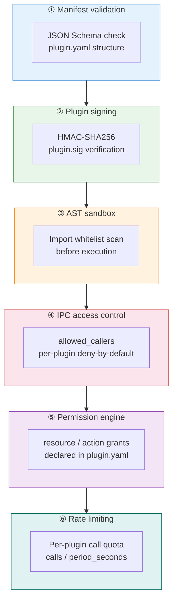
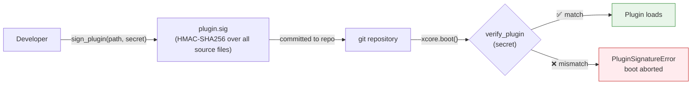
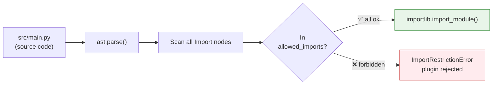
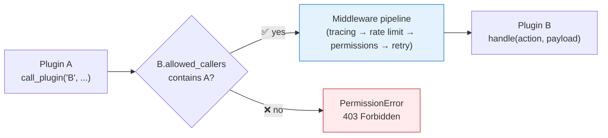
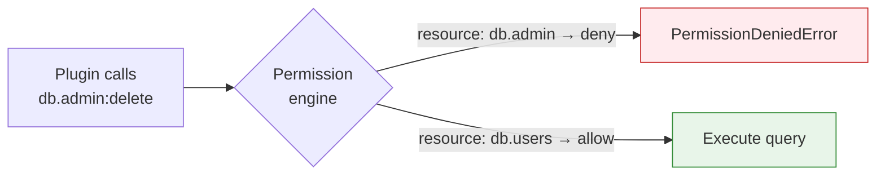

# Security

XCore implements **defense in depth** across six distinct layers.



---

## ① Manifest validation

Every `plugin.yaml` is validated against a JSON Schema at load time.
Missing required fields (`name`, `version`) or unknown `execution_mode` values cause an immediate `ManifestValidationError`.

```yaml title="Valid manifest"
name: my_plugin         # required
version: "1.0.0"        # required
execution_mode: trusted # trusted | sandboxed | legacy
entry_point: src/main.py
```

---

## ② Plugin signing

Signing ensures that plugin files have not been tampered with since the last authorized signature.



### Enable strict mode

```yaml title="integration.yaml"
plugins:
  secret_key: "your-hmac-secret"
  strict_trusted: true       # reject unsigned TrustedBase plugins
```

### Sign a plugin

=== "CLI"

    ```bash
    # Sign
    poetry run xcore plugin sign plugins/my_plugin --secret "your-hmac-secret"
    # → creates plugins/my_plugin/plugin.sig

    # Verify
    poetry run xcore plugin verify plugins/my_plugin --secret "your-hmac-secret"
    # → ✅ signature valid
    ```

=== "Python"

    ```python
    from xcore.kernel.security.signature import sign_plugin, verify_plugin

    sign_plugin("plugins/my_plugin", secret="your-hmac-secret")

    is_valid = verify_plugin("plugins/my_plugin", secret="your-hmac-secret")
    # True / False
    ```

---

## ③ AST sandbox

Sandboxed plugins are scanned by an AST parser **before** the module is imported. Any `import` or `from X import` not on the whitelist causes an `ImportRestrictionError` at load time — the plugin never executes.



### Configure the global whitelist

```yaml title="integration.yaml"
security:
  allowed_imports:            # everything a sandboxed plugin can import
    - json
    - math
    - re
    - datetime
    - typing
    - uuid
    - decimal
    - hashlib
    - base64
    - asyncio
    - logging
    - collections
    - functools
    - itertools

  forbidden_imports:          # explicit deny — overrides allowed_imports
    - os
    - subprocess
    - socket
    - importlib
```

### Per-plugin extension

```yaml title="plugin.yaml"
allowed_imports:
  - statistics    # adds to the global list for this plugin only
  - decimal
```

!!! danger "No runtime escape"
    The scan catches `import os`, `from os import path`, `__import__("os")`, and `importlib.import_module("os")` — all blocked at parse time, before any code runs.

---

## ④ IPC access control

Every plugin-to-plugin call passes through an **IPC auth check** before anything else in the middleware pipeline.



### Configuration

```yaml title="plugin.yaml (target plugin)"
allowed_callers:
  - auth_plugin       # only these plugins may call this one
  - billing_plugin
```

| Value | Effect |
|:------|:-------|
| `[]` (empty list) | **All IPC calls blocked** — default for new plugins |
| `["*"]` | All plugins allowed |
| `["auth_plugin"]` | Only `auth_plugin` may call |

Enable globally:

```yaml title="integration.yaml"
tenancy:
  enforce_ipc: true
```

---

## ⑤ Permission engine

Plugins declare their resource/action grants in `plugin.yaml`. The permission engine checks every IPC call.

```yaml title="plugin.yaml"
permissions:
  - resource: "cache.*"       # glob — all keys in cache
    actions: ["read", "write"]
    effect: allow

  - resource: "db.users"      # specific table
    actions: ["read", "write"]
    effect: allow

  - resource: "db.admin"
    actions: ["*"]
    effect: deny              # explicit deny overrides any allow
```

### Access denied flow



---

## ⑥ Rate limiting

### Global default

```yaml title="integration.yaml"
security:
  rate_limit_default:
    calls: 200
    period_seconds: 60   # 200 calls/min applied to every plugin
```

### Per-plugin override

```yaml title="plugin.yaml"
resources:
  rate_limit:
    calls: 50
    period_seconds: 60   # this plugin: 50 calls/min
```

When the quota is exceeded, the call returns `{"status": "error", "code": "rate_limit_exceeded"}` without reaching the plugin.

---

## Production checklist

```yaml title="integration.yaml"
app:
  env: production              # activates key validation at boot
  secret_key: "${SECRET_KEY}"  # load from env — never hardcode
  server_key: "${SERVER_KEY}"

plugins:
  secret_key: "${PLUGIN_SECRET_KEY}"
  strict_trusted: true         # reject unsigned plugins
```

```bash
# Generate strong keys
openssl rand -hex 32   # for secret_key and server_key
openssl rand -hex 32   # for plugin secret_key
```

!!! danger "Boot guard"
    XCore **refuses to start** in `env: production` if any secret key matches the default value (`"change-me-in-production"`).

---

## Security audit

```bash
# Run Bandit static analysis (reports written to ./reports/)
make auto-security

# Direct invocation
poetry run bandit -r xcore/ -f txt
```
