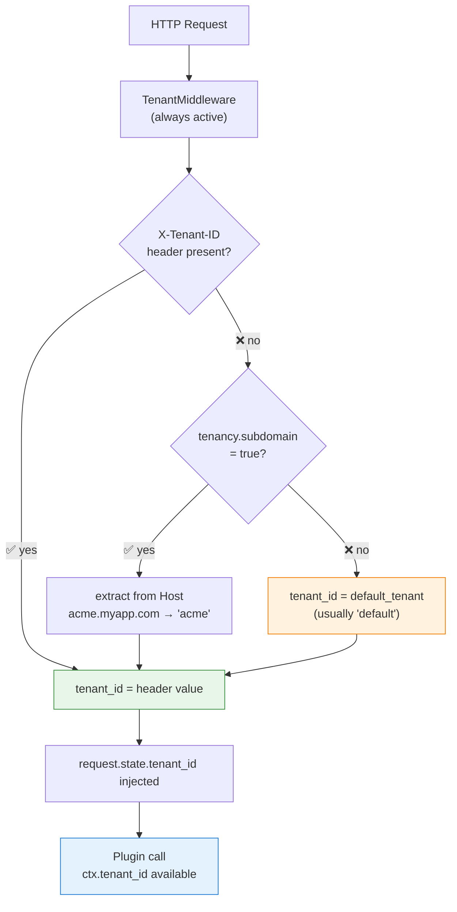
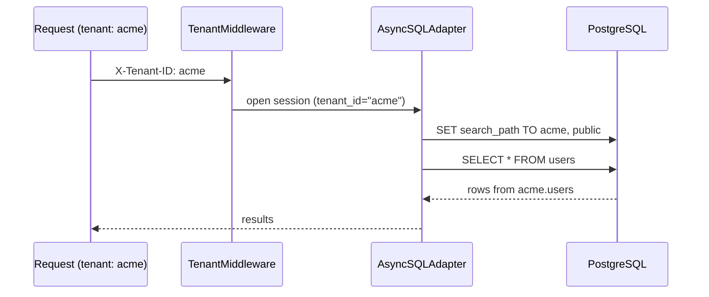
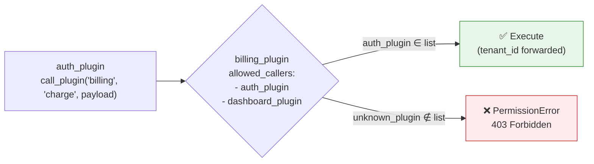

# Multi-Tenancy

XCore includes **native** multi-tenant support. When enabled, each HTTP request is associated with a tenant ID, and all services (cache, database, scheduler) automatically scope their resources — **no code change required in your plugins**.

---

## How tenant resolution works



---

## Configuration

```yaml title="integration.yaml"
tenancy:
  enabled: true                 # (1)!
  header: "X-Tenant-ID"        # (2)!
  subdomain: false              # (3)!
  default_tenant: "default"    # (4)!

  isolate_cache: true           # (5)!
  isolate_db: true              # (6)!
  isolate_scheduler: false      # (7)!
  enforce_ipc: true             # (8)!
```

1. `false` = all requests use `default_tenant`. `TenantMiddleware` is always mounted, but inactive.
2. HTTP header to read the tenant ID from.
3. Extract tenant from `acme.myapp.com` → `"acme"`.
4. Fallback when no header or subdomain is found.
5. Prefix all cache keys with `<tenant_id>:`.
6. `SET search_path TO <tenant_id>, public` before every DB session (PostgreSQL).
7. Prefix APScheduler job IDs with `<tenant_id>:`.
8. Check `allowed_callers` on every IPC call.

---

## Reading the tenant in a plugin

```python title="No changes needed — just read ctx.tenant_id"
class Plugin(AutoDispatchMixin, TrustedBase):

    @action("get_invoice")
    async def get_invoice(self, payload: dict) -> dict:
        tenant = self.ctx.tenant_id   # "acme", "beta_corp", "default", …

        # Use it for logging, metrics, or custom business logic
        self.logger.info("[%s] get_invoice %s", tenant, payload.get("id"))

        async with self.db.session() as session:
            # With isolate_db=true, search_path is already set to "acme"
            ...
```

---

## Cache isolation

```mermaid
flowchart LR
    subgraph Tenant_acme["Tenant: acme"]
        P1["Plugin\ncache.set('invoices', data)"] --> K1["stored as\n'acme:invoices'"]
        P2["Plugin\ncache.get('invoices')"] --> K1
    end

    subgraph Tenant_beta["Tenant: beta_corp"]
        P3["Plugin\ncache.set('invoices', data)"] --> K2["stored as\n'beta_corp:invoices'"]
        P4["Plugin\ncache.get('invoices')"] --> K2
    end

    K1 -.x K2
    note["Keys are fully isolated\n— no leakage possible"]

    style K1 fill:#E3F2FD,stroke:#1976D2
    style K2 fill:#E8F5E9,stroke:#388E3C
```

When `isolate_cache: true`, the prefix is added transparently — plugin code does not change:

```python
# Plugin code (same for all tenants)
await self.cache.set("invoices", data)     # stored as "acme:invoices" for tenant "acme"
result = await self.cache.get("invoices")  # reads "acme:invoices"
```

---

## Database isolation (PostgreSQL)

When `isolate_db: true`, XCore runs `SET search_path TO <tenant_id>, public` before every SQLAlchemy session. This enables **PostgreSQL schema-level** isolation:



**Setup required** — create one PostgreSQL schema per tenant:

=== "SQL setup"

    ```sql
    CREATE SCHEMA acme;
    CREATE SCHEMA beta_corp;

    -- Run your migrations in each schema
    -- (e.g. with Alembic using --schema=acme)
    ```

=== "Alembic migration"

    ```bash
    # Run migration for each tenant schema
    alembic upgrade head --x tenant=acme
    alembic upgrade head --x tenant=beta_corp
    ```

!!! note "SQLite / MySQL"
    Schema-level isolation is PostgreSQL-specific. For other databases, add a `tenant_id` column to your tables and filter at the query level.

---

## Scheduler isolation

When `isolate_scheduler: true`, job IDs are automatically prefixed:

```python
# Plugin code — no change needed
self.scheduler.add_job(func=..., id="daily_report", ...)
# Stored as "acme:daily_report" for tenant "acme"
# Stored as "beta_corp:daily_report" for tenant "beta_corp"
```

This prevents tenants' jobs from colliding with each other.

---

## IPC enforcement

When `enforce_ipc: true`, every plugin-to-plugin call verifies the caller against `allowed_callers` in the target plugin's manifest. The tenant ID flows through the call chain automatically.



---

## Client usage

```http
POST /app/invoices/action HTTP/1.1
Host: myapp.com
X-Tenant-ID: acme
Content-Type: application/json

{"action": "list", "payload": {"page": 1}}
```

```python title="httpx client example"
import httpx

BASE = "http://localhost:8000/app/invoices/action"

for tenant in ["acme", "beta_corp"]:
    r = httpx.post(
        BASE,
        json={"action": "list", "payload": {}},
        headers={"X-Tenant-ID": tenant},
    )
    print(f"{tenant}: {r.json()}")
    # Completely isolated results per tenant
```

---

## Isolation summary

| Feature | Config flag | What happens automatically |
|:--------|:-----------|:--------------------------|
| Cache key prefix | `isolate_cache: true` | `set("key")` → stored as `"<tenant>:key"` |
| DB schema routing | `isolate_db: true` | `SET search_path TO <tenant>, public` |
| Scheduler job prefix | `isolate_scheduler: true` | `add_job(id="x")` → stored as `"<tenant>:x"` |
| IPC caller check | `enforce_ipc: true` | Blocks callers not in `allowed_callers` |
| Tenant in context | always | `self.ctx.tenant_id` available in every call |
