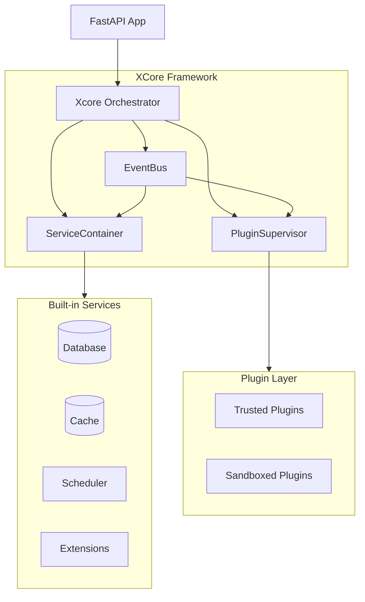

# XCore Framework Documentation

Welcome to **XCore** — a production-grade, plugin-first Python framework built on FastAPI.

## What is XCore?

XCore is a modular orchestration framework designed to load, isolate, and manage plugins in a secure sandboxed environment. It enables building extensible applications where each feature can be developed, tested, and deployed independently.

## Key Features

- **🚀 Dynamic Plugin System** — Load, unload, and hot-reload plugins without server restart
- **🔒 Sandboxing & Security** — Isolated execution with process limits, timeouts, and automatic restarts
- **🔌 Native Service Integration** — Built-in support for SQL (PostgreSQL, MySQL, SQLite), NoSQL (Redis), Task Scheduling (APScheduler), and more
- **📡 Event-Driven Architecture** — Powerful event bus enabling inter-plugin communication and system events
- **🌐 Custom HTTP Routes** — Plugins can expose their own FastAPI endpoints
- **♻️ Hot Reloading** — Automatic file watching for development
- **📊 Production Ready** — YAML configuration, environment variables, structured logging, metrics

## Quick Start

```bash
# Install dependencies
poetry install

# Configure environment
cp .env.example .env
# Edit .env with your settings

# Run development server
poetry run uvicorn app:app --reload --port 8082
```

## Documentation Structure

```
docs/
├── getting-started/     # Installation and first steps
├── guides/             # How-to guides
├── reference/          # API reference and configuration
├── architecture/       # System architecture and design
├── development/        # Development guidelines
├── deployment/         # Production deployment
└── examples/           # Code examples and tutorials
```

## Project Architecture



## Next Steps

- [Installation Guide](getting-started/installation.md)
- [Creating Your First Plugin](guides/creating-plugins.md)
- [Configuration Reference](reference/configuration.md)
- [Architecture Overview](architecture/overview.md)

## Community & Support

- GitHub Issues: [Report bugs or request features](https://github.com/traoreera/xcore/issues)
- Discussions: [Community forum](https://github.com/traoreera/xcore/discussions)

## License

XCore is released under the [MIT License](../LICENSE).
