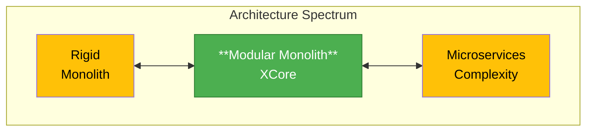
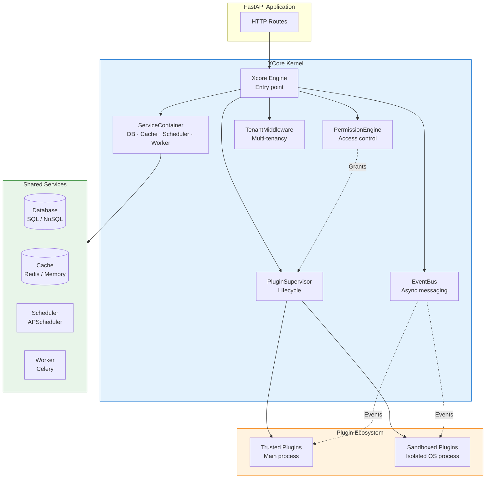
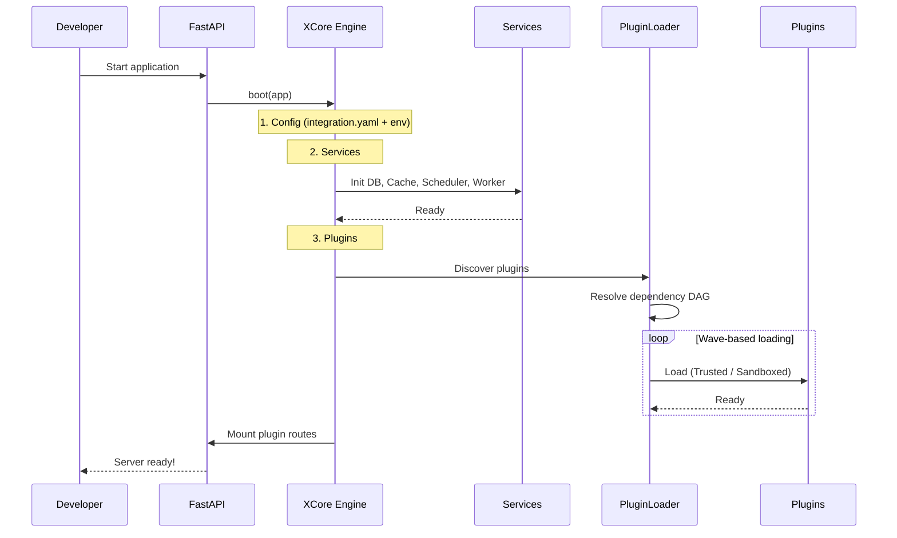

# XCore Framework

**XCore** is a production-grade Python framework for building modular, extensible, and secure applications. Built on **FastAPI** and **asyncio**, it follows a **Modular Monolith** architecture where each feature lives in an isolated plugin with its own lifecycle, permissions, and resource limits.

---

<div class="grid cards" markdown>

-   :material-rocket-launch:{ .lg .middle } **High Performance**

    Built on FastAPI and asyncio for maximum throughput with minimal overhead.

-   :material-shield-lock:{ .lg .middle } **Security by Design**

    Multi-layer sandbox, AST validation, per-plugin capability grants, and IPC access control.

-   :material-puzzle-outline:{ .lg .middle } **Plugin-First Architecture**

    Everything is a plugin. Load, unload, and hot-reload without downtime.

-   :material-database:{ .lg .middle } **Integrated Services**

    SQL/NoSQL databases, Redis cache, APScheduler, and Celery task queues — all pre-wired.

-   :material-lightning-bolt:{ .lg .middle } **Events & Hooks**

    Async event bus for loose coupling between components.

-   :material-office-building:{ .lg .middle } **Native Multi-Tenancy**

    Automatic cache, database, and scheduler isolation per tenant with one config flag.

</div>

---

## Why XCore?

Modern applications oscillate between two extremes: **rigid monoliths** that are hard to maintain and **distributed microservices** that are expensive to operate. XCore offers a third path: the **Modular Monolith**.


```mermaid
flowchart LR
    subgraph Spectrum["Architecture Spectrum"]
        direction LR
        M[Rigid<br/>Monolith] <--> MM[**Modular Monolith**<br/>XCore] <--> MS[Microservices<br/>Complexity]
    end
    style MM fill:#4CAF50,color:#fff,stroke:#2E7D32
    style M fill:#FFC107,color:#000
    style MS fill:#FFC107,color:#000
```

| Aspect | Classic Monolith | XCore (Modular Monolith) | Microservices |
|:-------|:----------------|:------------------------|:-------------|
| **Deployment** | Single, risky | Single, plugins isolated | Multiple, complex |
| **Isolation** | None | Sandbox per plugin | Process / network |
| **Scalability** | Vertical | Per-plugin via Celery | Horizontal |
| **Complexity** | Low | Medium | High |
| **Dev velocity** | Fast | Fast | Slow |

---

## Architecture at a Glance


```mermaid
flowchart TB
    subgraph App["FastAPI Application"]
        FA[HTTP Routes]
    end

    subgraph Kernel["XCore Kernel"]
        direction TB
        X[Xcore Engine<br/>Entry point]
        SC[ServiceContainer<br/>DB · Cache · Scheduler · Worker]
        PS[PluginSupervisor<br/>Lifecycle]
        EB[EventBus<br/>Async messaging]
        PE[PermissionEngine<br/>Access control]
        TM[TenantMiddleware<br/>Multi-tenancy]
    end

    subgraph Plugins["Plugin Ecosystem"]
        direction LR
        TP[Trusted Plugins<br/>Main process]
        SP[Sandboxed Plugins<br/>Isolated OS process]
    end

    subgraph Services["Shared Services"]
        DB[(Database<br/>SQL / NoSQL)]
        CACHE[(Cache<br/>Redis / Memory)]
        SCHED[Scheduler<br/>APScheduler]
        WORKER[Worker<br/>Celery]
    end

    FA --> X
    X --> SC & PS & EB & PE & TM
    SC --> Services
    PS --> TP & SP
    EB -.->|Events| TP & SP
    PE -.->|Grants| PS

    style Kernel fill:#E3F2FD,stroke:#1976D2
    style Plugins fill:#FFF3E0,stroke:#F57C00
    style Services fill:#E8F5E9,stroke:#388E3C
```

---

## Boot Sequence


```mermaid
sequenceDiagram
    participant Dev as Developer
    participant App as FastAPI
    participant Kernel as XCore Engine
    participant Svc as Services
    participant Loader as PluginLoader
    participant P as Plugins

    Dev->>App: Start application
    App->>Kernel: boot(app)

    Note over Kernel: 1. Config (integration.yaml + env)
    Note over Kernel: 2. Services
    Kernel->>Svc: Init DB, Cache, Scheduler, Worker
    Svc-->>Kernel: Ready

    Note over Kernel: 3. Plugins
    Kernel->>Loader: Discover plugins
    Loader->>Loader: Resolve dependency DAG

    loop Wave-based loading
        Loader->>P: Load (Trusted / Sandboxed)
        P-->>Loader: Ready
    end

    Kernel->>App: Mount plugin routes
    App-->>Dev: Server ready!
```

---

## Quick Start

### 1. Install

```bash
git clone https://github.com/traoreera/xcore
cd xcore
poetry install
```

### 2. Configure — `integration.yaml`

```yaml
app:
  name: "my-app"
  debug: true
  secret_key: "change-me-in-production"
  plugin_prefix: "/app"

plugins:
  directory: ./plugins
  secret_key: "change-me-in-production"

services:
  databases:
    db:
      type: sqlasync
      url: sqlite+aiosqlite:///./app.db
  cache:
    backend: memory
    ttl: 300
```

### 3. Entry point — `main.py`

```python
from contextlib import asynccontextmanager
from fastapi import FastAPI
from xcore import Xcore

xcore = Xcore(config_path="integration.yaml")

@asynccontextmanager
async def lifespan(app: FastAPI):
    await xcore.boot(app)
    yield
    await xcore.shutdown()

app = FastAPI(**xcore._config.app.fastapi.to_dict(), lifespan=lifespan)
xcore.setup(app)   # register middlewares before startup
```

### 4. First plugin

```
plugins/hello/
├── plugin.yaml
└── src/main.py
```

```yaml
# plugin.yaml
name: hello
version: "1.0.0"
execution_mode: trusted
entry_point: src/main.py
```

```python
# src/main.py
from xcore import TrustedBase
from xcore.sdk.decorators import action
from xcore.sdk.mixin.ipc import AutoDispatchMixin
from xcore.kernel.api.contract import ok

class Plugin(AutoDispatchMixin, TrustedBase):

    @action("ping")
    async def ping(self, payload: dict) -> dict:
        return ok(pong=True)
```

### 5. Run

```bash
poetry run uvicorn main:app --reload
poetry run xcore plugin list
```

---

## Documentation Map

| Section | Description |
|:--------|:-----------|
| [Installation](getting-started/installation.md) | Set up your development environment |
| [Quick Start](getting-started/quickstart.md) | Build your first plugin in 5 minutes |
| [Creating a Plugin](guides/creating-plugins.md) | Full plugin development guide |
| [Plugin Manifest](guides/plugin-manifest.md) | Complete `plugin.yaml` reference |
| [Services](guides/services.md) | DB, Cache, Scheduler, and Celery |
| [Multi-Tenancy](guides/tenancy.md) | Tenant isolation across all services |
| [Middlewares](guides/middlewares.md) | ASGI middleware pipeline |
| [Events & Hooks](guides/events.md) | Async messaging between components |
| [Security](guides/security.md) | Sandbox, plugin signing, IPC control |
| [SDK Reference](reference/sdk.md) | `@action`, `@schema`, `AutoDispatchMixin` |
| [Configuration](reference/configuration.md) | All `integration.yaml` options |
| [CLI](reference/cli.md) | Command-line interface |
| [Architecture](architecture/overview.md) | Internals deep dive |
