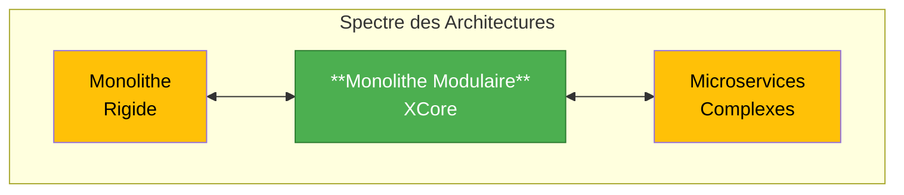
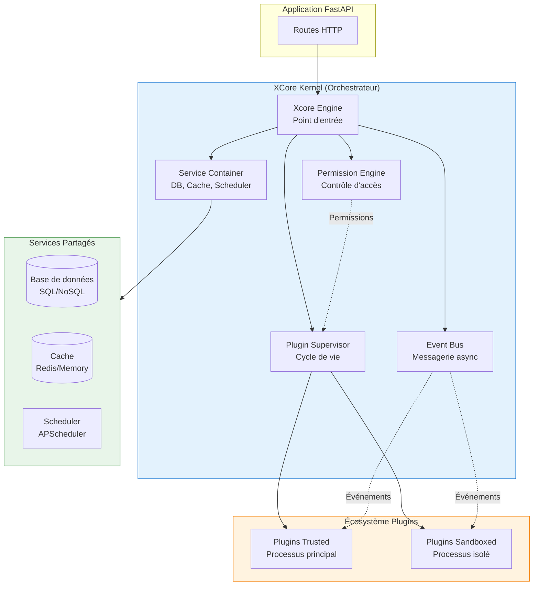
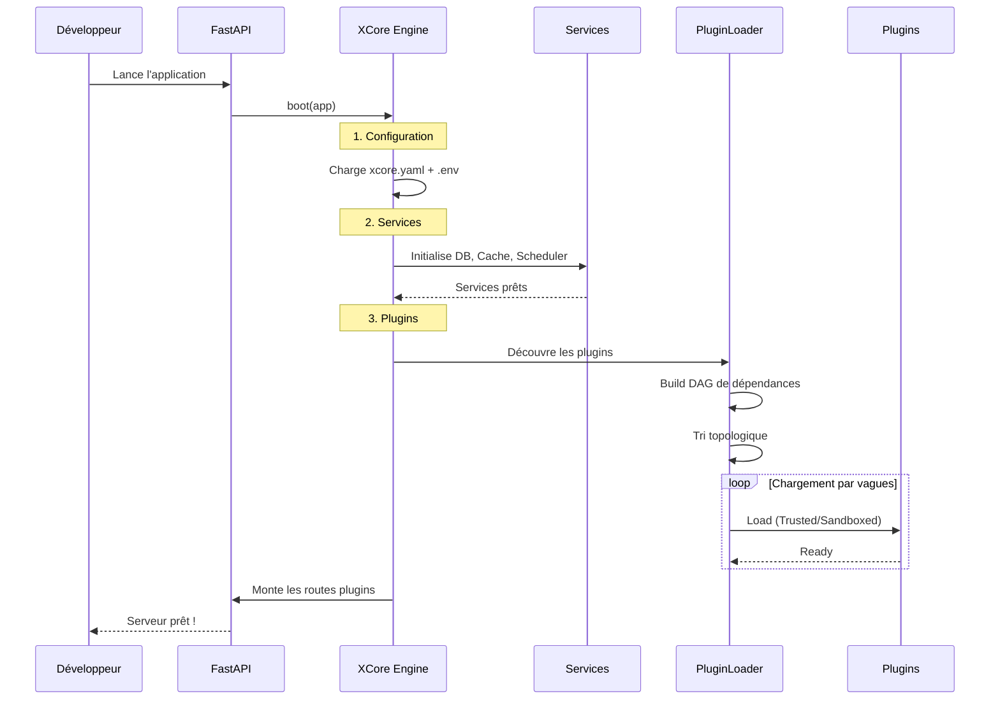
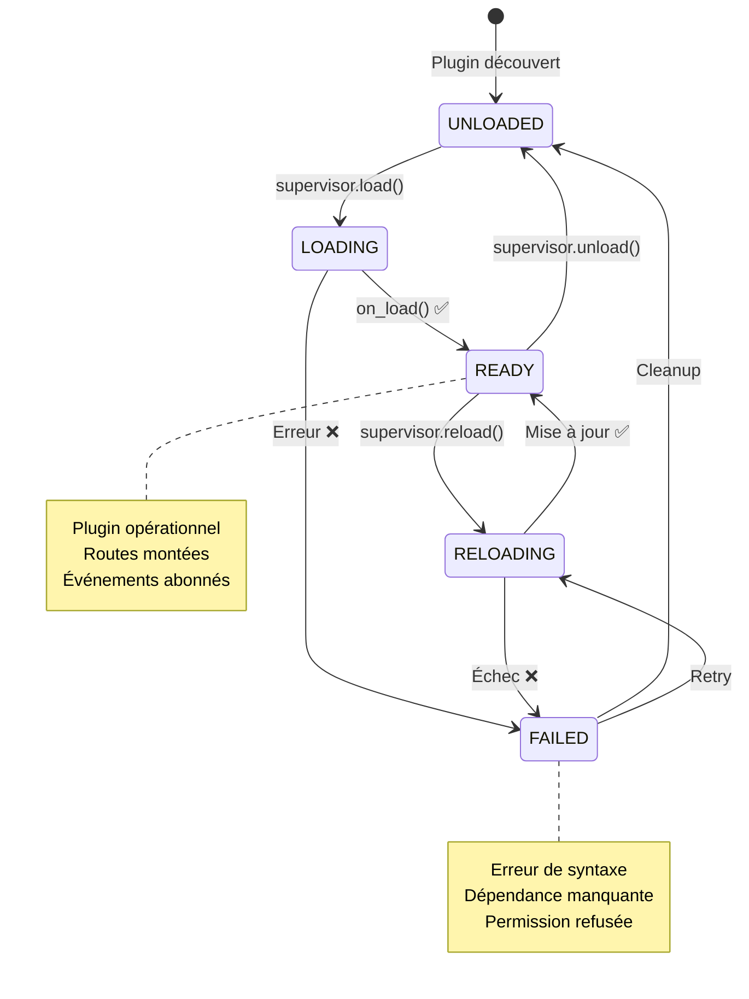
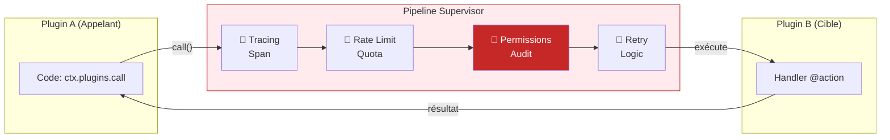

# XCore Framework

**XCore** est un framework Python de niveau production, conçu pour construire des applications modulaires, extensibles et sécurisées. Basé sur **FastAPI** et **asyncio**, il suit une architecture **Modular Monolith** où chaque fonctionnalité est encapsulée dans des plugins isolés.

---

<div class="grid cards" markdown>

-   :material-rocket-launch:{ .lg .middle } **Haute Performance**

    Construit sur FastAPI et asyncio pour un débit maximal avec un overhead minimal.

-   :material-shield-lock:{ .lg .middle } **Sécurité par Design**

    Sandbox multi-couche, validation AST, et moteur de permissions granulaire.

-   :material-puzzle-outline:{ .lg .middle } **Architecture Plugin-First**

    Tout est un plugin. Chargement, déchargement et rechargement à chaud sans downtime.

-   :material-database:{ .lg .middle } **Services Intégrés**

    Bases SQL/NoSQL, cache Redis, et scheduling de tâches inclus.

-   :material-lightning-bolt:{ .lg .middle } **Événements & Hooks**

    Système de messagerie asynchrone pour un couplage lâche entre composants.

-   :material-scale-balance:{ .lg .middle } **Isolation Garantie**

    Plugins trusted (processus principal) ou sandboxed (processus OS isolé).

</div>

---

## Pourquoi XCore ?

Les applications modernes oscillent entre deux extrêmes : le **monolithe rigide** difficile à maintenir et les **microservices complexes** à orchestrer. XCore propose une troisième voie : le **Monolithe Modulaire**.


```mermaid
flowchart LR
    subgraph Traduction["Spectre des Architectures"]
        direction LR
        M[Monolithe<br/>Rigide] <--> MM[**Monolithe Modulaire**<br/>XCore] <--> MS[Microservices<br/>Complexes]
    end

    style MM fill:#4CAF50,color:#fff,stroke:#2E7D32
    style M fill:#FFC107,color:#000
    style MS fill:#FFC107,color:#000
```

### Les Avantages du Modular Monolith

| Aspect | Monolithe Classique | XCore (Modular Monolith) | Microservices |
| :--- | :--- | :--- | :--- |
| **Déploiement** | Unique, risqué | Unique, plugins isolés | Multiple, complexe |
| **Isolation** | Aucune | Sandbox par plugin | Processus/network |
| **Scalabilité** | Verticale | Plugins scalables | Horizontale |
| **Complexité** | Faible | Moyenne | Élevée |
| **Temps de dev** | Rapide | Rapide | Lent |

---

## Architecture en un Coup d'Œil


```mermaid
flowchart TB
    subgraph App["Application FastAPI"]
        FA[Routes HTTP]
    end

    subgraph Kernel["XCore Kernel (Orchestrateur)"]
        direction TB
        X[Xcore Engine<br/>Point d'entrée]
        SC[Service Container<br/>DB, Cache, Scheduler]
        PS[Plugin Supervisor<br/>Cycle de vie]
        EB[Event Bus<br/>Messagerie async]
        PE[Permission Engine<br/>Contrôle d'accès]
    end

    subgraph Plugins["Écosystème Plugins"]
        direction LR
        TP[Plugins Trusted<br/>Processus principal]
        SP[Plugins Sandboxed<br/>Processus isolé]
    end

    subgraph Services["Services Partagés"]
        DB[(Base de données<br/>SQL/NoSQL)]
        CACHE[(Cache<br/>Redis/Memory)]
        SCHED[Scheduler<br/>APScheduler]
    end

    FA --> X
    X --> SC
    X --> PS
    X --> EB
    X --> PE

    SC --> Services
    PS --> TP
    PS --> SP

    EB -.->|Événements| TP
    EB -.->|Événements| SP
    PE -.->|Permissions| PS

    style Kernel fill:#E3F2FD,stroke:#1976D2
    style Plugins fill:#FFF3E0,stroke:#F57C00
    style Services fill:#E8F5E9,stroke:#388E3C
```

---

## Comment XCore Fonctionne

### 1. Initialisation (Boot Sequence)


```mermaid
sequenceDiagram
    participant Dev as Développeur
    participant App as FastAPI
    participant Kernel as XCore Engine
    participant Services as Services
    participant Loader as PluginLoader
    participant P as Plugins

    Dev->>App: Lance l'application
    App->>Kernel: boot(app)

    Note over Kernel: 1. Configuration
    Kernel->>Kernel: Charge xcore.yaml + .env

    Note over Kernel: 2. Services
    Kernel->>Services: Initialise DB, Cache, Scheduler
    Services-->>Kernel: Services prêts

    Note over Kernel: 3. Plugins
    Kernel->>Loader: Découvre les plugins
    Loader->>Loader: Build DAG de dépendances
    Loader->>Loader: Tri topologique

    loop Chargement par vagues
        Loader->>P: Load (Trusted/Sandboxed)
        P-->>Loader: Ready
    end

    Kernel->>App: Monte les routes plugins
    App-->>Dev: Serveur prêt !
```

### 2. Cycle de Vie d'un Plugin


```mermaid
stateDiagram-v2
    [*] --> UNLOADED: Plugin découvert

    UNLOADED --> LOADING: supervisor.load()
    LOADING --> READY: on_load() ✅
    LOADING --> FAILED: Erreur ❌

    READY --> RELOADING: supervisor.reload()
    RELOADING --> READY: Mise à jour ✅
    RELOADING --> FAILED: Échec ❌

    READY --> UNLOADED: supervisor.unload()
    FAILED --> UNLOADED: Cleanup
    FAILED --> RELOADING: Retry

    note right of READY
        Plugin opérationnel
        Routes montées
        Événements abonnés
    end note

    note right of FAILED
        Erreur de syntaxe
        Dépendance manquante
        Permission refusée
    end note
```

### 3. Communication Inter-Plugins

Quand le **Plugin A** appelle le **Plugin B**, l'appel transite par le **Supervisor** qui applique un pipeline de sécurité :


```mermaid
flowchart LR
    subgraph PluginA["Plugin A (Appelant)"]
        A[Code: ctx.plugins.call]
    end

    subgraph Supervisor["Pipeline Supervisor"]
        direction TB
        M1[📍 Tracing<br/>Span]
        M2[🛑 Rate Limit<br/>Quota]
        M3[🔐 Permissions<br/>Audit]
        M4[🔄 Retry<br/>Logic]
    end

    subgraph PluginB["Plugin B (Cible)"]
        B[Handler @action]
    end

    A -- "call()" --> M1
    M1 --> M2
    M2 --> M3
    M3 --> M4
    M4 -- "exécute" --> B
    B -- "résultat" --> A

    style Supervisor fill:#FFEBEE,stroke:#C62828
    style M3 fill:#C62828,color:#fff
```

---

## Démarrage Rapide

### Étape 1 : Installation

```bash
# Avec Poetry (recommandé)
poetry add xcore-framework

# Ou avec pip
pip install xcore-framework
```

### Étape 2 : Configuration

Créez un fichier `xcore.yaml` :

```yaml
app:
  name: "Mon Application"
  debug: true

services:
  db:
    backend: "sqlite"
    url: "sqlite+aiosqlite:///./app.db"

  cache:
    backend: "memory"
    ttl: 300
```

### Étape 3 : Point d'Entrée

```python
from fastapi import FastAPI
from xcore import Xcore

app = FastAPI(title="Mon App XCore")
core = Xcore(config_path="xcore.yaml")

@app.on_event("startup")
async def startup():
    await core.boot(app)  # 🚀 Boot du kernel

@app.on_event("shutdown")
async def shutdown():
    await core.shutdown()  # 🛑 Cleanup
```

### Étape 4 : Premier Plugin

```
plugins/hello/
├── plugin.yaml
└── src/
    └── main.py
```

**plugin.yaml** :
```yaml
name: hello
version: "1.0.0"
execution_mode: trusted
entry_point: src/main.py
```

**src/main.py** :
```python
from xcore.sdk import TrustedBase, AutoDispatchMixin, action, ok

class Plugin(AutoDispatchMixin, TrustedBase):

    @action("greet")
    async def greet(self, payload: dict):
        name = payload.get("name", "Monde")
        return ok(message=f"Bonjour, {name} !")
```

### Étape 5 : Tester

```bash
# Via CLI
xcore plugin call hello greet '{"name": "Développeur"}'

# Résultat : {"status": "ok", "message": "Bonjour, Développeur !"}
```

---

## Parcours de Documentation

| 📚 Section | Description |
| :--- | :--- |
| [🚀 Installation](getting-started/installation.md) | Configurer l'environnement de développement |
| [⚡ Quick Start](getting-started/quickstart.md) | Créer votre premier plugin en 5 minutes |
| [🧩 Créer un Plugin](guides/creating-plugins.md) | Guide complet du développement de plugins |
| [🏗️ Architecture](architecture/overview.md) | Comprendre les internals du framework |
| [🛡️ Sécurité](guides/security.md) | Sandbox, permissions et isolation |
| [📡 Événements](guides/events.md) | Système de messagerie et hooks |
| [🔧 Services](guides/services.md) | Utiliser DB, Cache et Scheduler |
| [📖 SDK Reference](reference/sdk.md) | API complète du SDK |

---

## Ressources Supplémentaires

-   [Exemples de code](examples/README.md) - Plugins de base à avancés
-   [CLI Reference](reference/cli.md) - Commandes de gestion
-   [Troubleshooting](guides/troubleshooting.md) - Résolution de problèmes
-   [Contributing](development/contributing.md) - Guide de contribution

---

<p align="center">
  <b>XCore Framework</b> — Construit avec ❤️ par l'équipe XCore
</p>
