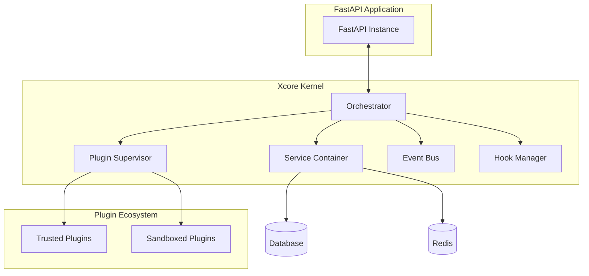

# Introduction

**Xcore v2.3.0** is a high-performance, plugin-first orchestration framework built on top of **FastAPI**. It is designed to load, isolate, and manage modular extensions (plugins) in a secure, sandboxed environment.

At its core, Xcore follows a **"minimal core"** philosophy: the framework provides the infrastructure (runtime, services, security, observability), while all business logic and features reside in independent, hot-reloadable **plugins**.

### Why Xcore?

Modern backend development often faces the trade-off between the speed of a monolith and the scalability of microservices. Xcore offers a third path: **Modular Monoliths with Plugin Isolation**.

- **Extensibility**: Add or update features without touching the core system.
- **Security**: Run third-party or experimental code in a sandboxed subprocess with strict resource limits and AST-based scanning.
- **Integrated Services**: Native support for SQL, NoSQL, Redis, Caching, and Scheduling, all injected automatically into your plugins.
- **Production Ready**: Built-in multi-tenancy, structured logging, OpenTelemetry tracing, and Prometheus metrics.

---

### Core Architecture

Xcore acts as the orchestrator between your FastAPI application, shared services, and your plugin ecosystem.

```mermaid
flowchart TB
    subgraph App["FastAPI Application"]
        F[FastAPI Instance]
    end

    subgraph Core["Xcore Kernel"]
        X[Orchestrator]
        PS[Plugin Supervisor]
        SC[Service Container]
        EB[Event Bus]
        HM[Hook Manager]
    end

    subgraph Plugins["Plugin Ecosystem"]
        T[Trusted Plugins]
        S[Sandboxed Plugins]
    end

    F <--> X
    X --> PS
    X --> SC
    X --> EB
    X --> HM
    PS --> T
    PS --> S
    SC --> DB[(Database)]
    SC --> RD[(Redis)]
```

### Key Components

`Xcore` Orchestrator
:   The main entry point. It manages the boot sequence, initializes services, and attaches the plugin management API to your FastAPI application.

Plugin Supervisor
:   Handles the lifecycle (load, boot, shutdown, reload) of all plugins. It ensures that dependencies are resolved in the correct order using a Directed Acyclic Graph (DAG).

Service Container
:   A unified registry for shared resources like Databases (SQLAlchemy, MongoDB), Caching (Redis), and background task workers.

Execution Modes
:   **Trusted Mode**: Plugins run in the main process with full access to the system. Recommended for core features.
    **Sandboxed Mode**: Plugins run in isolated subprocesses with restricted imports, filesystem guards, and CPU/Memory limits. Ideal for untrusted or experimental code.

---

### Target Audience

**Application Developers**
:   Use Xcore to build stable, scalable backends by composing existing plugins and managing shared services.

**Plugin Developers**
:   Create modular extensions that can be shared across multiple Xcore projects. You can choose to be **Trusted** (high performance, full access) or **Sandboxed** (safe, restricted).

---

### See Also

[Installation & Setup](./installation.md)
:   Get Xcore installed in your environment.

[Quickstart](./quickstart.md)
:   Get Xcore up and running in less than 5 minutes.

[Core Architecture](kernel/kernel.md)
:   Deep dive into the Kernel, Supervisor, and Lifecycle management.

[Plugin Development](plugins/plugin-anatomy.md)
:   Learn how to build your first plugin.

[Command Line Interface](cli/index.md)
:   Manage your project and plugins with the powerful `xcore` CLI.
