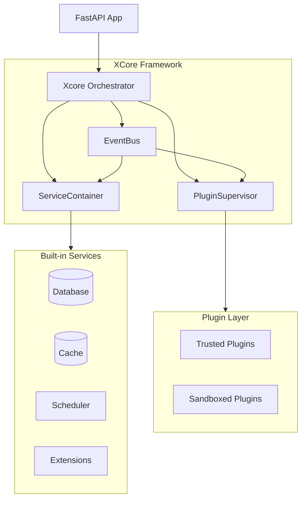

# XCore Framework Documentation

Welcome to **XCore** — a production-grade, plugin-first Python framework built on FastAPI.

## What is XCore?

XCore is a modular orchestration framework designed to load, isolate, and manage plugins in a secure sandboxed environment. It enables building extensible applications where each feature can be developed, tested, and deployed independently.

## Key Features

- **🚀 Dynamic Plugin System** — Load, unload, and hot-reload plugins without server restarts.
- **🔒 Sandboxing & Security** — Isolated execution with process limits, AST scanning, and permission enforcement.
- **🔌 Native Service Integration** — Built-in support for SQL (PostgreSQL, MySQL, SQLite), NoSQL (Redis), Task Scheduling (APScheduler), and more.
- **📡 Event-Driven Architecture** — Powerful event bus enabling inter-plugin communication and system-level hooks.
- **🌐 Custom HTTP Routes** — Plugins can expose their own FastAPI endpoints seamlessly.
- **♻️ Hot Reloading** — Automatic file watching for rapid development.
- **📊 Production Ready** — YAML configuration, environment variable injection, structured logging, and metrics.

## Quick Start

```bash
# Install dependencies
poetry install

# Configure environment
cp .env.example .env
# Edit .env with your settings

# Run development server
make run-dev
```

## Documentation Structure

- [**Getting Started**](getting-started/installation.md): Installation and first steps.
- [**Guides**](guides/creating-plugins.md): Deep dives into plugins, services, and events.
- [**Architecture**](architecture/overview.md): Internal design and core concepts.
- [**Reference**](reference/configuration.md): Exhaustive API and configuration reference.
- [**Examples**](examples/complete-plugin.md): Real-world plugin implementations.

## Project Architecture


```mermaid
graph TB
    subgraph XCore["XCore Framework"]
        X[Xcore Orchestrator]
        SC[ServiceContainer]
        PS[PluginSupervisor]
        EB[EventBus]
    end

    subgraph Services["Built-in Services"]
        DB[(Database)]
        CACHE[(Cache)]
        SCHED[Scheduler]
        EXT[Extensions]
    end

    subgraph Plugins["Plugin Layer"]
        T[Trusted Plugins]
        S[Sandboxed Plugins]
    end

    X --> SC
    X --> PS
    X --> EB
    SC --> Services
    PS --> Plugins
    EB --> PS
    EB --> SC

    FA[FastAPI App] --> X
```

## Next Steps

- [Installation Guide](getting-started/installation.md)
- [Creating Your First Plugin](guides/creating-plugins.md)
- [Configuration Reference](reference/configuration.md)
- [Architecture Overview](architecture/overview.md)
- [Security Best Practices](guides/security.md)

## Versions

- **Current Stable**: v2.0.0 — Plugin-first architecture with advanced sandboxing.
- [Full Changelog](versions.md)

## Community & Support

- GitHub Issues: [Report bugs or request features](https://github.com/traoreera/xcore/issues)
- Discussions: [Community forum](https://github.com/traoreera/xcore/discussions)

## License

XCore is released under the [MIT License](./LICENSE).
