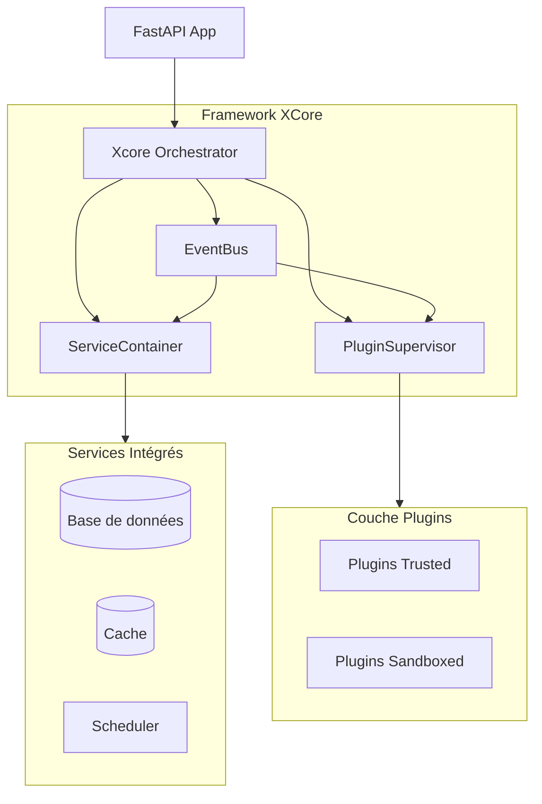

# XCore Framework - Documentation Officielle

Bienvenue dans la documentation de **XCore** — le framework Python "plugin-first" de qualité production, bâti sur FastAPI.

## Qu'est-ce que XCore ?

XCore est un orchestrateur modulaire conçu pour charger, isoler et gérer des plugins dans un environnement sécurisé et performant. Il permet de construire des applications extensibles où chaque fonctionnalité peut être développée, testée et déployée indépendamment.

## Fonctionnalités Clés

- **🚀 Système de Plugins Dynamique** — Chargement, déchargement et rechargement à chaud sans redémarrage.
- **🔒 Sandboxing & Sécurité** — Isolation par processus, limites de ressources, timeouts et scan AST.
- **🔌 Intégration Native de Services** — Support SQL (PostgreSQL, MySQL, SQLite), NoSQL (Redis), Planification (APScheduler).
- **📡 Architecture Pilotée par les Événements** — Bus d'événements haute performance pour la communication inter-plugins.
- **🌐 Routes HTTP Personnalisées** — Les plugins exposent leurs propres endpoints FastAPI.
- **♻️ Hot Reloading** — Surveillance des fichiers pour un développement fluide.
- **📊 Prêt pour la Production** — Configuration YAML, variables d'env, logs structurés, métriques.

## Démarrage Rapide

```bash
# Installation des dépendances
poetry install

# Lancement du serveur de développement
make run-dev
```

## Structure de la Documentation

-   **[Installation](getting-started/installation.md)** : Guide de mise en route.
-   **[Architecture](architecture/overview.md)** : Plongeon dans les concepts internes.
-   **[Guide de Création de Plugins](guides/creating-plugins.md)** : Créez votre première extension.
-   **[Référence SDK](reference/sdk.md)** : Liste exhaustive des APIs pour développeurs.
-   **[Sécurité](guides/security.md)** : Détails sur l'isolation et les permissions.

---

## Architecture simplifiée


```mermaid
graph TB
    subgraph XCore["Framework XCore"]
        X[Xcore Orchestrator]
        SC[ServiceContainer]
        PS[PluginSupervisor]
        EB[EventBus]
    end

    subgraph Services["Services Intégrés"]
        DB[(Base de données)]
        CACHE[(Cache)]
        SCHED[Scheduler]
    end

    subgraph Plugins["Couche Plugins"]
        T[Plugins Trusted]
        S[Plugins Sandboxed]
    end

    X --> SC
    X --> PS
    X --> EB
    SC --> Services
    PS --> Plugins
    EB --> PS
    EB --> SC

    FA[FastAPI App] --> X
```

## Versions

-   **Stable** : v2.0.0 — Architecture plugin-first avec sandboxing.
-   [Historique complet](versions.md)

## Support et Communauté

-   Issues GitHub : [Signaler un bug](https://github.com/traoreera/xcore/issues)
-   Discussions : [Forum communautaire](https://github.com/traoreera/xcore/discussions)

## Licence

XCore est distribué sous licence [MIT](./LICENSE).
