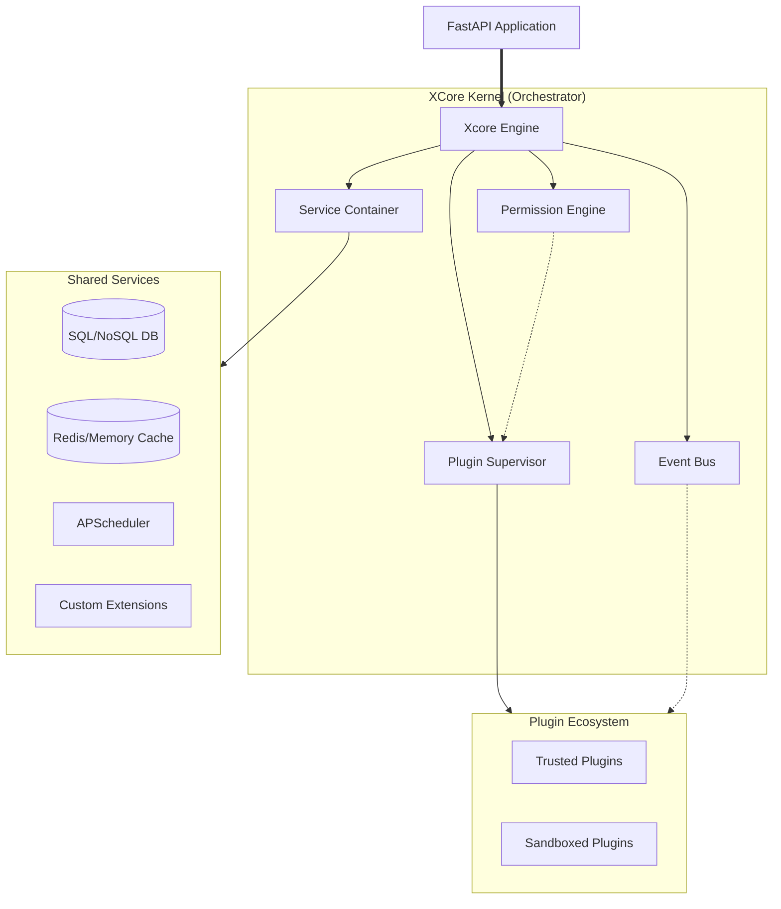

# XCore Framework

**XCore** is a production-grade, plugin-first Python framework built on top of FastAPI. It is designed for developers who need to build highly extensible, secure, and modular applications.

---

<div class="grid cards" hide-on-toc markdown>

-   :material-rocket-launch:{ .lg .middle } __High Performance__

    Built on FastAPI and asyncio for maximum throughput and minimal overhead.

-   :material-shield-lock:{ .lg .middle } __Secure by Design__

    Multi-layer sandboxing, AST-based code validation, and granular permission engine.

-   :material-puzzle-outline:{ .lg .middle } __Plugin-First Architecture__

    Everything is a plugin. Load, unload, and hot-reload components without downtime.

-   :material-lan:{ .lg .middle } __Built-in Services__

    Native support for SQL/NoSQL databases, Redis caching, and task scheduling.

</div>

---

## Why XCore?

Modern applications often struggle with monolithic designs or overly complex microservices. XCore provides a middle ground: a **Modular Monolith** architecture where features are decoupled as plugins but run within a unified, orchestrated environment.

### Core Philosophy

1.  **Isolation**: Plugins can run in trusted mode (main process) or sandboxed mode (isolated OS process).
2.  **Orchestration**: A central kernel manages lifecycle, dependencies (DAG), and cross-plugin communication.
3.  **Observability**: Out-of-the-box support for structured logging, Prometheus metrics, and OpenTelemetry tracing.
4.  **Developer Experience**: A powerful CLI and SDK make building and testing plugins a breeze.

---

## Technical Overview


```mermaid
graph TB
    subgraph XCore_Kernel["XCore Kernel (Orchestrator)"]
        X[Xcore Engine]
        SC[Service Container]
        PS[Plugin Supervisor]
        EB[Event Bus]
        PE[Permission Engine]
    end

    subgraph Infrastructure["Shared Services"]
        DB[(SQL/NoSQL DB)]
        CACHE[(Redis/Memory Cache)]
        SCHED[APScheduler]
        EXT[Custom Extensions]
    end

    subgraph Plugin_Layer["Plugin Ecosystem"]
        direction LR
        T[Trusted Plugins]
        S[Sandboxed Plugins]
    end

    X --> SC
    X --> PS
    X --> EB
    X --> PE
    SC --> Infrastructure
    PS --> Plugin_Layer
    EB -.-> Plugin_Layer
    PE -.-> PS

    FA[FastAPI Application] ==> X
```

---

## Getting Started in 3 Steps

### 1. Install the Framework
```bash
pip install xcore-framework
# or using poetry
poetry add xcore-framework
```

### 2. Configure Your App
Create an `xcore.yaml` to define your services and plugin directory.
```yaml
app:
  name: "My App"
services:
  cache:
    backend: "memory"
```

### 3. Create Your First Plugin
Define a `plugin.yaml` and a `main.py`, then boot the framework.
```python
from xcore import Xcore
from fastapi import FastAPI

app = FastAPI()
core = Xcore()

@app.on_event("startup")
async def startup():
    await core.boot(app)
```

---

## Explore the Documentation

*   [**Installation Guide**](getting-started/installation.md) - Set up your environment.
*   [**Plugin SDK**](reference/sdk.md) - Learn how to build plugins.
*   [**Architecture**](architecture/overview.md) - Understand the internals.
*   [**Security**](guides/security.md) - Deep dive into the sandboxing model.
*   [**Examples**](examples/README.md) - Real-world plugin implementations.
