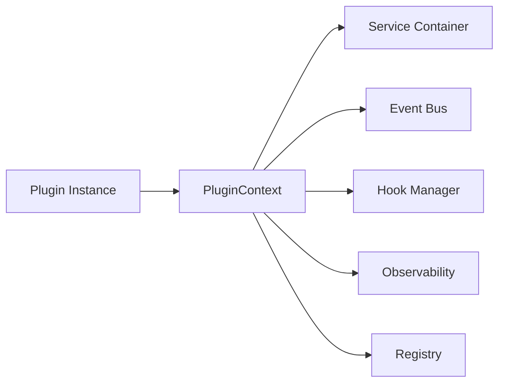

# Plugin Context

The `PluginContext` is a rich object injected into every Trusted plugin during the `on_load` phase. It serves as the single source of truth for the plugin, providing access to shared services, cross-plugin communication, and framework-level utilities.

---

### Key Concepts

#### The Trusted Gateway
In **Trusted Mode**, the context is directly available via `self.ctx`. It bridges the gap between the isolated plugin and the global framework state.



#### Service Resolution & Scoping
The context provides a `get_service(name)` method that interacts with the `PluginRegistry`. This ensures that:
- **Scoping**: You can only access services marked as `public` or specifically shared with your plugin.
- **Fail-closed**: Requesting a non-existent or restricted service raises a `KeyError` or `PermissionError`.

---

### Practical Guide

#### Accessing Services
Use the type-hinted helper methods in `TrustedBase` for the best developer experience.

```python linenums="1" hl_lines="6 7"
from xcore import TrustedBase

class Plugin(TrustedBase):
    async def on_load(self):
        # High-level helpers (with IDE autocompletion)
        self.db = self.get_service("db")
        self.cache = self.get_service("cache")

        # Raw context access
        self.ctx.metrics.counter("plugin_load_total").inc()
```

#### Multi-Tenancy Metadata
The context automatically tracks the current `tenant_id` during a request. This is used by the `ServiceContainer` to isolate database schemas and cache keys.

```python
async def handle(self, action, payload):
    tenant = self.ctx.tenant_id
    print(f"Executing action {action} for tenant: {tenant}")
```

#### Emitting Events
Plugins can communicate asynchronously via the global `EventBus`.

```python
async def handle(self, action, payload):
    # Fire-and-forget event (non-blocking)
    self.ctx.events.emit_sync("user.created", {"id": 123})

    # Wait for all listeners to complete
    await self.ctx.events.emit("user.deleted", {"id": 123})
```

---

### API Reference

#### `PluginContext` Attributes
| Attribute | Type | Description |
|-----------|------|-------------|
| `name` | `str` | The unique name of the current plugin. |
| `services` | `dict` | Dictionary of all available shared services. |
| `events` | `EventBus` | The global asynchronous event bus. |
| `hooks` | `HookManager` | Interface for registering/emitting hooks. |
| `env` | `dict` | Environment variables defined in `plugin.yaml`. |
| `config` | `dict` | The `extra` configuration block from the manifest. |
| `tenant_id` | `str` | The ID of the currently active tenant. |
| `metrics` | `MetricsRegistry` | Utility to record counters and gauges. |
| `tracer` | `Tracer` | Interface for OpenTelemetry tracing. |

---

### YAML Configuration

Plugin-specific configuration is passed to the context via the `extra` block in `plugin.yaml`.

```yaml title="plugin.yaml"
name: "my_plugin"
extra:
  api_url: "https://api.external.com"
  retry_count: 3
```

This becomes available as `self.ctx.config["api_url"]`.

---

### Common Errors & Pitfalls

!!! warning "Accessing Context in __init__"
    `self.ctx` is injected **after** the class is instantiated but **before** `on_load` is called. Never try to access `self.ctx` or services inside your plugin's `__init__` method.
    **Fix**: Move all initialization logic to `async def on_load(self):`.

!!! failure "Service Shadowing"
    If you register a service with the same name as a core service (e.g., `db`), the `PluginRegistry` will raise a `PermissionError` to protect the kernel.

---

### Best Practices

!!! success "Use Type-Hinted Helpers"
    Prefer `self.get_service("db")` over `self.ctx.services["db"]`. The helper methods provide better IDE support and safer error handling.

!!! tip "Plugin Config for Dynamic Behavior"
    Use the `extra` configuration block in `plugin.yaml` to make your plugin reusable across different environments without changing the code.
