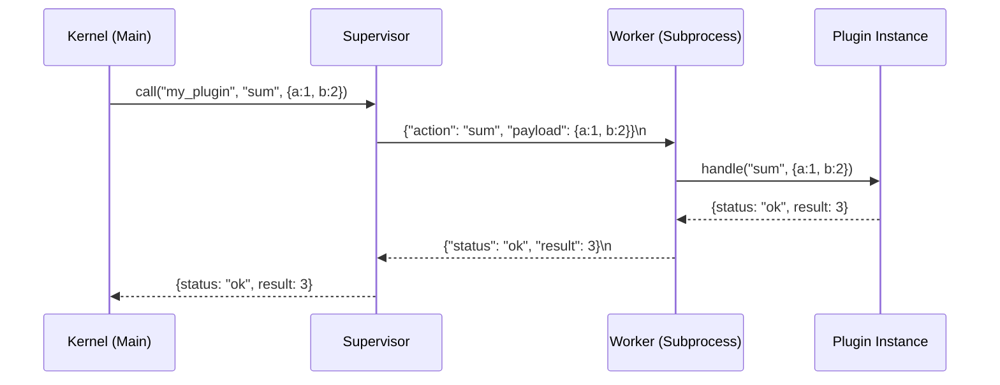

# Execution Modes

Xcore supports two primary execution modes for plugins: **Trusted** and **Sandboxed**. The choice depends on the source of the plugin and the required level of performance versus security.

---

### Comparison Table

| Feature | Trusted Mode | Sandboxed Mode |
|---------|--------------|----------------|
| **Process** | Main Process | Isolated Subprocess |
| **Performance** | Native (Fast) | IPC Overhead (Medium) |
| **Security** | None (Full Access) | High (Restricted) |
| **Filesystem** | Full Access | Restricted (FilesystemGuard) |
| **Imports** | All Python modules | Whitelisted modules only |
| **Resource Limits** | Shared with App | CPU, Memory & Disk Quotas |
| **Use Case** | Core business logic | 3rd-party, Untrusted, or Experimental |

---

### Trusted Mode

Trusted plugins run directly in the main FastAPI process. They have full access to the system, including environment variables, sensitive files, and the entire Python standard library.

#### Signature Verification
To prevent malicious code from being injected into the `plugins/` directory, Xcore supports mandatory signature verification for Trusted plugins.

```yaml title="xcore.yaml"
plugins:
  strict_trusted: true
```

When enabled, Xcore will refuse to load any Trusted plugin that does not have a valid `plugin.sig` file generated using the `xcore plugin sign` command.

---

### Sandboxed Mode

Sandboxed plugins run in an isolated subprocess. Xcore applies multiple layers of security to ensure that the sandboxed code cannot compromise the host system.

#### 1. Filesystem Guard
The `FilesystemGuard` intercepts all file operations (via `open`, `os`, and `pathlib`).
- **Fail-closed**: By default, the plugin can only access its own `data/` directory.
- **Traversal Protection**: Relative paths are resolved and checked against the plugin root.

#### 2. Import Restrictions
The sandbox blocks access to sensitive Python modules such as `subprocess`, `os`, `ctypes`, `socket`, and `shutil`. Any attempt to import these will raise a `PermissionError`.

#### 3. Resource Limits
Resource limits are enforced via `RLIMIT_AS` (Memory) and `RLIMIT_CPU` (CPU) on Linux systems.

```yaml title="plugin.yaml"
resources:
  max_memory_mb: 128
  max_disk_mb: 50
  timeout_seconds: 5.0
```

#### 4. Inter-Process Communication (IPC)
Since the plugin runs in a separate process, communication happens via a JSON newline-delimited protocol over standard I/O pipes.



---

### Configuration

#### Declaring Mode in `plugin.yaml`
```yaml linenums="1"
name: "security_scanner"
mode: "sandboxed"  # (1)!
entry_point: "src/main.py"

filesystem:
  allowed_paths: ["data/", "tmp/"]
  denied_paths: ["src/"]

resources:
  max_memory_mb: 256
```

1.  Accepted values: `trusted` | `sandboxed`.

---

### Common Errors & Pitfalls

!!! danger "Sandboxed: PermissionDenied"
    If a sandboxed plugin tries to access a file outside `allowed_paths`, or imports a forbidden module, it will receive a `PermissionError`.
    **Fix**: Explicitly add the path to `allowed_paths` or use a Trusted plugin if full access is required.

!!! warning "IPC Overhead"
    Every call to a sandboxed plugin involves JSON serialization/deserialization and process context switching. Avoid using sandboxed plugins for high-frequency operations (e.g., millions of calls per second).

!!! failure "DiskQuotaExceeded"
    If the `data/` directory exceeds `max_disk_mb`, the `SandboxProcessManager` will block further `call()` attempts.
    **Fix**: Clean up temporary files or increase the quota in `plugin.yaml`.

---

### Best Practices

!!! success "Use Sandboxing for Extension Points"
    If your framework allows users to upload their own logic (e.g., a "Transformation Plugin"), **always** use Sandboxed mode.

!!! tip "Health Checks"
    Enable health checks for sandboxed plugins to ensure the supervisor can automatically restart them if they crash or hang.

```yaml title="plugin.yaml"
runtime:
  health_check:
    enabled: true
    interval_seconds: 30
    timeout_seconds: 5
```
