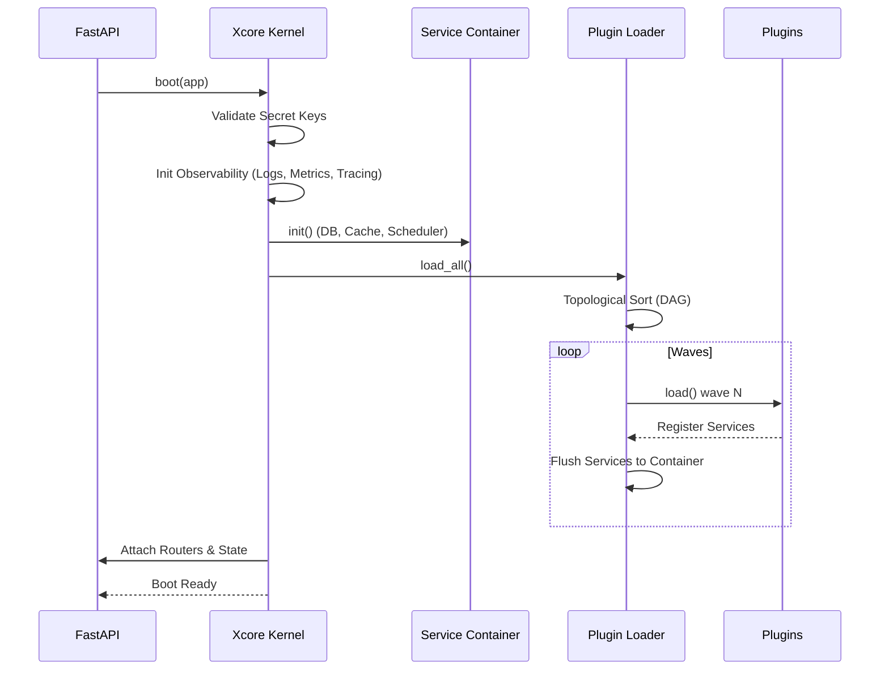

# Kernel & Lifecycle

The **Kernel** is the heart of Xcore. It orchestrates the boot sequence, manages shared services, and supervises the entire plugin ecosystem.

### Prerequisites

- [x] [Installation & Setup](../installation.md) completed
- [x] Basic understanding of [FastAPI Lifespan](https://fastapi.tiangolo.com/advanced/events/)

---

### Key Concepts

#### The Orchestration Flow
Xcore follows a strict, sequential boot process to ensure that services are available before plugins load, and that dependencies are respected.



#### Plugin Waves (Topological Loading)
Xcore uses a Directed Acyclic Graph (DAG) to resolve plugin dependencies. Plugins are grouped into **Waves**:
1. **Wave 0**: Plugins with no dependencies.
2. **Wave 1**: Plugins depending only on Wave 0.
3. **Wave N**: Plugins depending on previous waves.

Plugins in the same wave are loaded in parallel using `asyncio.gather`. If a plugin fails to load, all its dependents in subsequent waves are automatically skipped (**Cascade Failure**).

#### Execution Isolation
Every plugin is assigned a unique namespace (e.g., `xcore_plugin_my_plugin`) during import. This prevents global `sys.modules` collisions when multiple plugins have files with the same name (like `utils.py`).

---

### Practical Guide

#### Customizing the Boot
You can interact with the Kernel before and after the boot sequence.

```python linenums="1" hl_lines="10 11"
from xcore import Xcore

xcore = Xcore("xcore.yaml")

@asynccontextmanager
async def lifespan(app):
    # Perform pre-boot checks
    print(f"Starting Xcore v{xcore.__version__}")

    await xcore.boot(app)

    # Access loaded plugins
    print(f"Loaded plugins: {xcore.plugins.list_plugins()}")

    yield
    await xcore.shutdown()
```

---

### API Reference

#### `Xcore` Orchestrator
| Method | Description |
|--------|-------------|
| `setup(app: FastAPI)` | Registers middlewares. Call this **before** `boot()`. |
| `boot(app: FastAPI = None)` | Starts all subsystems in order. |
| `shutdown()` | Graceful stop of plugins and services (reverse order). |

#### `PluginSupervisor` (`xcore.plugins`)
| Method | Description |
|--------|-------------|
| `call(name, action, payload)` | Call a plugin method via the middleware pipeline. |
| `reload(name)` | Hot-reload a specific plugin. |
| `status()` | Get health status and uptime of all plugins. |

---

### YAML Configuration

The runtime behavior is controlled via the `app` and `plugins` sections.

```yaml linenums="1"
app:
  env: "development"       # str — "development" | "production". Default: "development"
  plugin_prefix: "/plugin" # str — Base path for plugin HTTP routes. Default: "/plugin"
  secret_key: ~            # bytes — Required for signing/auth.

plugins:
  directory: "./plugins"   # str — Path to plugins folder. Default: "./plugins"
  strict_trusted: false    # bool — Enable signature check for Trusted plugins. Default: false
  interval: 2              # int — Watcher interval for hot-reload. Default: 2
```

---

### Common Errors & Pitfalls

!!! danger "RuntimeError: SECRET_KEY default"
    In `production` mode, Xcore will refuse to boot if `app.secret_key` or `plugins.secret_key` equals `b"change-me-in-production"`.
    **Fix**: Set unique bytes keys in your environment or YAML.

!!! warning "LoadError: Missing Plugin class"
    Trusted plugins must define a class named `Plugin` in their `main.py`.
    **Fix**: Ensure your entry point contains `class Plugin(TrustedBase):`.

!!! failure "Circular Dependencies"
    If Plugin A requires Plugin B, and Plugin B requires Plugin A, the `PluginLoader` will raise a `ValueError` during topological sort.
    **Fix**: Refactor shared logic into a third "Base" plugin.

---

### Best Practices

!!! success "Graceful Shutdown"
    Always call `await xcore.shutdown()` in your lifespan. This ensures that `on_stop` and `on_unload` hooks are called, allowing plugins to close DB connections or stop background tasks.

!!! tip "Wave Optimization"
    Keep your dependency tree shallow. Too many waves will slow down the boot sequence as waves are processed sequentially.

---

### See Also

[Execution Modes](./execution-modes.md)
:   Understand the difference between Trusted and Sandboxed plugins.

[Plugin Anatomy](../plugins/plugin-anatomy.md)
:   The structure of the `plugins/` directory and `plugin.yaml`.

[Service Container](../services/services.md)
:   How services are initialized and propagated between waves.
