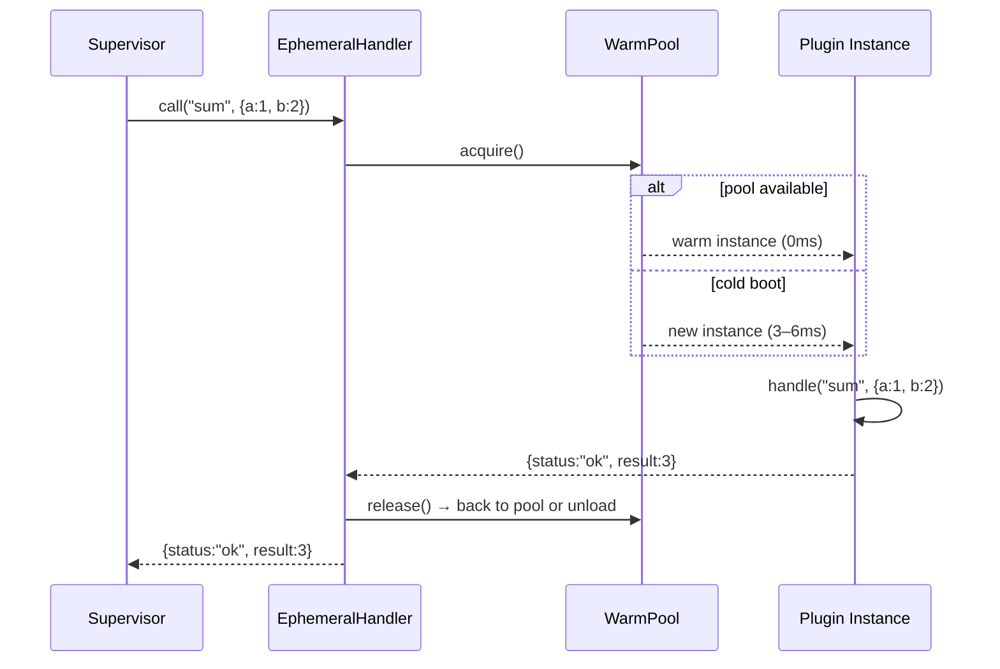

# Ephemeral Plugins

The **Ephemeral** mode is the third execution mode of Xcore, alongside [Trusted](./trusted-plugins.md) and [Sandboxed](./sandboxed-plugins.md). It is designed for **serverless-like**, **stateless** plugins that are created per call and destroyed right after.

---

### What is Ephemeral Mode?

An Ephemeral plugin is **loaded, executed, and unloaded for every call**. No instance survives between two calls, which means:

- **Zero implicit state**: the plugin cannot leak memory, connections, or cached values between requests.
- **Bounded memory**: idle instances are reclaimed by an automatic sweeper.
- **Per-call isolation**: even a crash in `handle()` discards the instance without affecting the next call.

The kernel never knows the plugin is ephemeral: `EphemeralHandler` implements the same `PluginHandler` interface as `LifecycleManager` and `SandboxProcessManager`, so the supervisor, permissions, rate limiting, and HTTP routing all work unchanged.



---

### Why Use Ephemeral Mode?

| Scenario | Why Ephemeral |
|---|---|
| **Hot reload without memory leaks** | Repeated reloads no longer accumulate instances — each is garbage-collected after the call. |
| **Unpredictable load spikes** | Cold boots absorb bursts; the warm pool covers the steady baseline. |
| **Untrusted / third-party logic (faster than sandbox)** | Same-process execution gives near-native speed with per-call isolation. |
| **Side-effect-heavy plugins** | Connections (DB, Redis) opened in `on_load` are torn down after each call — no dangling handles. |
| **Serverless-style actions** | `pool_size=0` gives pure cold-boot execution, ideal for rare or low-frequency actions. |

!!! warning "When NOT to use Ephemeral"
    - **Stateful plugins** (sessions, in-memory caches, connection reuse) — each call starts from scratch.
    - **High-frequency hot paths** — per-call `on_load` has a real cost. For millions of calls/second, prefer Trusted mode.
    - **Background schedulers** (`@cron`, `@interval`) — scheduled tasks run against a handler, not a live instance.

---

### How It Works

#### The Warm Pool

The `WarmPool` (`xcore/kernel/runtime/warm_pool.py`) pre-loads `pool_size` instances at boot and keeps them ready:

- **Pool hit**: an available instance is served immediately (~0 ms).
- **Cold boot**: if the pool is empty, a new `LifecycleManager` is loaded on demand (3–6 ms per benchmark).
- **Backpressure**: `max_concurrent` caps the total number of simultaneous instances (pool + cold). Beyond this, `acquire()` **waits** instead of unboundedly creating instances.
- **Idle sweeper**: every 10 s, instances idle for more than `max_idle_seconds` are unloaded. The freshest `pool_size` instances are always kept.
- **Error safety**: if `handle()` raises, the instance is **discarded** (not returned to the pool) — a potentially corrupted instance never gets reused.

#### Call lifecycle

1. `acquire()` — pool hit or cold boot (bounded by `max_concurrent`).
2. `handle(action, payload)` — your plugin logic runs inside `src/main.py`.
3. `release()` — the instance returns to the pool, or is unloaded if the pool is full.
4. On error — `discard()` unloads the instance and releases its concurrency slot.

---

### Prerequisites

- [x] [Xcore Installation](../installation.md) (≥ 2.3.3)
- [x] A plugin with the standard structure (`plugin.yaml` + `src/main.py`)

---

### Configuration

The ephemeral settings are resolved in this precedence order:

1.  **Per-plugin**: the `ephemeral:` block in `plugin.yaml`.
2.  **Global**: the `plugins.ephemeral:` section in `integration.yaml` / `xcore.yaml`.
3.  **Defaults**: `EphemeralConfig()` if nothing is configured.

#### 1. Per-plugin (`plugin.yaml`)

```yaml linenums="1"
name: "image_processor"
version: "1.0.0"
execution_mode: "ephemeral"   # (1)!
entry_point: "src/main.py"

ephemeral:                     # (2)!
  pool_size: 2                # warm instances pre-loaded at boot
  max_idle_seconds: 60        # unload idle instances after 60s
  max_concurrent: 10          # max simultaneous instances (backpressure)
  boot_timeout: 5             # seconds before a boot is considered failed
```

1.  Must be `ephemeral`. Values accepted: `trusted` | `sandboxed` | `legacy` | `ephemeral`.
2.  Optional. Falls back to the global `plugins.ephemeral:` config.

#### 2. Global (`integration.yaml`)

```yaml linenums="1"
plugins:
  ephemeral:
    pool_size: 1
    max_idle_seconds: 60
    max_concurrent: 10
    boot_timeout: 5.0
```

Every ephemeral plugin **without** its own `ephemeral:` block inherits this configuration.

#### 3. Defaults

| Key | Type | Default | Description |
|:--- | :--- | :--- | :--- |
| `pool_size` | `int` | `0` | Warm instances pre-loaded. `0` = pure cold boot on every call. |
| `max_idle_seconds` | `int` | `60` | Seconds before an idle instance is unloaded. |
| `max_concurrent` | `int` | `10` | Max simultaneous instances (pool + cold boot). Beyond this, calls wait. |
| `boot_timeout` | `float` | `5.0` | Seconds allowed for a single instance boot before it fails. |

!!! tip "Tuning advice"
    - Start with `pool_size: 1` and monitor `cold_boots` in the status endpoint.
    - If cold boots stay at zero over time, raise `pool_size` to remove latency; if instances sit idle, lower it.
    - `max_concurrent` is your safety valve against load spikes — set it to the maximum memory you can afford.

---

### Writing an Ephemeral Plugin

The plugin source is **identical** to a Trusted plugin. Only the manifest changes.

```python title="src/main.py"
from xcore import TrustedBase, ok, error


class Plugin(TrustedBase):

    async def on_load(self):
        self.logger.info("instance chargée", plugin="image_processor")

    async def on_unload(self):
        self.logger.info("instance déchargée", plugin="image_processor")

    async def handle(self, action, payload):
        if action == "ping":
            return ok(msg="pong")
        return error("action inconnue")
```

!!! warning "Stateless by design"
    Do not cache data on `self` between calls, open long-lived connections in `on_load`, or start background tasks. Everything is torn down when the call finishes.

---

### Monitoring

Each ephemeral plugin exposes its status through the standard plugin status endpoint (`supervisor.status()`):

```json
{
  "name": "image_processor",
  "mode": "ephemeral",
  "state": "ready",
  "pool": {
    "pool_size": 2,
    "available": 1,
    "total_alive": 2,
    "cold_boots": 4,
    "max_idle_s": 60
  },
  "calls_total": 150,
  "calls_error": 2,
  "uptime_s": 3600.0
}
```

| Field | Meaning |
|:--- | :--- |
| `pool.available` | Ready instances in the pool right now. |
| `pool.total_alive` | Instances currently in existence (pool + in flight). |
| `pool.cold_boots` | Total cold boots since start — if it climbs fast, `pool_size` is too low. |
| `calls_error` | Calls that failed and triggered a `discard()`. |

---

### Common Errors & Pitfalls

!!! danger "Boot timeout"
    `Ephemeral boot timeout (Xs)` means `on_load()` took longer than `boot_timeout`.
    **Fix**: move heavy initialization out of `on_load`, or raise `boot_timeout`.

!!! warning "Instances are never reused after an error"
    A failed `handle()` discards the instance. If your plugin fails often, expect more cold boots (visible in `pool.cold_boots`).

!!! failure "Stateful behavior breaks silently"
    Ephemeral plugins have no persistence. Rely on the cache (`self.get_service("cache")`) or the database for anything that must survive a call.

---

### See Also

[Execution Modes](../kernel/execution-modes.md)
:   Comparison of all execution modes.

[Trusted Plugins](./trusted-plugins.md)
:   Same plugin API without per-call isolation.

[Plugin Anatomy](./plugin-anatomy.md)
:   Structure and manifest reference.

[Hot Reloading](../kernel/kernel.md)
:   Ephemeral mode is the recommended companion for frequent hot reloads.
