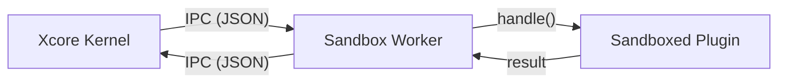

# Sandboxed Plugins

Sandboxed plugins are designed for untrusted or experimental code. They run in a separate subprocess with restricted imports, filesystem access, and resource limits. Unlike Trusted plugins, they are isolated from the main application's memory and services.

---

### Prerequisites

- [x] [Xcore Installation](../installation.md)
- [x] [C++ Scanner Build](../installation.md#3-compile-the-c-security-scanner) (Highly Recommended)
- [x] [Plugin Anatomy](./plugin-anatomy.md) understood

---

### Key Concepts

#### Total Isolation
A Sandboxed plugin does not have access to the `PluginContext`. It cannot directly use `self.get_service()` or emit events on the global bus. Instead, it acts as a "pure actor" that receives a payload and returns a JSON response.



#### Security Layers
1.  **AST Scanning**: Before loading, Xcore scans the code for forbidden imports (`os`, `subprocess`, `ctypes`, etc.) and dangerous builtins.
2.  **Filesystem Guard**: Intercepts `open()` and `pathlib` calls. By default, only the `data/` directory is writable.
3.  **Resource Limits**: Enforces Memory (RSS/Data) and CPU time limits via Linux `resource` module.
4.  **Namespace Isolation**: Uses a custom `sys.meta_path` hook to ensure the plugin can only import its own local files or whitelisted standard modules.

---

### Practical Guide

#### 1. Implementation
Since you don't inherit from `TrustedBase`, your plugin class just needs to implement the `handle` method.

```python linenums="1"
class Plugin:
    async def on_load(self):
        print("Sandboxed plugin starting...")

    async def handle(self, action: str, payload: dict) -> dict:
        if action == "transform":
            text = payload.get("text", "")
            # Only allowed filesystem access
            with open("data/log.txt", "a") as f:
                f.write(f"Transforming: {text}\n")

            return {"status": "ok", "result": text.upper()}

        return {"status": "error", "msg": "Action not supported"}
```

#### 2. Manifest Configuration
You must explicitly declare the `execution_mode` and resource limits in `plugin.yaml`.

```yaml linenums="1" title="plugin.yaml"
name: "text_transformer"
execution_mode: "sandboxed"
entry_point: "src/main.py"

filesystem:
  allowed_paths: ["data/"]
  denied_paths: ["src/"]

resources:
  max_memory_mb: 128
  max_disk_mb: 10
  timeout_seconds: 2.0
```

---

### Security Restrictions

#### Forbidden Modules
The following modules (and many others) are blocked by default:
- `os`, `sys`, `subprocess`
- `socket`, `ssl`, `http`, `urllib`, `requests`, `httpx`, `aiohttp`
- `ctypes`, `cffi`, `mmap`
- `threading`, `multiprocessing`
- `pickle`, `marshal`

#### Forbidden Builtins & Attributes
- `exec`, `eval`, `compile`, `input`
- `__subclasses__`, `__mro__`, `__globals__`, `__builtins__`

---

### API Reference

Sandboxed plugins are managed by the `SandboxProcessManager`.

| Action | Result |
|--------|--------|
| `ping` | Internal action used for health checks. Returns `{"status": "ok", "pong": true}`. |
| `shutdown` | Gracefully stops the worker process. |
| *custom* | Any action handled by your `handle()` method. |

---

### Common Errors & Pitfalls

!!! danger "PermissionError: [sandbox] BLOCKED"
    This occurs if your plugin tries to import a forbidden module or access a restricted file.
    **Check**: Look at the `stack` trace in the logs to see exactly where the violation occurred.

!!! warning "IPCTimeoutError"
    If your `handle` method takes longer than `resources.timeout_seconds`, the supervisor will kill the call and return an error.
    **Fix**: Optimize your code or increase the timeout in `plugin.yaml`.

!!! failure "DiskQuotaExceeded"
    The `data/` directory is monitored. If it exceeds `max_disk_mb`, further calls will be blocked.
    **Fix**: Delete old files in `data/` or increase the quota.

---

### Best Practices

!!! success "Stateless Design"
    Treat your sandboxed plugins as stateless functions. While you can write to `data/`, assume the process can be restarted at any time by the supervisor.

!!! tip "Local Imports"
    You can import any `.py` file located within your plugin's `src/` directory. They are automatically added to your isolated namespace.

---

### See Also

[Security & Sandboxing](../security/security.md)
:   Deep dive into the `FilesystemGuard` and `ASTScanner` implementation.

[Permissions & Policies](./permissions.md)
:   How to request specific permissions in the manifest.
