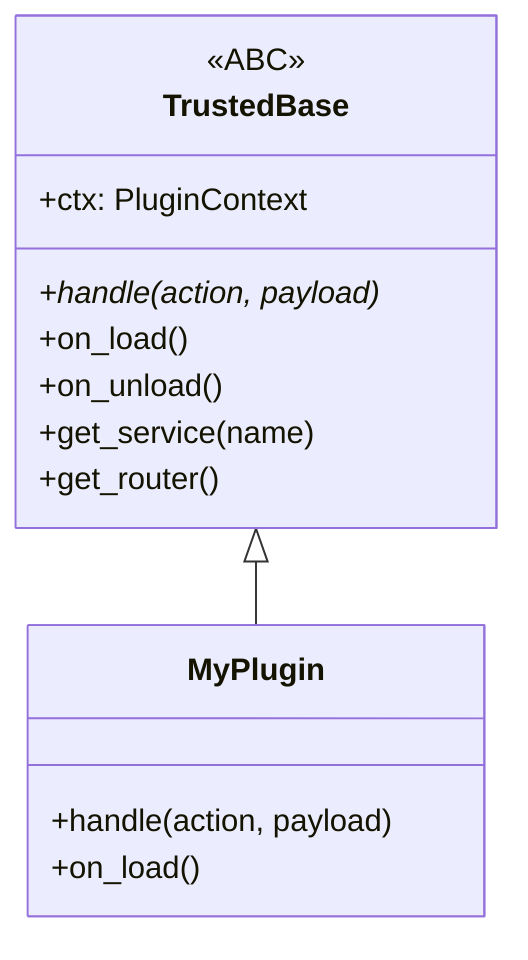

# Trusted Plugins

Trusted plugins are native Python extensions that run directly in the main Xcore process. They have full access to all system resources and the shared service container, making them ideal for performance-critical logic and deep system integration.

---

### Prerequisites

- [x] [Plugin Anatomy](./plugin-anatomy.md) understood
- [x] Python 3.12+ and `asyncio` proficiency

---

### Key Concepts

#### The `TrustedBase` Contract
Every Trusted plugin must inherit from `xcore.TrustedBase` and implement at least the `handle` method.



#### Standardized Responses
Xcore provides `ok()` and `error()` helpers to ensure all plugins return a consistent JSON structure.
- `ok(data)` → `{"status": "ok", ...data}`
- `error(msg, code)` → `{"status": "error", "msg": msg, "code": code}`

---

### Practical Guide

#### 1. Basic Implementation
Create a file `src/main.py` inside your plugin directory.

```python linenums="1"
from xcore import TrustedBase, ok, error

class Plugin(TrustedBase):
    async def on_load(self):
        # (1) Resolve services once during load
        self.db = self.get_service("db")
        self.cache = self.get_service("cache")

    async def handle(self, action: str, payload: dict) -> dict:
        if action == "ping":
            return ok(pong=True)

        if action == "save":
            key = payload.get("key")
            val = payload.get("val")
            await self.cache.set(key, val)
            return ok()

        return error("Unknown action", code="not_found")
```

1.  **Service Resolution**: Always resolve services in `on_load` or `handle`, never in `__init__`.

#### 2. Exposing HTTP Routes
Trusted plugins can seamlessly attach routes to the main FastAPI application.

```python linenums="1"
from fastapi import APIRouter
from xcore import TrustedBase

class Plugin(TrustedBase):
    def get_router(self) -> APIRouter:
        router = APIRouter(prefix="/v1", tags=["my-plugin"])

        @router.get("/status")
        async def get_status():
            return {"status": "running"}

        return router
```

!!! note "Automatic Prefixing"
    Routes are automatically mounted under `/plugin/<plugin_name>/`. In the example above, the route will be accessible at `/plugin/my_plugin/v1/status`.

#### 3. Event & Hook System
Use the `self.ctx` to interact with other parts of the system asynchronously.

```python linenums="1"
class Plugin(TrustedBase):
    async def on_start(self):
        # Subscribe to a global event
        @self.ctx.events.on("user.login")
        async def on_login(event):
            print(f"User {event.data['user_id']} logged in")

    async def handle(self, action, payload):
        # Emit a fire-and-forget event
        self.ctx.events.emit_sync("plugin.action_triggered", {"action": action})
        return ok()
```

---

### API Reference

#### Lifecycle Hooks
| Hook | Description |
|------|-------------|
| `on_init()` | Called immediately after instantiation. |
| `on_load()` | Called after `PluginContext` is injected. **Recommended for service setup.** |
| `on_start()`| Called after all plugins in the current wave are loaded. |
| `on_reload()`| Called during a hot-reload operation. |
| `on_stop()` | Called before the plugin is unloaded. |
| `on_unload()`| Final cleanup hook. |

#### Helper Methods
| Method | Description |
|--------|-------------|
| `get_service(name)` | Returns a service from the container. Supports literal overloads for IDE typing. |
| `get_service_as(name, type)` | Returns a service cast to a specific type (e.g., `AsyncSQLAdapter`). |
| `call_plugin(name, action, payload)` | IPC helper to call another plugin from within the Trusted environment. |

---

### YAML Configuration

Ensure your `plugin.yaml` is set to `trusted` mode.

```yaml
name: "my_trusted_plugin"
execution_mode: "trusted"
entry_point: "src/main.py"
```

---

### Common Errors & Pitfalls

!!! danger "Service Collision"
    If you register a service in `on_load` that already exists in the global container, Xcore will raise a `PermissionError`.
    **Fix**: Prefix your service names (e.g., `myplugin_db`) or use the `PluginRegistry` to set them as private.

!!! warning "Synchronous Blocking"
    Trusted plugins run in the main event loop. If you perform blocking I/O (like `time.sleep()` or synchronous requests) inside a hook or `handle`, you will freeze the entire application.
    **Fix**: Always use `async`/`await` or `run_in_executor`.

---

### Best Practices

!!! success "Fail-Closed Permissions"
    Even for Trusted plugins, explicitly declare the services you intend to use in the `permissions:` block of `plugin.yaml`. This helps with auditing and security reviews.

!!! tip "Use emit_sync() for Logging"
    For events where you don't need to wait for a response (like analytics or logging), use `self.ctx.events.emit_sync()`. It's faster as it doesn't await the handlers.
