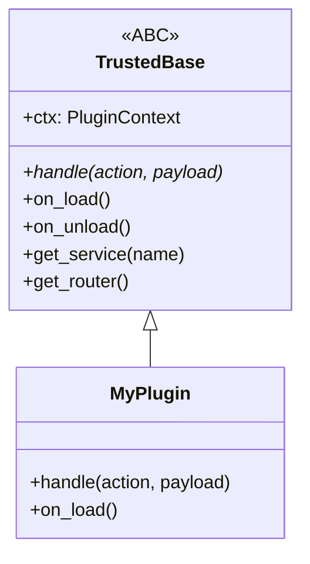

# Trusted Plugins

Trusted plugins are native Python extensions that run directly in the main Xcore process. They have full access to all system resources and the shared service container, making them ideal for performance-critical logic and deep system integration.

---

### Prerequisites

- [x] [Plugin Anatomy](./plugin-anatomy.md) understood
- [x] Python 3.14+ and `asyncio` proficiency

---

### Key Concepts

#### The `TrustedBase` Contract
Every Trusted plugin must inherit from `xcore.TrustedBase` and implement at least the `handle` method.


```mermaid
classDiagram
    class TrustedBase {
        <<ABC>>
        +ctx: PluginContext
        +handle(action, payload)*
        +on_load()
        +on_unload()
        +get_service(name)
        +get_router()
    }
    class MyPlugin {
        +handle(action, payload)
        +on_load()
    }
    TrustedBase <|-- MyPlugin
```

#### Standardized Responses
Xcore provides `ok()` and `error()` helpers to ensure all plugins return a consistent JSON structure.
- `ok(data)` → `{"status": "ok", ...data}`
- `error(msg, code)` → `{"status": "error", "msg": msg, "code": code}`

---

### Practical Guide

#### 1. Basic Implementation
Create a file `src/main.py` inside your plugin directory.

```python linenums="1"
from xcore import TrustedBase, ok, error

class Plugin(TrustedBase):
    async def on_load(self):
        # (1) Resolve services once during load
        self.db = self.get_service("db")
        self.cache = self.get_service("cache")

    async def handle(self, action: str, payload: dict) -> dict:
        if action == "ping":
            return ok(pong=True)

        if action == "save":
            key = payload.get("key")
            val = payload.get("val")
            await self.cache.set(key, val)
            return ok()

        return error("Unknown action", code="not_found")
```

1.  **Service Resolution**: Always resolve services in `on_load` or `handle`, never in `__init__`.

#### 2. Exposing HTTP Routes
Trusted plugins can seamlessly attach routes to the main FastAPI application.

```python linenums="1"
from fastapi import APIRouter
from xcore import TrustedBase

class Plugin(TrustedBase):
    def get_router(self) -> APIRouter:
        router = APIRouter(prefix="/v1", tags=["my-plugin"])

        @router.get("/status")
        async def get_status():
            return {"status": "running"}

        return router
```

!!! note "Automatic Prefixing"
    Routes are automatically mounted under `/plugin/<plugin_name>/`. In the example above, the route will be accessible at `/plugin/my_plugin/v1/status`.

#### 3. Event & Hook System
Use the `self.ctx` to interact with other parts of the system asynchronously.

```python linenums="1"
class Plugin(TrustedBase):
    async def on_start(self):
        # Subscribe to a global event
        @self.ctx.events.on("user.login")
        async def on_login(event):
            print(f"User {event.data['user_id']} logged in")

    async def handle(self, action, payload):
        # Emit a fire-and-forget event
        self.ctx.events.emit_sync("plugin.action_triggered", {"action": action})
        return ok()
```

---

### API Reference

#### Lifecycle Hooks
| Hook | Description |
|------|-------------|
| `on_init()` | Called immediately after instantiation. |
| `on_load()` | Called after `PluginContext` is injected. **Recommended for service setup.** |
| `on_start()`| Called after all plugins in the current wave are loaded. |
| `on_reload()`| Called during a hot-reload operation. |
| `on_stop()` | Called before the plugin is unloaded. |
| `on_unload()`| Final cleanup hook. |

#### Helper Methods
| Method | Description |
|--------|-------------|
| `get_service(name)` | Returns a service from the container. Supports literal overloads for IDE typing. |
| `get_service_as(name, type)` | Returns a service cast to a specific type (e.g., `AsyncSQLAdapter`). |
| `call_plugin(name, action, payload)` | IPC helper to call another plugin from within the Trusted environment. |
| `ctx.spawn_task(coro, name=None)` | Creates a background task tracked by the kernel: it is cancelled **and awaited** when the plugin is unloaded or reloaded. Use it instead of a bare `asyncio.create_task()`. |

---

### YAML Configuration

Ensure your `plugin.yaml` is set to `trusted` mode.

```yaml
name: "my_trusted_plugin"
execution_mode: "trusted"
entry_point: "src/main.py"
```

---

### Common Errors & Pitfalls

!!! danger "Service Collision"
    If you register a service in `on_load` that already exists in the global container, Xcore will raise a `PermissionError`.
    **Fix**: Prefix your service names (e.g., `myplugin_db`) or use the `PluginRegistry` to set them as private.

!!! warning "Synchronous Blocking"
    Trusted plugins run in the main event loop, in a single thread. Anything your code does *between two `await`s* — CPU work, `time.sleep()`, a synchronous HTTP or database call — freezes the **entire application**, and the Python GIL means threads do not change that for CPU-bound work.
    **Fix**: use `async`/`await`; for blocking I/O use `asyncio.to_thread()`; for heavy CPU work use `execution_mode: sandboxed` (one process per plugin, outside the main loop and its GIL).

!!! warning "`timeout_seconds` cannot interrupt synchronous code"
    The `resources.timeout_seconds` limit is enforced with `asyncio.wait_for`, which can only act at an `await`. A `handle()` that burns 1 s of CPU without awaiting and has `timeout_seconds: 0.2` still returns normally after 1 s.
    Xcore now **reports** it instead: a synchronous step longer than `plugins.loop_block_warn_ms` (default `250`, `0` disables) logs `plugin blocked the event loop` with the plugin and action, rate-limited to one warning per plugin every 10 s, and `status()` exposes `max_loop_block_ms`. The same warning exists for scheduler jobs (`scheduler job blocked the event loop`) and for synchronous hooks that exceed their timeout (their worker thread cannot be interrupted and keeps running).

---

### Reload, Unload and Memory

When a plugin is unloaded or reloaded, the kernel releases what it can track: scheduler jobs, health checks, event/hook subscriptions, services you exported, your router and middlewares, and tasks created with `ctx.spawn_task()`. A plugin instance lives in reference cycles, so Xcore also schedules a garbage collection shortly afterwards (`plugins.gc_after_unload`, default `true`) and checks that the old instance is really gone.

If you see `plugin instance still referenced after unload` in the logs, something outside the plugin context still holds it — typically:

- a task started with a bare `asyncio.create_task()` (use `ctx.spawn_task()`),
- a callback or bound method registered on a global object you imported yourself,
- a service object stored somewhere that outlives the plugin.

!!! note "Scheduler job ids are namespaced"
    Jobs you register are stored as `<plugin>:<job_id>` so two plugins can both have a `cleanup` job. Inside your plugin you keep using your own id (`remove_job("cleanup")`).

!!! warning "Reload only affects one worker process"
    With several server workers (`uvicorn --workers N`, `xcli manager start --workers N`) each worker process loads its own copy of every plugin. A `POST /plugins/<name>/reload` is handled by **one** worker only; the others keep running the old code until restarted. There is no cross-worker reload broadcast yet: restart the workers (or reload through each of them) to roll out a new plugin version.

---

### Best Practices

!!! success "Fail-Closed Permissions"
    Even for Trusted plugins, explicitly declare the services you intend to use in the `permissions:` block of `plugin.yaml`. This helps with auditing and security reviews.

!!! tip "Use emit_sync() for Logging"
    For events where you don't need to wait for a response (like analytics or logging), use `self.ctx.events.emit_sync()`. It's faster as it doesn't await the handlers.
