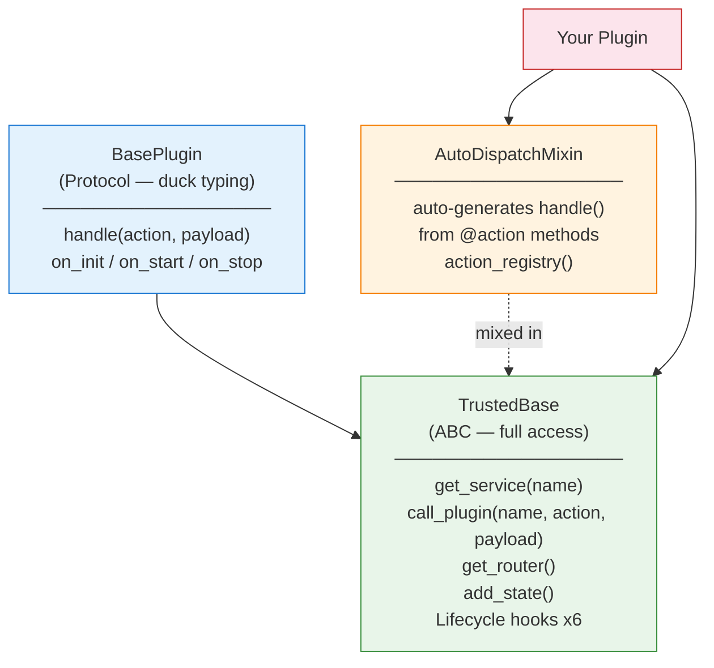
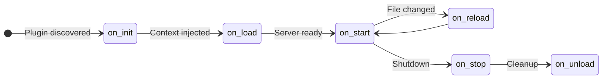
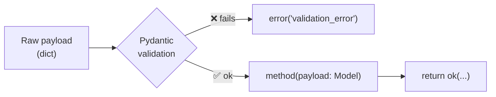

# SDK Reference

The XCore SDK (`xcore/sdk/`) provides decorators and base classes for plugin authors.

---

## Plugin class hierarchy



---

## `TrustedBase`

Abstract base class for trusted plugins. Provides full access to services, events, hooks, and the kernel context.

```python
from xcore import TrustedBase
```

### Injected attributes

| Attribute | Type | Description |
|:----------|:-----|:------------|
| `self.ctx` | `PluginContext` | Full kernel context |
| `self.ctx.services` | `ServiceContainer` | Service container |
| `self.ctx.events` | `EventBus` | Async event bus |
| `self.ctx.hooks` | `HookManager` | Before/after hooks |
| `self.ctx.tenant_id` | `str` | Current request tenant |
| `self.ctx.name` | `str` | This plugin's name |
| `self.ctx.manifest` | `PluginManifest` | Parsed plugin.yaml |

### `get_service(name)` — typed overloads

```python title="All typed keys"
self.db        = self.get_service("db")          # → AsyncSQLAdapter
self.cache     = self.get_service("cache")       # → CacheService
self.scheduler = self.get_service("scheduler")   # → SchedulerService
self.worker    = self.get_service("worker")      # → WorkerService
self.syncdb    = self.get_service("syncdb")      # → SQLAdapter
self.mongo     = self.get_service("mongodb")     # → MongoDBAdapter
self.redis     = self.get_service("redisAdapter")# → RedisAdapter
self.analytics = self.get_service("analytics")  # → Any (named connection)

# Explicit type for named connection (IDE-friendly)
from xcore.services.database.adapters.async_sql import AsyncSQLAdapter
self.analytics = self.get_service_as("analytics", AsyncSQLAdapter)
```

### `call_plugin(plugin, action, payload)` — IPC

```python
result = await self.call_plugin(
    "billing_plugin",        # target plugin name (from plugin.yaml)
    "charge",                # action name
    {"amount": 99, "currency": "USD"},
)
# result → {"status": "ok", "charge_id": "ch_xxx"}
```

!!! note "Tenant propagation"
    `tenant_id` flows automatically through `call_plugin`. You don't need to forward it manually.

### `get_router()` — HTTP routes

```python
def get_router(self):
    from fastapi import APIRouter
    router = APIRouter(prefix="/v1", tags=["my_plugin"])

    @router.get("/status")
    async def status():
        return {"ok": True}

    return router
# Auto-mounted at /app/my_plugin/v1/status
```

### Lifecycle hooks



```python
async def on_init(self) -> None:
    """Before context injection. No services yet."""

async def on_load(self) -> None:
    """Context injected. Services available. Primary setup hook."""
    self.db = self.get_service("db")

async def on_start(self) -> None:
    """Server fully ready and accepting requests."""

async def on_reload(self) -> None:
    """Called after a hot-reload (source file changed)."""

async def on_stop(self) -> None:
    """Server is shutting down."""

async def on_unload(self) -> None:
    """Plugin removed. Release connections, clear state."""
```

---

## `AutoDispatchMixin`

Eliminates the need to write a `handle()` switch statement manually.

=== "Without AutoDispatchMixin"

    ```python
    class Plugin(TrustedBase):

        async def handle(self, action: str, payload: dict) -> dict:
            if action == "ping":
                return await self._ping(payload)
            elif action == "create_user":
                return await self._create_user(payload)
            elif action == "delete_user":
                return await self._delete_user(payload)
            else:
                return {"status": "error", "msg": f"Unknown action: {action}"}

        async def _ping(self, payload): ...
        async def _create_user(self, payload): ...
        async def _delete_user(self, payload): ...
    ```

=== "With AutoDispatchMixin ✅"

    ```python
    from xcore.sdk.mixin.ipc import AutoDispatchMixin
    from xcore.sdk.decorators import action

    class Plugin(AutoDispatchMixin, TrustedBase):

        @action("ping")
        async def ping(self, payload: dict) -> dict: ...

        @action("create_user")
        async def create_user(self, payload: dict) -> dict: ...

        @action("delete_user")
        async def delete_user(self, payload: dict) -> dict: ...

        # handle() is auto-generated — unknown actions return:
        # {"status": "error", "code": "unknown_action", "msg": "..."}
    ```

### `action_registry()`

Returns the list of all declared actions with their schemas:

```python
plugin.action_registry()
# [
#   {"action": "ping"},
#   {"action": "create_user", "version": "1.0", "description": "Create a user."},
# ]
```

---

## `@action`

Maps an action string to a method. Used with `AutoDispatchMixin`.

```python
from xcore.sdk.decorators import action

@action("greet")
async def greet(self, payload: dict) -> dict:
    return ok(message=f"Hello {payload.get('name', 'world')}")

# handle("greet", {"name": "Dev"}) → calls self.greet({"name": "Dev"})
```

---

## `@schema`

Registers a versioned payload schema with `SchemaRegistry`. Enables IPC validation, deprecation warnings, and API documentation.

```python title="Full @schema example"
from xcore.sdk.decorators import action, schema

@action("create_user")
@schema(
    version="2.0",                          # (1)!
    input={
        "name":     (str, ...),             # (2)!
        "email":    (str, ...),             # required
        "role":     (str, "user"),          # (3)!
        "username": (str, ""),              # (4)!
    },
    output={
        "user_id":  (int, ...),
        "name":     (str, ...),
    },
    deprecated_fields={                     # (5)!
        "username": "Use 'name' instead — deprecated since v1.5",
    },
    breaking_since="2.0",                   # (6)!
    description="Create a new user account.",
    validate=True,                          # (7)!
)
async def create_user(self, payload: dict) -> dict:
    ...
```

1. Schema version string — used for tracking and routing.
2. `(type, ...)` → required field.
3. `(type, default)` → optional field with a default value.
4. Will trigger a deprecation warning if included in the payload.
5. `{field_name: reason}` — logs `WARNING` when a deprecated field is present.
6. Version at which this schema became a breaking change.
7. Enable Pydantic input validation from the `input` schema.

---

## `@validate_payload`

Validates the payload against a Pydantic model before the method is called.

```python title="With validation"
from pydantic import BaseModel, EmailStr
from xcore.sdk.decorators import validate_payload

class CreateUserPayload(BaseModel):
    name: str
    email: str
    role: str = "user"

@action("create_user")
@validate_payload(CreateUserPayload)      # (1)!
async def create_user(self, payload: CreateUserPayload) -> dict:
    # payload is a fully validated Pydantic model here
    return ok(name=payload.name)
```

1. On validation failure, returns `{"status": "error", "code": "validation_error", "msg": "..."}` — the method is never called.



---

## `@require_service`

Guards a method — raises `RuntimeError` at startup if the named service is not available in the container.

```python
from xcore.sdk.decorators import require_service

@action("save")
@require_service("db")        # (1)!
async def save(self, payload: dict) -> dict:
    async with self.db.session() as session:
        ...
```

1. Checked when the plugin loads. If `"db"` is not in the `ServiceContainer`, the plugin fails to start with a clear error message.

---

## Response helpers

```python
from xcore.kernel.api.contract import ok, error
```

=== "ok()"

    ```python
    # With keyword args
    return ok(user_id=42, name="Alice")
    # → {"status": "ok", "user_id": 42, "name": "Alice"}

    # With a dict
    return ok({"items": [1, 2, 3], "total": 3})
    # → {"status": "ok", "items": [1, 2, 3], "total": 3}

    # Empty success
    return ok()
    # → {"status": "ok"}
    ```

=== "error()"

    ```python
    # With code
    return error("User not found", code="not_found")
    # → {"status": "error", "msg": "User not found", "code": "not_found"}

    # With extra fields
    return error("Validation failed", code="invalid_input", field="email", value="bad")
    # → {"status": "error", "msg": "...", "code": "invalid_input", "field": "email", "value": "bad"}
    ```

---

## `PluginManifest`

Parsed `plugin.yaml`. Available as `self.ctx.manifest` inside a plugin at runtime.

```python title="Accessing manifest fields"
async def on_load(self):
    m = self.ctx.manifest

    print(m.name)              # "my_plugin"
    print(m.version)           # "1.0.0"
    print(m.execution_mode)    # ExecutionMode.TRUSTED
    print(m.allowed_callers)   # ["auth_plugin"]
    print(m.permissions)       # [{"resource": "cache.*", ...}]
    print(m.resources.rate_limit.calls)  # 200
    print(m.extra)             # {"my_custom_key": "value"} — unknown yaml keys
```

---

## `VersionConstraint`

Evaluates semver constraints from `requires:`.

```python
from xcore.sdk.plugin_base import VersionConstraint

vc = VersionConstraint(">=1.2,<2.0")
vc.matches("1.5.0")   # True
vc.matches("2.0.0")   # False
vc.matches("1.1.9")   # False

vc2 = VersionConstraint("^1.5")   # >=1.5, <2.0
vc2.matches("1.9.0")  # True
vc2.matches("2.0.0")  # False
```

Supported operators: `>=`, `<=`, `>`, `<`, `==`, `!=`, `^` (caret), `~` (tilde).
