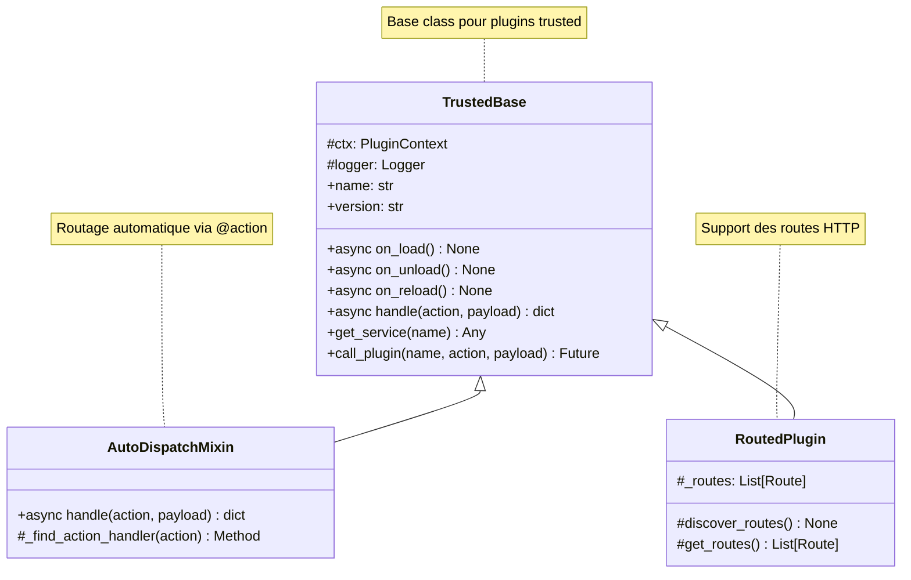
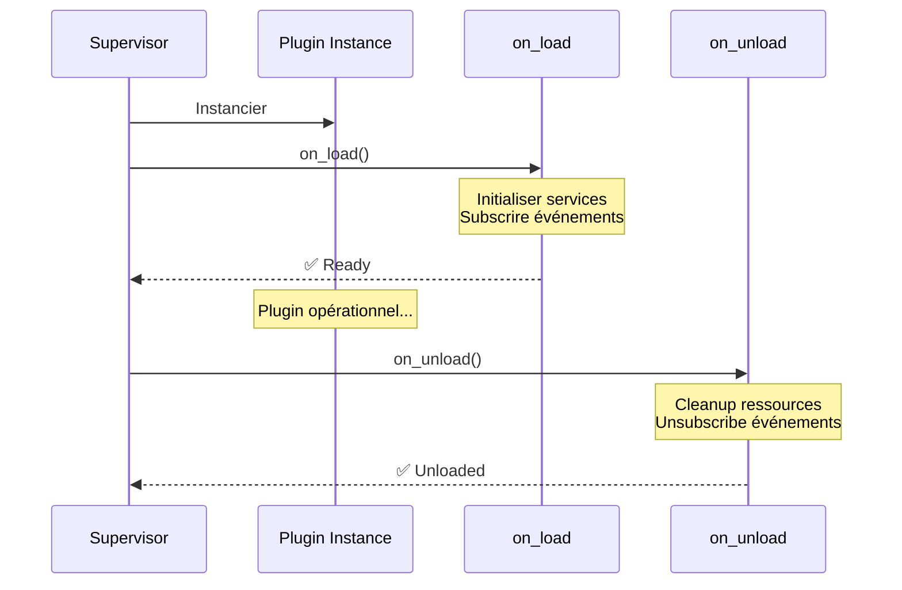

# XCore SDK Reference

Le SDK XCore est une bibliothèque haut niveau conçue pour faciliter le développement de plugins sécurisés, scalables et maintenables.

---

## Vue d'Ensemble du SDK

```mermaid
flowchart TB
    subgraph Core["🎯 Classes Core"]
        TB[TrustedBase<br/>Base plugins trusted]
        BP[BasePlugin<br/>Interface low-level]
        SB[SandboxedBase<br/>Base plugins sandboxed]
    end

    subgraph Mixins["🔧 Mixins"]
        ADM[AutoDispatchMixin<br/>Routage @action]
        RP[RoutedPlugin<br/>Routes HTTP]
        VM[ValidateMixin<br/>Validation Pydantic]
    end

    subgraph Decorators["📝 Décorateurs"]
        D1[@action]
        D2[@route]
        D3[@validate_payload]
        D4[@on / @filter]
    end

    subgraph Helpers["🛠️ Helpers"]
        H1[ok / error]
        H2[Event]
        H3[Response types]
    end

    Core --> Mixins
    Mixins --> Decorators
    Decorators --> Helpers

    style Core fill:#E3F2FD,stroke:#1976D2
    style Mixins fill:#FFF3E0,stroke:#F57C00
    style Decorators fill:#E8F5E9,stroke:#388E3C
    style Helpers fill:#F3E5F5,stroke:#7B1FA2
```

---

## 1. Classes Core

### `TrustedBase`

Classe de base principale pour les plugins qui s'exécutent dans le **processus principal** XCore.



#### Cycle de Vie



#### Implémentation Complète

```python
from xcore.sdk import TrustedBase, AutoDispatchMixin, action, ok, error
from pydantic import BaseModel, Field
from typing import Optional

class GreetInput(BaseModel):
    """Schema de validation pour l'action greet."""
    name: str = Field(min_length=1, max_length=100, description="Nom à saluer")
    language: str = Field(default="fr", description="Langue")

class Plugin(AutoDispatchMixin, TrustedBase):
    """
    Plugin de démonstration montrant toutes les fonctionnalités de TrustedBase.
    """

    async def on_load(self) -> None:
        """
        🎯 Point d'entrée au chargement du plugin.

        Initialiser ici :
        - Les services (db, cache, scheduler)
        - Les subscriptions d'événements
        - L'état interne
        """
        self.logger.info(f"🚀 Chargement de {self.name} v{self.version}")

        # Initialiser les services
        self.db = self.get_service("db")
        self.cache = self.get_service("cache")
        self.scheduler = self.get_service("scheduler")

        # S'abonner à un événement
        self.ctx.events.on("user.created", self._on_user_created, priority=50)

        self.logger.info("✅ Plugin prêt")

    async def on_unload(self) -> None:
        """
        🧹 Point de cleanup au déchargement.

        Nettoyer ici :
        - Connexions ouvertes
        - Subscriptions événements
        - Tâches scheduler
        """
        self.logger.info(f"👋 Déchargement de {self.name}")
        # Cleanup si nécessaire

    async def on_reload(self) -> None:
        """
        🔄 Appelé lors d'un hot-reload.

        Re-initialiser l'état sans perdre les connexions.
        """
        self.logger.info(f"🔄 Rechargement de {self.name}")
        await self.on_load()  # Ré-initialiser

    @action("greet")
    async def greet(self, payload: dict) -> dict:
        """
        🎯 Action: Saluer un utilisateur.

        Args:
            payload: {"name": "Votre nom", "language": "fr"}

        Returns:
            {"status": "ok", "message": "Bonjour, X !"}
        """
        # Valider l'input
        try:
            input_data = GreetInput(**payload)
        except ValidationError as e:
            return error(msg=str(e), code="invalid_input", status_code=400)

        # Logique métier
        greetings = {
            "fr": "Bonjour",
            "en": "Hello",
            "es": "Hola"
        }
        greeting = greetings.get(input_data.language, "Hello")
        message = f"{greeting}, {input_data.name} !"

        self.logger.info(f"Salutation: {message}")
        return ok(message=message)

    @on("user.created")
    async def _on_user_created(self, event: Event) -> None:
        """Handler pour l'événement user.created."""
        user_email = event.data.get("email")
        self.logger.info(f"Nouvel utilisateur: {user_email}")
```

---

### `BasePlugin`

Interface low-level pour tous les types de plugins. Utilisé pour la logique interne du framework ou pour construire des runners personnalisés.

```python
from xcore.sdk import BasePlugin

class CustomPluginRunner(BasePlugin):
    """
    Implémentation personnalisée d'un runner de plugin.
    """

    async def initialize(self, config: dict) -> None:
        """Initialisation personnalisée."""
        pass

    async def execute(self, action: str, payload: dict) -> dict:
        """Exécution personnalisée."""
        return {"status": "ok", "result": "custom"}

    async def cleanup(self) -> None:
        """Cleanup personnalisé."""
        pass
```

---

## 2. Décorateurs

### `@action(name: str)`

Définit une méthode comme handler d'action IPC. Nécessite `AutoDispatchMixin`.

```mermaid
flowchart LR
    A[Appel IPC<br/>action="greet"] --> B[AutoDispatchMixin.handle]
    B --> C{Rechercher<br/>@action("greet")}
    C -->|Trouvé| D[Exécuter handler]
    C -->|Non trouvé| E[❌ Error 404]
    D --> F[Retourner résultat]

    style B fill:#E3F2FD,stroke:#1976D2
    style D fill:#E8F5E9,stroke:#388E3C
    style E fill:#FFEBEE,stroke:#C62828
```

```python
from xcore.sdk import TrustedBase, AutoDispatchMixin, action, ok

class Plugin(AutoDispatchMixin, TrustedBase):

    @action("ping")
    async def ping(self, payload: dict) -> dict:
        """Health check simple."""
        return ok(status="pong", timestamp=self._now())

    @action("add")
    async def add(self, payload: dict) -> dict:
        """Additionne deux nombres."""
        a = payload.get("a", 0)
        b = payload.get("b", 0)
        return ok(result=a + b)

    @action("complex_operation")
    async def complex_op(self, payload: dict) -> dict:
        """Opération avec validation et services."""
        # Accéder au service
        db = self.get_service("db")

        # Vérifier le cache
        cache_key = f"op:{payload.get('id')}"
        cached = await self.cache.get(cache_key)
        if cached:
            return ok(result=cached, source="cache")

        # Exécuter l'opération
        result = await self._do_operation(payload)

        # Caster le résultat
        await self.cache.set(cache_key, result, ttl=300)

        return ok(result=result, source="computed")
```

---

### `@route(path: str, method: str, ...)`

Définit une route FastAPI directement sur la classe du plugin. Nécessite le mixin `RoutedPlugin`.

```mermaid
flowchart TB
    subgraph Plugin["🧩 Plugin"]
        R1[@route("/users", GET)]
        R2[@route("/users/{id}", GET)]
        R3[@route("/users", POST)]
    end

    subgraph Mount["📡 FastAPI Mount"]
        M1[/plugin/my_plugin/users]
        M2[/plugin/my_plugin/users/{id}]
    end

    R1 --> M1
    R2 --> M2
    R3 --> M1

    style Plugin fill:#FFF3E0,stroke:#F57C00
    style Mount fill:#E3F2FD,stroke:#1976D2
```

#### Paramètres du Décorateur

| Paramètre | Type | Défaut | Description |
| :--- | :--- | :--- | :--- |
| `path` | str | Requis | Chemin de la route |
| `method` | str | "GET" | Méthode HTTP |
| `tags` | list | None | Tags pour OpenAPI |
| `summary` | str | None | Résumé pour docs |
| `status_code` | int | 200 | Code de statut par défaut |
| `dependencies` | list | None | Dépendances FastAPI |
| `permissions` | list | None | Permissions requises |

#### Exemple Complet

```python
from xcore.sdk import TrustedBase, RoutedPlugin, route, ok, error
from fastapi import Depends, HTTPException
from pydantic import BaseModel, EmailStr

class UserCreate(BaseModel):
    email: EmailStr
    name: str
    password: str

class UserResponse(BaseModel):
    id: int
    email: str
    name: str

class Plugin(RoutedPlugin, TrustedBase):
    """Plugin avec routes HTTP complètes."""

    @route("/users", method="GET", tags=["users"], summary="Lister les utilisateurs")
    async def list_users(self, limit: int = 100, offset: int = 0) -> dict:
        """
        Liste tous les utilisateurs avec pagination.

        - **limit**: Nombre maximum d'utilisateurs
        - **offset**: Décalage pour la pagination
        """
        db = self.get_service("db")
        async with db.session() as session:
            query = f"SELECT * FROM users LIMIT {limit} OFFSET {offset}"
            result = await session.execute(query)
            users = result.fetchall()

        return ok(users=[dict(u) for u in users], total=len(users))

    @route("/users/{user_id}", method="GET", tags=["users"])
    async def get_user(self, user_id: int) -> dict:
        """Récupérer un utilisateur par ID."""
        db = self.get_service("db")
        async with db.session() as session:
            query = "SELECT * FROM users WHERE id = :id"
            result = await session.execute(query, {"id": user_id})
            user = result.fetchone()

        if not user:
            return error(msg="Utilisateur non trouvé", code="not_found", status_code=404)

        return ok(user=dict(user))

    @route("/users", method="POST", tags=["users"], status_code=201)
    async def create_user(self, data: UserCreate) -> dict:
        """Créer un nouvel utilisateur."""
        db = self.get_service("db")

        async with db.session() as session:
            query = "INSERT INTO users (email, name) VALUES (:email, :name) RETURNING *"
            result = await session.execute(query, dict(data))
            user = result.fetchone()
            await session.commit()

        # Émettre un événement
        await self.ctx.events.emit("user.created", {
            "id": user.id,
            "email": user.email
        })

        return ok(user=dict(user))

    @route("/health", method="GET", tags=["system"])
    async def health_check(self) -> dict:
        """Endpoint de santé du plugin."""
        return ok(
            plugin=self.name,
            version=self.version,
            status="healthy"
        )
```

---

### `@validate_payload(schema: Type[BaseModel], type_response="dict")`

Valide automatiquement le payload IPC contre un modèle Pydantic.

```mermaid
flowchart TB
    A[Payload Reçu] --> B[@validate_payload]
    B --> C{Validation}
    C -->|✅ Valide| D[Handler exécuté]
    C -->|❌ Invalide| E[Erreur 400]

    D --> F{type_response ?}
    F -->|dict| G[Dict validé]
    F -->|pydantic| H[Instance Pydantic]

    style B fill:#E3F2FD,stroke:#1976D2
    style E fill:#FFEBEE,stroke:#C62828
```

#### Modes de Retour

```python
from xcore.sdk import TrustedBase, AutoDispatchMixin, action, ok
from xcore.sdk.decorators import validate_payload
from pydantic import BaseModel

class CreateUserInput(BaseModel):
    email: str
    name: str
    age: int = Field(ge=0, le=150)

class Plugin(AutoDispatchMixin, TrustedBase):

    # Mode 1: Retourne un dict validé
    @action("create_user_dict")
    @validate_payload(CreateUserInput, type_response="dict")
    async def create_user_dict(self, payload: dict) -> dict:
        # payload est un dict validé
        email = payload["email"]
        name = payload["name"]
        return ok(email=email, name=name)

    # Mode 2: Retourne l'instance Pydantic
    @action("create_user_model")
    @validate_payload(CreateUserInput, type_response="pydantic")
    async def create_user_model(self, payload: CreateUserInput) -> dict:
        # payload est une instance CreateUserInput
        email = payload.email
        name = payload.name
        age = payload.age
        return ok(email=email, name=name, age=age)
```

---

### `@trusted` / `@sandboxed`

Markers pour s'assurer qu'une méthode s'exécute uniquement dans le mode spécifié.

```python
from xcore.sdk import TrustedBase, trusted, sandboxed, action

class Plugin(TrustedBase):

    @action("trusted_only")
    @trusted
    async def trusted_operation(self, payload: dict) -> dict:
        """Ne s'exécute que en mode trusted."""
        return ok(result="trusted")

    @action("sandboxed_only")
    @sandboxed
    async def sandboxed_operation(self, payload: dict) -> dict:
        """Ne s'exécute que en mode sandboxed."""
        return ok(result="sandboxed")
```

---

### `@on(event_name: str, priority: int = 50)`

Subscribe un handler à un événement.

```python
from xcore.sdk import TrustedBase, on, Event

class Plugin(TrustedBase):

    @on("user.created", priority=100)
    async def handle_user_created(self, event: Event):
        """Handler avec haute priorité."""
        pass

    @on("order.completed", priority=50)
    async def handle_order_completed(self, event: Event):
        """Handler avec priorité normale."""
        pass
```

---

### `@filter(hook_name: str)` et `@action_hook(hook_name: str)`

Enregistre un hook filter ou action.

```python
from xcore.sdk import TrustedBase, filter, action_hook

class Plugin(TrustedBase):

    @filter("page_title")
    def modify_title(self, title: str) -> str:
        """Filter: modifie le titre de page."""
        return f"{title} | Mon App"

    @action_hook("before_render")
    def before_render_log(self, template: str):
        """Action hook: log avant rendu."""
        self.logger.info(f"Rendu: {template}")
```

---

## 3. Mixins

### `AutoDispatchMixin`

Fournit une implémentation automatique de `handle()` en routant vers les méthodes décorées avec `@action`.

```mermaid
flowchart TB
    A[IPC: handle("greet", payload)] --> B[AutoDispatchMixin.handle]
    B --> C[Rechercher @action("greet")]
    C --> D{Trouvé ?}
    D -->|Oui| E[Exécuter greet(payload)]
    D -->|Non| F[Erreur: Action inconnue]
    E --> G[Retourner résultat]
    F --> H[Retourner error()]

    style B fill:#E3F2FD,stroke:#1976D2
    style E fill:#E8F5E9,stroke:#388E3C
    style F fill:#FFEBEE,stroke:#C62828
```

```python
# Sans AutoDispatchMixin (verbeux)
class Plugin(TrustedBase):
    async def handle(self, action: str, payload: dict) -> dict:
        if action == "ping":
            return await self.ping(payload)
        elif action == "greet":
            return await self.greet(payload)
        else:
            return error(f"Action inconnue: {action}", code="not_found")

# Avec AutoDispatchMixin (concis)
class Plugin(AutoDispatchMixin, TrustedBase):

    @action("ping")
    async def ping(self, payload: dict) -> dict:
        return ok(status="pong")

    @action("greet")
    async def greet(self, payload: dict) -> dict:
        return ok(message=f"Hello !")
```

---

### `RoutedPlugin`

Active la découverte automatique et le montage des routes FastAPI.

```python
from xcore.sdk import TrustedBase, RoutedPlugin, route

class Plugin(RoutedPlugin, TrustedBase):
    """Les routes sont automatiquement montées sur /plugin/{name}/..."""

    @route("/hello", methods=["GET"])
    async def hello(self):
        return {"message": "Hello"}

    @route("/hello/{name}", methods=["GET"])
    async def hello_name(self, name: str):
        return {"message": f"Hello, {name}!"}
```

**Routes montées :**
- `GET /plugin/my_plugin/hello`
- `GET /plugin/my_plugin/hello/{name}`

---

## 4. Helpers

### `ok(**kwargs) -> dict`

Génère une réponse de succès standardisée.

```python
from xcore.sdk import ok

# Simple
ok(message="Succès")
# → {"status": "ok", "message": "Succès"}

# Multiple
ok(user_id=123, email="test@example.com")
# → {"status": "ok", "user_id": 123, "email": "test@example.com"}

# Avec données complexes
ok(users=[...], total=100, page=1)
# → {"status": "ok", "users": [...], "total": 100, "page": 1}
```

### `error(msg: str, code: str, status_code: int = 400) -> dict`

Génère une réponse d'erreur standardisée.

```python
from xcore.sdk import error

# Erreur de validation
error(msg="Champ requis manquant", code="validation_error", status_code=400)
# → {"status": "error", "msg": "Champ requis manquant", "code": "validation_error"}

# Erreur not found
error(msg="Ressource non trouvée", code="not_found", status_code=404)
# → {"status": "error", "msg": "Ressource non trouvée", "code": "not_found"}

# Erreur serveur
error(msg="Erreur interne", code="internal_error", status_code=500)
```

---

## 5. Repositories & Data Access

### `BaseAsyncRepository`

Classe de base pour les interactions asynchrones avec la base de données.

```python
from xcore.repositories import BaseAsyncRepository
from typing import TypeVar, Generic, List, Optional
from pydantic import BaseModel

class User(BaseModel):
    id: int
    email: str
    name: str

class UserRepository(BaseAsyncRepository):
    """Repository pour les opérations sur les utilisateurs."""

    async def get_by_email(self, email: str) -> Optional[User]:
        """Récupérer un utilisateur par email."""
        query = "SELECT * FROM users WHERE email = :email"
        result = await self.session.execute(query, {"email": email})
        row = result.fetchone()
        return User(**dict(row)) if row else None

    async def list_all(self, limit: int = 100) -> List[User]:
        """Lister tous les utilisateurs."""
        query = "SELECT * FROM users LIMIT :limit"
        result = await self.session.execute(query, {"limit": limit})
        return [User(**dict(row)) for row in result.fetchall()]

    async def create(self, data: dict) -> User:
        """Créer un nouvel utilisateur."""
        query = "INSERT INTO users (email, name) VALUES (:email, :name) RETURNING *"
        result = await self.session.execute(query, data)
        row = result.fetchone()
        await self.session.commit()
        return User(**dict(row))
```

---

## 6. RBAC Checker

Dépendance FastAPI pour appliquer le contrôle d'accès basé sur les rôles.

```python
from fastapi import Depends
from xcore.security import RBACChecker, require_role

checker = RBACChecker()

@route("/admin/users", methods=["GET"], dependencies=[Depends(require_role("admin"))])
async def list_users_admin():
    """Route protégée: nécessite le rôle admin."""
    pass

@route("/profile", methods=["GET"], dependencies=[Depends(require_role("user"))])
async def get_profile():
    """Route protégée: nécessite le rôle user."""
    pass
```

---

## 7. Tableau Récapitulatif

| Composant | Usage | Exemple |
| :--- | :--- | :--- |
| `TrustedBase` | Base class plugins | `class Plugin(TrustedBase)` |
| `AutoDispatchMixin` | Routage @action | `class Plugin(AutoDispatchMixin, TrustedBase)` |
| `RoutedPlugin` | Routes HTTP | `@route("/path")` |
| `@action` | Handler IPC | `@action("greet")` |
| `@route` | Route HTTP | `@route("/users/{id}")` |
| `@validate_payload` | Validation Pydantic | `@validate_payload(UserSchema)` |
| `@on` | Subscription événement | `@on("user.created")` |
| `@filter` | Hook filter | `@filter("page_title")` |
| `ok()` | Réponse succès | `ok(message="OK")` |
| `error()` | Réponse erreur | `error(msg="Error", code="bad")` |

---

## Prochaines Lectures

| 📚 Guide | Objectif |
| :--- | :--- |
| [Creating Plugins](../guides/creating-plugins.md) | Tutoriel complet |
| [Security](../guides/security.md) | Bonnes pratiques sécurité |
| [Events](../guides/events.md) | Système d'événements |
