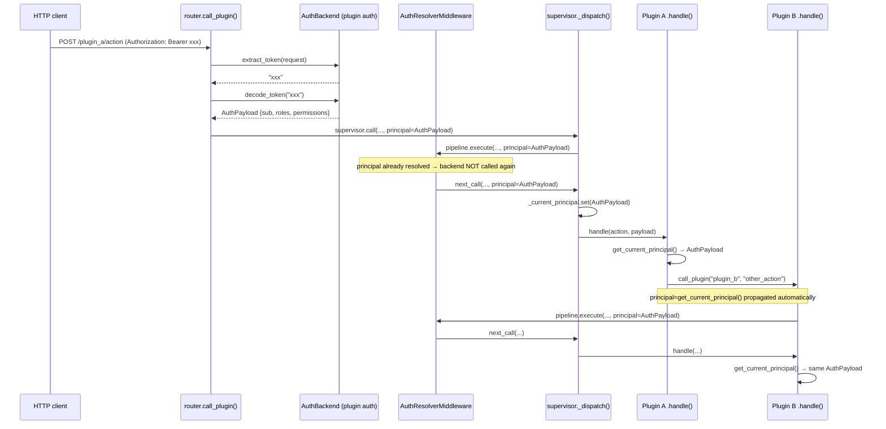

# Auth

xcore exposes a kernel-level authentication backend interface: plugins register a single `AuthBackend` implementation, and the kernel (HTTP routes, and now IPC calls) can query it to resolve the identity behind a call — without knowing anything about JWTs, sessions, or whatever credential scheme the backend actually implements.

```python
from xcore.sdk import (
    AuthBackend,
    AuthPayload,
    register_auth_backend,
    unregister_auth_backend,
    get_auth_backend,
    has_auth_backend,
)
```

---

## AuthPayload

A `TypedDict` representing an authenticated identity. Returned by `AuthBackend.decode_token()`.

```python
from xcore.kernel.api.auth import AuthPayload

payload: AuthPayload = {
    "sub": "user:abc123",            # unique identity string — required
    "roles": ["admin", "viewer"],    # optional
    "permissions": ["write:users"],  # optional
    "user": {"org": "acme"},         # optional, arbitrary extra data
}
```

Only `sub` is required; `roles`, `permissions`, and `user` are optional (`NotRequired`).

---

## AuthBackend

`Protocol` that a plugin implements to become the active auth backend. No base class to inherit — any object with these three async methods satisfies it.

```python
from xcore.kernel.api.auth import AuthBackend, AuthPayload

class JWTAuthBackend:
    def __init__(self, secret: str) -> None:
        self.secret = secret

    async def decode_token(self, token: str) -> AuthPayload | None:
        """Validate a token and return the identity, or None if invalid."""
        try:
            data = jwt.decode(token, self.secret, algorithms=["HS256"])
            return {"sub": data["sub"], "roles": data.get("roles", [])}
        except jwt.InvalidTokenError:
            return None

    async def extract_token(self, request) -> str | None:
        """Pull the raw token out of an incoming HTTP request."""
        header = request.headers.get("authorization", "")
        if header.startswith("Bearer "):
            return header[len("Bearer "):]
        return None

    async def has_permission(self, payload: AuthPayload, permission: str) -> bool:
        return permission in payload.get("roles", []) or permission in payload.get("permissions", [])
```

| Method | Signature | Description |
|--------|-----------|--------------|
| `decode_token` | `(token: str) → AuthPayload \| None` | Validate a raw token, return the identity or `None` |
| `extract_token` | `(request) → str \| None` | Pull the raw token out of an HTTP request (headers/cookies/query params) |
| `has_permission` | `(payload: AuthPayload, permission: str) → bool` | Check a single permission/role against a resolved identity |

---

## register_auth_backend / unregister_auth_backend

Registers the single active backend instance. There is no name/registry — one backend at a time per process.

```python
from xcore.sdk import register_auth_backend, unregister_auth_backend

class Plugin(TrustedBase):
    async def on_load(self) -> None:
        self._backend = JWTAuthBackend(secret=self.ctx.env["JWT_SECRET"])
        register_auth_backend(self._backend)

    async def on_unload(self) -> None:
        unregister_auth_backend()
```

`register_auth_backend` raises `TypeError` if the object doesn't structurally satisfy `AuthBackend` (missing one of the three methods).

---

## get_auth_backend / has_auth_backend

```python
from xcore.sdk import get_auth_backend, has_auth_backend

if has_auth_backend():
    backend = get_auth_backend()
    payload = await backend.decode_token(token)
```

`get_auth_backend()` returns `None` (never raises) when no backend is registered — every consumer in the kernel (RBAC, IPC resolution) treats "no backend" as a no-op, not an error.

---

## RBAC on HTTP routes

For role/permission checks on `@route`-declared HTTP endpoints:

```python
from xcore.kernel.api.rbac import RBACChecker, require_permission, require_role, get_current_user
```

| Export | Description |
|--------|-------------|
| `RBACChecker` | FastAPI dependency — resolves the user via the registered backend and checks required roles/permissions |
| `require_permission(*perms)` | Shortcut: `RBACChecker(list(perms))` |
| `require_role(*roles)` | Shortcut: `RBACChecker(list(roles))` |
| `get_current_user` | FastAPI dependency — just resolves and returns the `AuthPayload`, no check |

`RBACChecker` raises `HTTPException(503)` if no backend is registered (or passes through with `strict=False`), `401` if no/invalid token, `403` if required roles/permissions are missing. This only applies to routes declared with `@route(..., permissions=[...])` — see [`RoutedPlugin.get_router()`](./decorators.md#route).

---

## Resolving the current user on IPC calls

Separately from the HTTP-route RBAC above, the **IPC call path** (`supervisor.call()` / `TrustedBase.call_plugin()`) resolves the calling user and makes it available to plugin code, via the same registered `AuthBackend` — without requiring `@route`.

By itself, resolving the principal doesn't block anything — see [Enforcing action permissions](#enforcing-action-permissions) below for what actually denies a call. Existing behavior (requests with no backend registered, or no token, and actions declaring no `permissions`) is completely unaffected either way.

### How a token becomes a principal

1. The generic HTTP endpoint `POST /{plugin}/{action}` ([`router.py`](../../advanced/middleware.md)) calls `resolve_principal_from_request(request)`, which does the only two calls into the backend that happen for a given incoming request:
   ```python
   token = await backend.extract_token(request)   # read headers/cookies
   principal = await backend.decode_token(token)  # token → AuthPayload
   ```
   Best-effort: returns `None` without raising if there's no backend, no token, or an invalid token.
2. The resolved `principal` (an `AuthPayload` or `None`) travels as a kwarg through `supervisor.call(..., principal=principal)`.
3. Inside the middleware pipeline, `AuthResolverMiddleware` sits just before `PermissionMiddleware`. If `principal` is already set, it passes through unchanged — **the backend is never contacted twice for the same call**. It only calls `decode_token()` itself when it receives a raw `token=` kwarg instead of an already-resolved `principal`.
4. `PluginSupervisor._dispatch()` stores `principal` in a `ContextVar` (`_current_principal`, same pattern as the tenant-id ContextVar) for the duration of the call — never by mutating the plugin's shared `PluginContext`.
5. Plugin code reads it with `get_current_principal()`.
6. When a plugin calls another plugin via `self.call_plugin(...)`, the current principal is forwarded automatically — the nested call does **not** re-contact the auth backend:
   ```python
   # TrustedBase.call_plugin() — automatic, nothing to do in plugin code
   principal=get_current_principal()
   ```

### Diagram



### Reading the principal in a plugin

```python
from xcore.kernel.api.auth import get_current_principal

class Plugin(TrustedBase):
    async def handle(self, action, payload):
        principal = get_current_principal()
        if principal is None:
            # no backend registered, or no token on this call — not an error
            self.logger.debug("appel anonyme", action=action)
        else:
            self.logger.info("appel authentifié", sub=principal.get("sub"), action=action)
        ...
```

## Enforcing action permissions

`ActionPermissionMiddleware` sits right after `AuthResolverMiddleware` in the pipeline (before `PermissionMiddleware`). For the action being called, it reads the declared requirement via `handler.get_action_permissions(action)` (`LifecycleManager.get_action_permissions()`, which looks up `fn._xcore_action_permissions` on the dispatched method — see [@action](./decorators.md#action)):

- **No `permissions` declared** (the default) → no check at all, fully backward compatible.
- **`permissions` declared** → the principal must have at least one matching entry in `roles` or `permissions` for *every* required item, or the call is denied with `{"status": "error", "code": "action_permission_denied"}`. No `principal` (no backend registered, or no token on this call) with a declared requirement is a denial, not a silent pass — fail-closed: an explicit requirement with nobody to prove it can't be waved through.

```python
@action("delete_user", permissions=["admin"])
async def delete_user(self, payload: dict) -> dict:
    # only reached if the resolved principal has "admin" in roles or permissions
    ...
```

This is a separate system from `PermissionEngine` / `PolicySet` (plugin-to-plugin resource ACL, see [Permissions & Policies](../../plugins/permissions.md)) — that one answers "can plugin A call plugin B", this one answers "does this user have this role". Neither is merged into the other.

No `AuthBackend` implementation ships in this repository — the kernel only ever depends on the protocol (`decode_token`/`extract_token`/`has_permission`), never on how tokens are produced or stored. A plugin author provides one (signed JWT, a shared session store, an external IdP...) and registers it with `register_auth_backend()` in `on_load()`.
