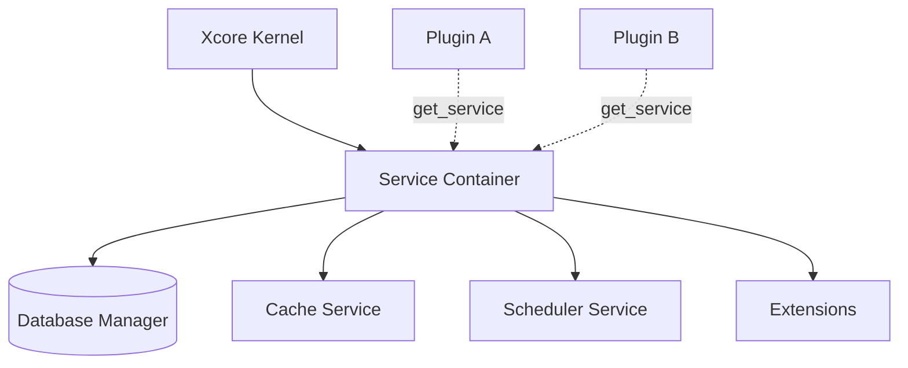

# Service Container

The **Service Container** is the central registry for all shared resources in Xcore. It manages the lifecycle (initialization and shutdown) of databases, caches, schedulers, and custom extensions, providing a unified and type-safe way for plugins to access them.

---

### Key Concepts

#### Centralized Resource Management
Instead of plugins managing their own connections, Xcore initializes services once at boot time. These services are then injected into the `PluginContext` of every Trusted plugin.



#### Initialization & Shutdown Order
To ensure dependencies are met (e.g., the Scheduler might need the Database), services are started and stopped in a strict order:

**Initialization Order**:
1.  **Database**: SQL (PostgreSQL, SQLite), NoSQL (MongoDB), Redis.
2.  **Cache**: Memory or Redis backend.
3.  **Scheduler**: APScheduler.
4.  **XWorker**: Background task worker (Celery/Internal).
5.  **Extensions**: Custom user-defined service providers.

**Shutdown Order**:
The exact reverse of initialization (Extensions first, Database last).

---

### Practical Guide

#### Accessing Services in a Plugin
While you can access the container directly via `self.ctx.services`, the recommended way is using the helpers provided by `TrustedBase`.

```python linenums="1" hl_lines="6 7 10"
from xcore import TrustedBase, AsyncSQLAdapter

class Plugin(TrustedBase):
    async def on_load(self):
        # 1. Standard resolution (type-hinted)
        self.db = self.get_service("db")
        self.cache = self.get_service("cache")

        # 2. Named connection resolution (explicit type)
        self.analytics = self.get_service_as("analytics", AsyncSQLAdapter)
```

#### Manual Registration
In rare cases (e.g., during testing or standalone usage), you can register services manually.

```python linenums="1"
from xcore.services.container import ServiceContainer
from my_custom_service import MyService

container = ServiceContainer(config.services)
container.register_service("my_custom", MyService())
```

---

### API Reference

#### `ServiceContainer`
| Method | Return Type | Description |
|--------|-------------|-------------|
| `get(name)` | `Any` | Returns a service by name. Supports literal overloads for `db`, `cache`, etc. |
| `get_as(name, type)` | `T` | Returns a service and validates that it matches the provided type. |
| `has(name)` | `bool` | Checks if a service is registered. |
| `health()` | `dict` | Performs a health check on all registered services. |

---

### YAML Configuration

The container is configured via the `services` section in `xcore.yaml`.

```yaml linenums="1" title="xcore.yaml"
services:
  databases:
    default:  # (1)!
      type: "sqlite"
      url: "sqlite:///./xcore.db"

  cache:
    backend: "memory"  # (2)!
    ttl: 300

  scheduler:
    enabled: true
    backend: "memory"
```

1.  The first database in the list is automatically aliased as `db`.
2.  Can be `memory` or `redis`.

---

### Common Errors & Pitfalls

!!! danger "KeyError: Service unavailable"
    This happens if you try to `get()` a service that wasn't defined in your configuration or whose provider failed to initialize.
    **Check**: Verify the keys in the `databases:` and `extensions:` sections of your `xcore.yaml`.

!!! warning "Circular Service Dependencies"
    If Service A requires Service B during `init()`, but Service B is initialized after Service A, the container will fail to boot.
    **Fix**: Use `Lazy Providers` or ensure your services can handle deferred initialization.

!!! failure "Service Shadowing"
    Manually registering a service with a name that conflicts with a core provider (like `db` or `cache`) will trigger a warning and may lead to unpredictable behavior.

---

### Best Practices

!!! success "Resolve Once, Use Often"
    Resolve your service references once in the `on_load()` hook and store them as instance attributes (`self.db`). This is more efficient than calling `get_service()` inside every `handle()` call.

!!! tip "Use get_service_as for Custom Extensions"
    If you use the `extensions:` block in `xcore.yaml` to load custom logic, always use `get_service_as()` to ensure your IDE provides correct autocompletion.
