# Architecture Overview

Understanding XCore's architecture and design principles.

## Design Philosophy

XCore follows these principles:

1. **Plugin-First**: Everything is a plugin. Core functionality is minimal.
2. **Security by Default**: Sandboxed execution with resource limits.
3. **Service-Oriented**: Shared services for common needs.
4. **Event-Driven**: Loose coupling via events.
5. **Production Ready**: Observability, metrics, and logging built-in.

## System Architecture

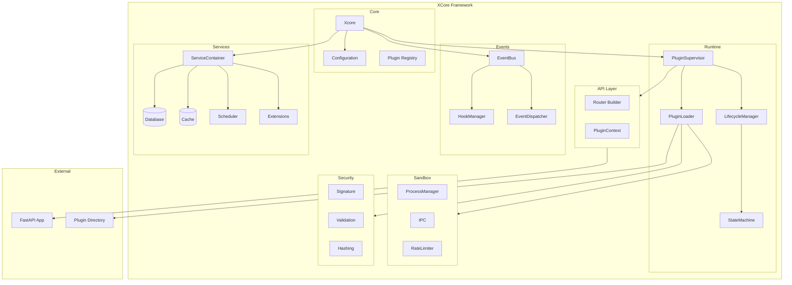

## Component Details

### Core Components

#### Xcore (Orchestrator)

**Location**: `xcore/__init__.py`

The main orchestrator that:
- Loads configuration
- Initializes services
- Boots the plugin system
- Attaches FastAPI routers

```mermaid
sequenceDiagram
    participant App as Application
    participant X as Xcore
    participant SC as ServiceContainer
    participant PS as PluginSupervisor
    participant FA as FastAPI

    App->>+X: __init__(config_path)
    X->>X: load_config()
    X-->>-App: instance

    App->>+X: boot(app)
    X->>+SC: init()
    SC->>SC: init_databases()
    SC->>SC: init_cache()
    SC->>SC: init_scheduler()
    SC-->>-X: services ready

    X->>X: init_events()
    X->>X: init_hooks()
    X->>X: init_registry()

    X->>+PS: boot()
    PS->>PS: load_all_plugins()
    PS-->>-X: plugins ready

    X->>FA: attach_router()
    X-->>-App: ready
```

#### Configuration

**Location**: `xcore/configurations/`

Configuration system:
- YAML parsing
- Environment variable substitution
- Validation
- Runtime access

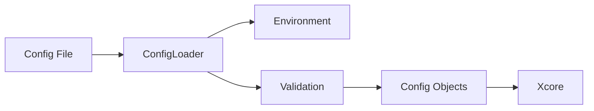

### Runtime Components

#### PluginSupervisor

**Location**: `xcore/kernel/runtime/supervisor.py`

High-level plugin management:
- Plugin lifecycle
- Action routing
- Rate limiting
- Retry logic

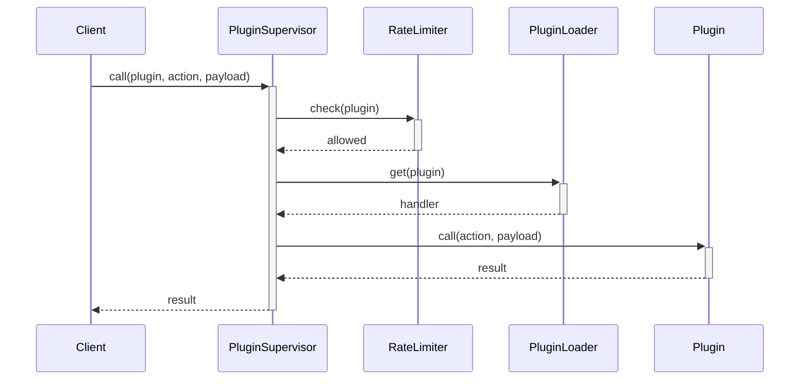

#### PluginLoader

**Location**: `xcore/kernel/runtime/loader.py`

Plugin loading logic:
- Directory scanning
- Manifest parsing
- Dependency resolution
- Topological sorting
- Mode-specific loading

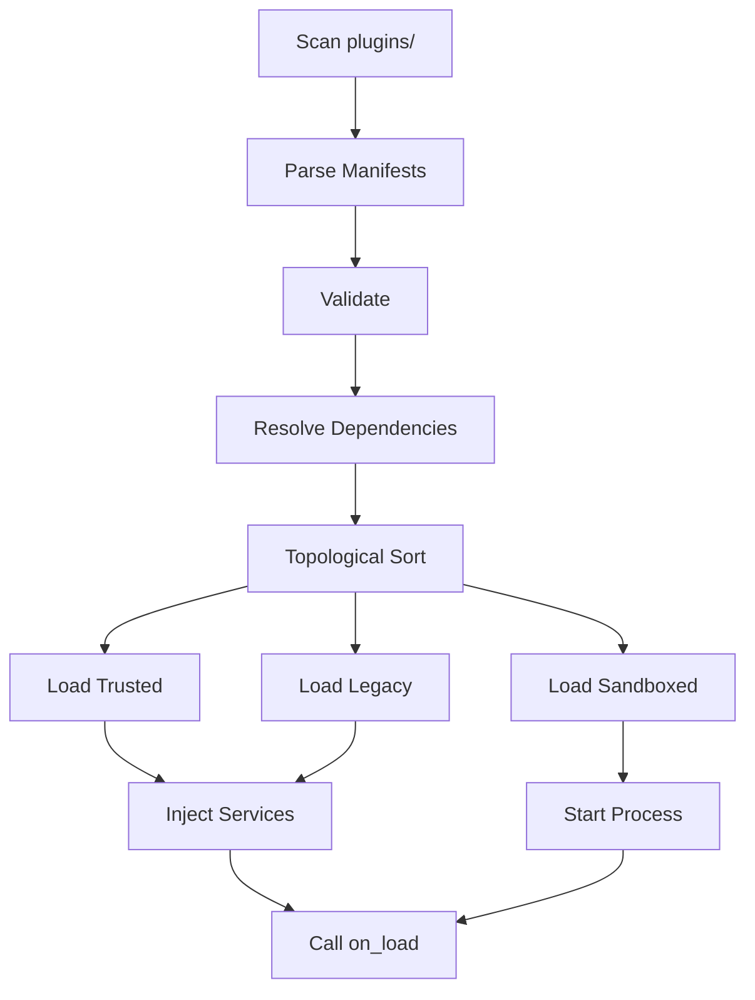

#### LifecycleManager

**Location**: `xcore/kernel/runtime/lifecycle.py`

Plugin lifecycle management:
- Context injection
- Hook execution
- State transitions

### Sandbox Components

#### ProcessManager

**Location**: `xcore/kernel/sandbox/process_manager.py`

Isolated execution:
- Process spawning
- IPC communication
- Resource monitoring
- Timeout handling

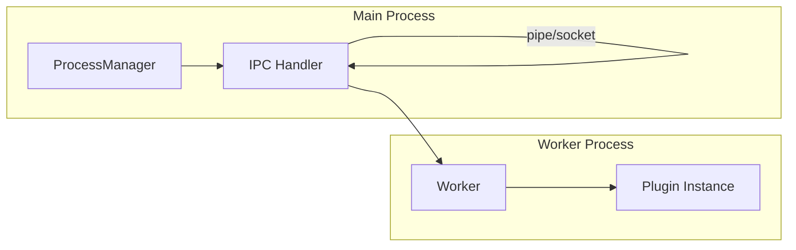

### Event System

#### EventBus

**Location**: `xcore/kernel/events/bus.py`

Event handling:
- Subscription management
- Priority-based execution
- Synchronous/asynchronous emission
- Error handling

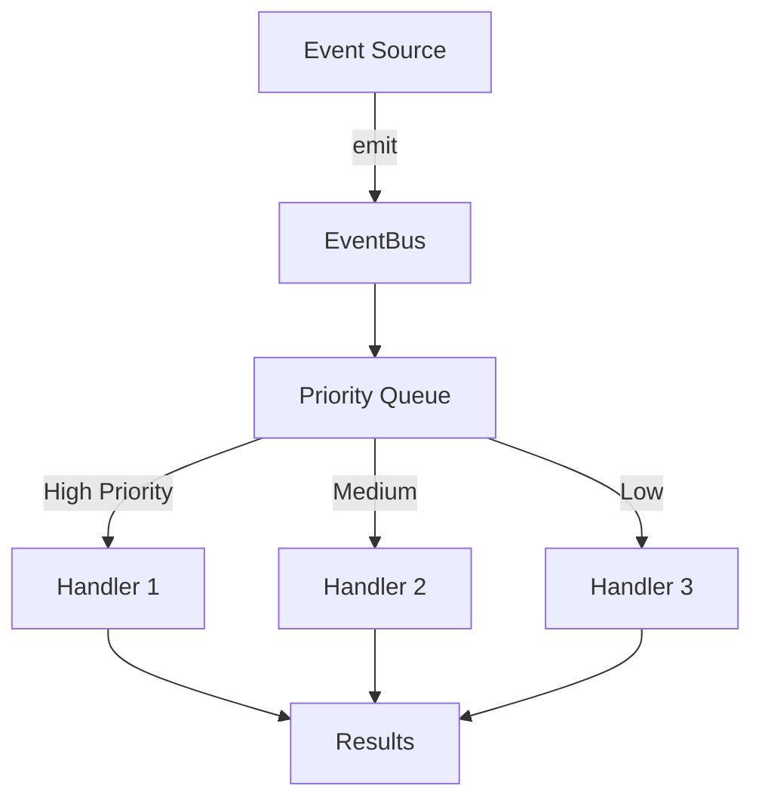

### Service Container

**Location**: `xcore/services/container.py`

Service management:
- Initialization order
- Dependency injection
- Health monitoring
- Graceful shutdown

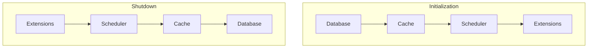

## Data Flow

### Plugin Action Flow

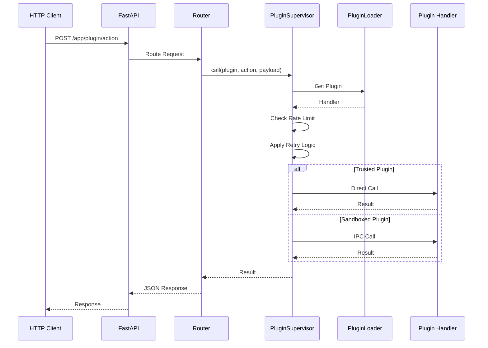

### HTTP Route Flow

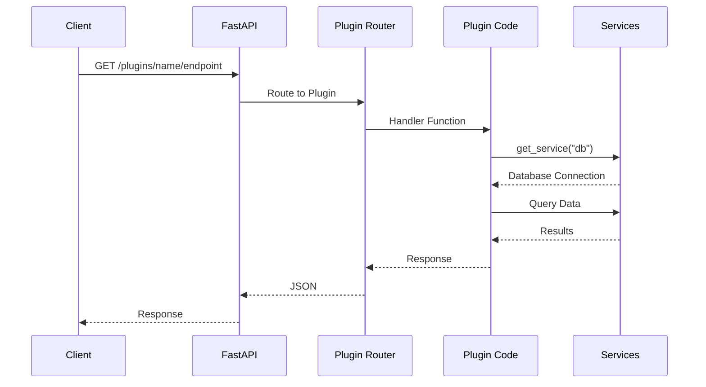

### Event Flow

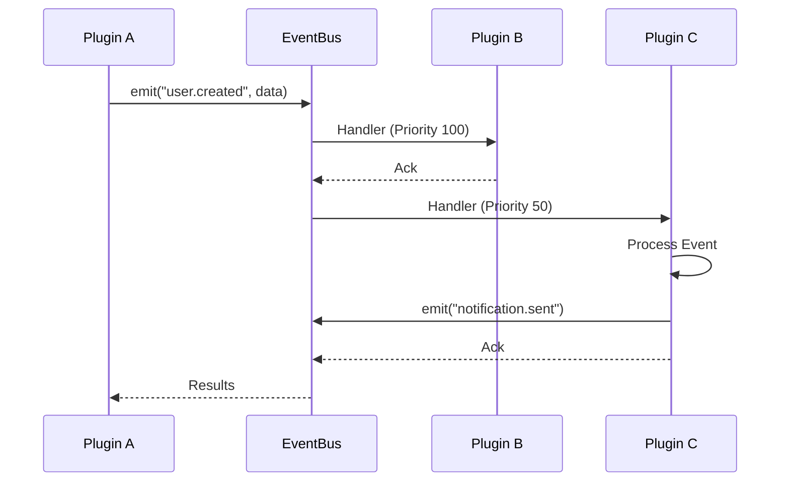

## Security Architecture

### Sandboxing

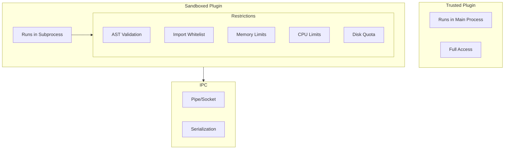

### Signature Verification

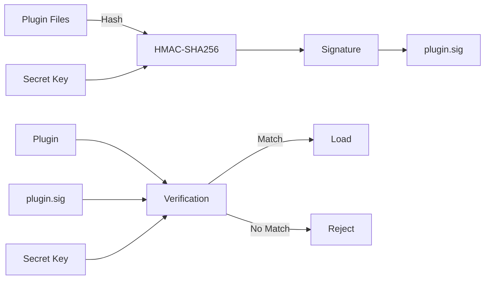

## Plugin Lifecycle

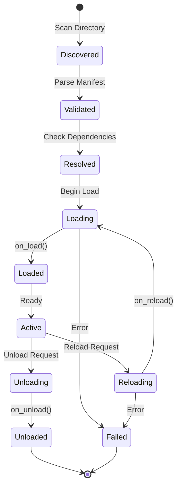

## Threading Model

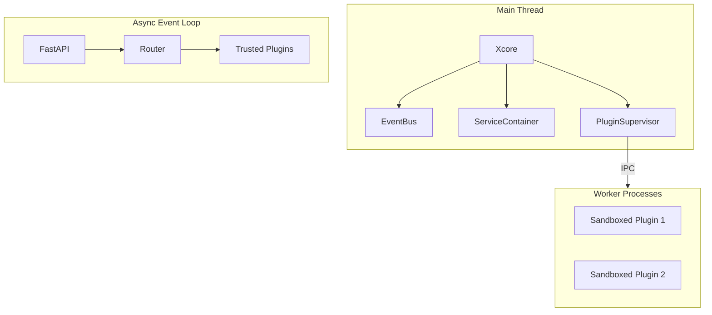

## Directory Structure

```
xcore/
├── __init__.py                 # Main orchestrator
├── __version__.py              # Version info
│
├── kernel/                     # Core framework
│   ├── api/                    # API layer
│   │   ├── contract.py         # Plugin contracts
│   │   ├── context.py          # Plugin context
│   │   ├── router.py           # FastAPI router builder
│   │   └── versioning.py       # API versioning
│   │
│   ├── runtime/                # Plugin runtime
│   │   ├── loader.py           # Plugin loader
│   │   ├── supervisor.py         # High-level management
│   │   ├── lifecycle.py        # Lifecycle management
│   │   └── state_machine.py    # State management
│   │
│   ├── sandbox/                # Sandboxed execution
│   │   ├── process_manager.py  # Process management
│   │   ├── worker.py             # Worker process
│   │   ├── ipc.py              # Inter-process communication
│   │   ├── limits.py             # Rate limiting
│   │   └── isolation.py        # Resource isolation
│   │
│   ├── events/                   # Event system
│   │   ├── bus.py                # EventBus
│   │   ├── dispatcher.py         # Event dispatcher
│   │   └── hooks.py            # Hook manager
│   │
│   ├── security/               # Security
│   │   ├── signature.py        # Plugin signing
│   │   ├── validation.py       # AST validation
│   │   └── hashing.py          # Hash utilities
│   │
│   └── observability/          # Observability
│       ├── logging.py          # Structured logging
│       ├── metrics.py          # Metrics collection
│       ├── tracing.py          # Distributed tracing
│       └── health.py           # Health checks
│
├── configurations/             # Configuration
│   ├── loader.py               # Config loader
│   └── sections.py             # Config dataclasses
│
├── services/                   # Built-in services
│   ├── container.py            # Service container
│   ├── base.py                 # Base service class
│   ├── cache/                  # Cache service
│   ├── database/               # Database service
│   ├── scheduler/              # Scheduler service
│   └── extensions/             # Extension loader
│
├── registry/                   # Plugin registry
│   ├── index.py                # Registry index
│   ├── resolver.py             # Dependency resolver
│   └── versioning.py           # Version management
│
├── sdk/                        # Plugin SDK
│   ├── __init__.py
│   ├── plugin_base.py          # Plugin manifest
│   └── decorators.py           # SDK decorators
│
└── cli/                        # Command line
    ├── main.py                 # CLI entry point
    ├── plugin_cmd.py           # Plugin commands
    └── validate_cmd.py         # Validation commands
```

## Performance Considerations

### Trusted Plugins
- Run in main process (fastest)
- Direct service access
- No serialization overhead
- Shared memory

### Sandboxed Plugins
- Process isolation
- IPC overhead (~1-5ms)
- Serialization cost
- Memory copying

### Scaling Strategies

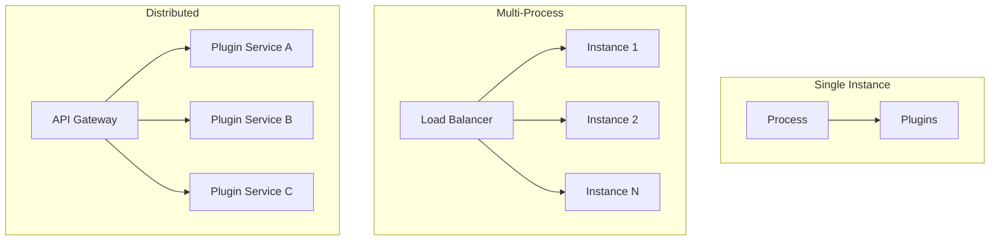

## Next Steps

- [Plugin Development](../guides/creating-plugins.md)
- [Service Integration](../guides/services.md)
- [Configuration Reference](../reference/configuration.md)
